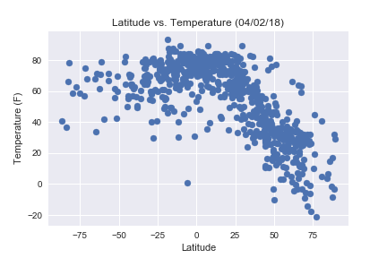
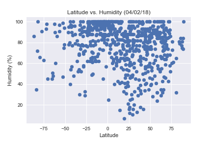
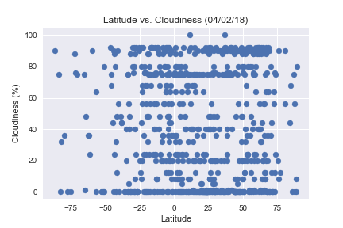

# Analysis
### 1.  Temperatures on average tend to be higher with latitudes that are closer to the equator
### 2.  Humidity on average tends to be higher with latitudes  that are closer the equator
### 3.  There is no correlation between the cloudiness and the distance

```python
# Dependencies
import openweathermapy.core as owm
import matplotlib.pyplot as plt
import seaborn as sns
import pandas as pd
import numpy as np
import json
import requests
from citipy import citipy
import random
import time as time
```


```python
# Import api_key
from config import api_key
```


```python
#Randomly select at least 500 unique (non-repeat) cities based on latitude and longitude:
    # Latitude in degrees is -90 and +90
    # Longitude is in the range -180 and +180

#Creating a dataframe to display the values
cities_df = pd.DataFrame(columns =
                            ['City',
                             'Latitudes',
                             'Longitudes',
                            ])
# Holding the variables
lat = []
lng = []
cities = []

#Creating loops to go through random lat and lng and assigning cities based on coordinates picked
    #2000 was chosen in order to ensure that atleast 500 would be unique (non-repeat) cities
for x in range(0,2000):
    lat.append(random.uniform(-90,90))
    lng.append(random.uniform(-180,180))
cities_df['Latitudes']  = lat
cities_df['Longitudes'] = lng

for index, row in cities_df.iterrows():
    city = citipy.nearest_city(row["Latitudes"],row["Longitudes"])
    cities.append(city.city_name)
cities_df['City'] = cities

#Displaying the top five
cities_df.head()
```


<div>
<style scoped>
    .dataframe tbody tr th:only-of-type {
        vertical-align: middle;
    }

    .dataframe tbody tr th {
        vertical-align: top;
    }

    .dataframe thead th {
        text-align: right;
    }
</style>
<table border="1" class="dataframe">
  <thead>
    <tr style="text-align: right;">
      <th></th>
      <th>City</th>
      <th>Latitudes</th>
      <th>Longitudes</th>
    </tr>
  </thead>
  <tbody>
    <tr>
      <th>0</th>
      <td>kayerkan</td>
      <td>73.843233</td>
      <td>87.141556</td>
    </tr>
    <tr>
      <th>1</th>
      <td>taolanaro</td>
      <td>-45.960918</td>
      <td>54.736105</td>
    </tr>
    <tr>
      <th>2</th>
      <td>cape town</td>
      <td>-82.907199</td>
      <td>-14.759134</td>
    </tr>
    <tr>
      <th>3</th>
      <td>rikitea</td>
      <td>-82.020721</td>
      <td>-133.366234</td>
    </tr>
    <tr>
      <th>4</th>
      <td>yellowknife</td>
      <td>67.690858</td>
      <td>-107.898782</td>
    </tr>
  </tbody>
</table>
</div>


```python
new_cities_df = cities_df.drop_duplicates("City", keep = "first")
new_cities_df =  new_cities_df.dropna(axis= 1, how = 'all')
len(new_cities_df)
```


    754


```python
# Creating empty lists to hold the information
temp = []
wind_speed = []
cloudiness = []
humidity = []

# Calling the API from the website
base_url = "http://api.openweathermap.org/data/2.5/weather?q="

counter = 0

for index, row in new_cities_df.iterrows():
    try:
        target_url = base_url + row["City"] + "&units=imperial" + "&appid="+ api_key
        time.sleep(1)
        response = requests.get(target_url).json()
        temp.append(response["main"]["temp"])
        wind_speed.append(response["wind"]["speed"])
        cloudiness.append(response["clouds"]["all"])
        humidity.append(response["main"]["humidity"])
    except:
        new_cities_df.drop(index, inplace = True)
        pass

    print("We are on city number " + str(counter))
    counter = counter + 1
    print("This is the city: " + row['City'])
    print(target_url)  
```

    We are on city number 0
    This is the city: kayerkan
    http://api.openweathermap.org/data/2.5/weather?q=kayerkan&units=imperial&appid=288bd40bdc806164c2b347c489a98cf6
    We are on city number 1
    This is the city: taolanaro
    http://api.openweathermap.org/data/2.5/weather?q=taolanaro&units=imperial&appid=288bd40bdc806164c2b347c489a98cf6
    We are on city number 2
    This is the city: cape town
    http://api.openweathermap.org/data/2.5/weather?q=cape town&units=imperial&appid=288bd40bdc806164c2b347c489a98cf6
    We are on city number 3
    This is the city: rikitea
    http://api.openweathermap.org/data/2.5/weather?q=rikitea&units=imperial&appid=288bd40bdc806164c2b347c489a98cf6
    We are on city number 4
    This is the city: yellowknife
    http://api.openweathermap.org/data/2.5/weather?q=yellowknife&units=imperial&appid=288bd40bdc806164c2b347c489a98cf6
    We are on city number 5
    This is the city: byron bay
    http://api.openweathermap.org/data/2.5/weather?q=byron bay&units=imperial&appid=288bd40bdc806164c2b347c489a98cf6
    We are on city number 6
    This is the city: lhokseumawe
    http://api.openweathermap.org/data/2.5/weather?q=lhokseumawe&units=imperial&appid=288bd40bdc806164c2b347c489a98cf6
    We are on city number 7
    This is the city: atuona
    http://api.openweathermap.org/data/2.5/weather?q=atuona&units=imperial&appid=288bd40bdc806164c2b347c489a98cf6
    We are on city number 8
    This is the city: rosario oeste
    http://api.openweathermap.org/data/2.5/weather?q=rosario oeste&units=imperial&appid=288bd40bdc806164c2b347c489a98cf6
    We are on city number 9
    This is the city: ushuaia
    http://api.openweathermap.org/data/2.5/weather?q=ushuaia&units=imperial&appid=288bd40bdc806164c2b347c489a98cf6
    We are on city number 10
    This is the city: port alfred
    http://api.openweathermap.org/data/2.5/weather?q=port alfred&units=imperial&appid=288bd40bdc806164c2b347c489a98cf6
    We are on city number 11
    This is the city: amderma
    http://api.openweathermap.org/data/2.5/weather?q=amderma&units=imperial&appid=288bd40bdc806164c2b347c489a98cf6
    We are on city number 12
    This is the city: severomuysk
    http://api.openweathermap.org/data/2.5/weather?q=severomuysk&units=imperial&appid=288bd40bdc806164c2b347c489a98cf6
    We are on city number 13
    This is the city: albany
    http://api.openweathermap.org/data/2.5/weather?q=albany&units=imperial&appid=288bd40bdc806164c2b347c489a98cf6
    We are on city number 14
    This is the city: castro
    http://api.openweathermap.org/data/2.5/weather?q=castro&units=imperial&appid=288bd40bdc806164c2b347c489a98cf6
    We are on city number 15
    This is the city: beringovskiy
    http://api.openweathermap.org/data/2.5/weather?q=beringovskiy&units=imperial&appid=288bd40bdc806164c2b347c489a98cf6
    We are on city number 16
    This is the city: carnarvon
    http://api.openweathermap.org/data/2.5/weather?q=carnarvon&units=imperial&appid=288bd40bdc806164c2b347c489a98cf6
    We are on city number 17
    This is the city: vaini
    http://api.openweathermap.org/data/2.5/weather?q=vaini&units=imperial&appid=288bd40bdc806164c2b347c489a98cf6
    We are on city number 18
    This is the city: busselton
    http://api.openweathermap.org/data/2.5/weather?q=busselton&units=imperial&appid=288bd40bdc806164c2b347c489a98cf6
    We are on city number 19
    This is the city: adrar
    http://api.openweathermap.org/data/2.5/weather?q=adrar&units=imperial&appid=288bd40bdc806164c2b347c489a98cf6
    We are on city number 20
    This is the city: ponta do sol
    http://api.openweathermap.org/data/2.5/weather?q=ponta do sol&units=imperial&appid=288bd40bdc806164c2b347c489a98cf6
    We are on city number 21
    This is the city: port-gentil
    http://api.openweathermap.org/data/2.5/weather?q=port-gentil&units=imperial&appid=288bd40bdc806164c2b347c489a98cf6
    We are on city number 22
    This is the city: isangel
    http://api.openweathermap.org/data/2.5/weather?q=isangel&units=imperial&appid=288bd40bdc806164c2b347c489a98cf6
    We are on city number 23
    This is the city: saleaula
    http://api.openweathermap.org/data/2.5/weather?q=saleaula&units=imperial&appid=288bd40bdc806164c2b347c489a98cf6
    We are on city number 24
    This is the city: tabiauea
    http://api.openweathermap.org/data/2.5/weather?q=tabiauea&units=imperial&appid=288bd40bdc806164c2b347c489a98cf6
    We are on city number 25
    This is the city: saint george
    http://api.openweathermap.org/data/2.5/weather?q=saint george&units=imperial&appid=288bd40bdc806164c2b347c489a98cf6
    We are on city number 26
    This is the city: kodiak
    http://api.openweathermap.org/data/2.5/weather?q=kodiak&units=imperial&appid=288bd40bdc806164c2b347c489a98cf6
    We are on city number 27
    This is the city: atagay
    http://api.openweathermap.org/data/2.5/weather?q=atagay&units=imperial&appid=288bd40bdc806164c2b347c489a98cf6
    We are on city number 28
    This is the city: sentyabrskiy
    http://api.openweathermap.org/data/2.5/weather?q=sentyabrskiy&units=imperial&appid=288bd40bdc806164c2b347c489a98cf6
    We are on city number 29
    This is the city: hobart
    http://api.openweathermap.org/data/2.5/weather?q=hobart&units=imperial&appid=288bd40bdc806164c2b347c489a98cf6
    We are on city number 30
    This is the city: chor
    http://api.openweathermap.org/data/2.5/weather?q=chor&units=imperial&appid=288bd40bdc806164c2b347c489a98cf6
    We are on city number 31
    This is the city: kapaa
    http://api.openweathermap.org/data/2.5/weather?q=kapaa&units=imperial&appid=288bd40bdc806164c2b347c489a98cf6
    We are on city number 32
    This is the city: bluff
    http://api.openweathermap.org/data/2.5/weather?q=bluff&units=imperial&appid=288bd40bdc806164c2b347c489a98cf6
    We are on city number 33
    This is the city: punta arenas
    http://api.openweathermap.org/data/2.5/weather?q=punta arenas&units=imperial&appid=288bd40bdc806164c2b347c489a98cf6
    We are on city number 34
    This is the city: broome
    http://api.openweathermap.org/data/2.5/weather?q=broome&units=imperial&appid=288bd40bdc806164c2b347c489a98cf6
    We are on city number 35
    This is the city: mecca
    http://api.openweathermap.org/data/2.5/weather?q=mecca&units=imperial&appid=288bd40bdc806164c2b347c489a98cf6
    We are on city number 36
    This is the city: saldanha
    http://api.openweathermap.org/data/2.5/weather?q=saldanha&units=imperial&appid=288bd40bdc806164c2b347c489a98cf6
    We are on city number 37
    This is the city: yekaterinoslavka
    http://api.openweathermap.org/data/2.5/weather?q=yekaterinoslavka&units=imperial&appid=288bd40bdc806164c2b347c489a98cf6
    We are on city number 38
    This is the city: uk
    http://api.openweathermap.org/data/2.5/weather?q=uk&units=imperial&appid=288bd40bdc806164c2b347c489a98cf6
    We are on city number 39
    This is the city: bilibino
    http://api.openweathermap.org/data/2.5/weather?q=bilibino&units=imperial&appid=288bd40bdc806164c2b347c489a98cf6
    We are on city number 40
    This is the city: puerto ayora
    http://api.openweathermap.org/data/2.5/weather?q=puerto ayora&units=imperial&appid=288bd40bdc806164c2b347c489a98cf6
    We are on city number 41
    This is the city: lavrentiya
    http://api.openweathermap.org/data/2.5/weather?q=lavrentiya&units=imperial&appid=288bd40bdc806164c2b347c489a98cf6
    We are on city number 42
    This is the city: vila velha
    http://api.openweathermap.org/data/2.5/weather?q=vila velha&units=imperial&appid=288bd40bdc806164c2b347c489a98cf6
    We are on city number 43
    This is the city: jamestown
    http://api.openweathermap.org/data/2.5/weather?q=jamestown&units=imperial&appid=288bd40bdc806164c2b347c489a98cf6
    We are on city number 44
    This is the city: hamilton
    http://api.openweathermap.org/data/2.5/weather?q=hamilton&units=imperial&appid=288bd40bdc806164c2b347c489a98cf6
    We are on city number 45
    This is the city: belushya guba
    http://api.openweathermap.org/data/2.5/weather?q=belushya guba&units=imperial&appid=288bd40bdc806164c2b347c489a98cf6
    We are on city number 46
    This is the city: mabaruma
    http://api.openweathermap.org/data/2.5/weather?q=mabaruma&units=imperial&appid=288bd40bdc806164c2b347c489a98cf6
    We are on city number 47
    This is the city: clyde river
    http://api.openweathermap.org/data/2.5/weather?q=clyde river&units=imperial&appid=288bd40bdc806164c2b347c489a98cf6
    We are on city number 48
    This is the city: mataura
    http://api.openweathermap.org/data/2.5/weather?q=mataura&units=imperial&appid=288bd40bdc806164c2b347c489a98cf6
    We are on city number 49
    This is the city: pangnirtung
    http://api.openweathermap.org/data/2.5/weather?q=pangnirtung&units=imperial&appid=288bd40bdc806164c2b347c489a98cf6
    We are on city number 50
    This is the city: hermanus
    http://api.openweathermap.org/data/2.5/weather?q=hermanus&units=imperial&appid=288bd40bdc806164c2b347c489a98cf6
    We are on city number 51
    This is the city: thompson
    http://api.openweathermap.org/data/2.5/weather?q=thompson&units=imperial&appid=288bd40bdc806164c2b347c489a98cf6
    We are on city number 52
    This is the city: arraial do cabo
    http://api.openweathermap.org/data/2.5/weather?q=arraial do cabo&units=imperial&appid=288bd40bdc806164c2b347c489a98cf6
    We are on city number 53
    This is the city: ampanihy
    http://api.openweathermap.org/data/2.5/weather?q=ampanihy&units=imperial&appid=288bd40bdc806164c2b347c489a98cf6
    We are on city number 54
    This is the city: flinders
    http://api.openweathermap.org/data/2.5/weather?q=flinders&units=imperial&appid=288bd40bdc806164c2b347c489a98cf6
    We are on city number 55
    This is the city: ambulu
    http://api.openweathermap.org/data/2.5/weather?q=ambulu&units=imperial&appid=288bd40bdc806164c2b347c489a98cf6
    We are on city number 56
    This is the city: bolu
    http://api.openweathermap.org/data/2.5/weather?q=bolu&units=imperial&appid=288bd40bdc806164c2b347c489a98cf6
    We are on city number 57
    This is the city: iraucuba
    http://api.openweathermap.org/data/2.5/weather?q=iraucuba&units=imperial&appid=288bd40bdc806164c2b347c489a98cf6
    We are on city number 58
    This is the city: sikonge
    http://api.openweathermap.org/data/2.5/weather?q=sikonge&units=imperial&appid=288bd40bdc806164c2b347c489a98cf6
    We are on city number 59
    This is the city: latung
    http://api.openweathermap.org/data/2.5/weather?q=latung&units=imperial&appid=288bd40bdc806164c2b347c489a98cf6
    We are on city number 60
    This is the city: werda
    http://api.openweathermap.org/data/2.5/weather?q=werda&units=imperial&appid=288bd40bdc806164c2b347c489a98cf6
    We are on city number 61
    This is the city: nikolskoye
    http://api.openweathermap.org/data/2.5/weather?q=nikolskoye&units=imperial&appid=288bd40bdc806164c2b347c489a98cf6
    We are on city number 62
    This is the city: umzimvubu
    http://api.openweathermap.org/data/2.5/weather?q=umzimvubu&units=imperial&appid=288bd40bdc806164c2b347c489a98cf6
    We are on city number 63
    This is the city: qaanaaq
    http://api.openweathermap.org/data/2.5/weather?q=qaanaaq&units=imperial&appid=288bd40bdc806164c2b347c489a98cf6
    We are on city number 64
    This is the city: artyk
    http://api.openweathermap.org/data/2.5/weather?q=artyk&units=imperial&appid=288bd40bdc806164c2b347c489a98cf6
    We are on city number 65
    This is the city: waipawa
    http://api.openweathermap.org/data/2.5/weather?q=waipawa&units=imperial&appid=288bd40bdc806164c2b347c489a98cf6
    We are on city number 66
    This is the city: illoqqortoormiut
    http://api.openweathermap.org/data/2.5/weather?q=illoqqortoormiut&units=imperial&appid=288bd40bdc806164c2b347c489a98cf6
    We are on city number 67
    This is the city: nisia floresta
    http://api.openweathermap.org/data/2.5/weather?q=nisia floresta&units=imperial&appid=288bd40bdc806164c2b347c489a98cf6
    We are on city number 68
    This is the city: airai
    http://api.openweathermap.org/data/2.5/weather?q=airai&units=imperial&appid=288bd40bdc806164c2b347c489a98cf6
    We are on city number 69
    This is the city: marystown
    http://api.openweathermap.org/data/2.5/weather?q=marystown&units=imperial&appid=288bd40bdc806164c2b347c489a98cf6
    We are on city number 70
    This is the city: rabo de peixe
    http://api.openweathermap.org/data/2.5/weather?q=rabo de peixe&units=imperial&appid=288bd40bdc806164c2b347c489a98cf6
    We are on city number 71
    This is the city: aquiraz
    http://api.openweathermap.org/data/2.5/weather?q=aquiraz&units=imperial&appid=288bd40bdc806164c2b347c489a98cf6
    We are on city number 72
    This is the city: chokurdakh
    http://api.openweathermap.org/data/2.5/weather?q=chokurdakh&units=imperial&appid=288bd40bdc806164c2b347c489a98cf6
    We are on city number 73
    This is the city: sur
    http://api.openweathermap.org/data/2.5/weather?q=sur&units=imperial&appid=288bd40bdc806164c2b347c489a98cf6
    We are on city number 74
    This is the city: atambua
    http://api.openweathermap.org/data/2.5/weather?q=atambua&units=imperial&appid=288bd40bdc806164c2b347c489a98cf6
    We are on city number 75
    This is the city: falam
    http://api.openweathermap.org/data/2.5/weather?q=falam&units=imperial&appid=288bd40bdc806164c2b347c489a98cf6
    We are on city number 76
    This is the city: khatanga
    http://api.openweathermap.org/data/2.5/weather?q=khatanga&units=imperial&appid=288bd40bdc806164c2b347c489a98cf6
    We are on city number 77
    This is the city: sembe
    http://api.openweathermap.org/data/2.5/weather?q=sembe&units=imperial&appid=288bd40bdc806164c2b347c489a98cf6
    We are on city number 78
    This is the city: dabou
    http://api.openweathermap.org/data/2.5/weather?q=dabou&units=imperial&appid=288bd40bdc806164c2b347c489a98cf6
    We are on city number 79
    This is the city: vao
    http://api.openweathermap.org/data/2.5/weather?q=vao&units=imperial&appid=288bd40bdc806164c2b347c489a98cf6
    We are on city number 80
    This is the city: auki
    http://api.openweathermap.org/data/2.5/weather?q=auki&units=imperial&appid=288bd40bdc806164c2b347c489a98cf6
    We are on city number 81
    This is the city: kemijarvi
    http://api.openweathermap.org/data/2.5/weather?q=kemijarvi&units=imperial&appid=288bd40bdc806164c2b347c489a98cf6
    We are on city number 82
    This is the city: owando
    http://api.openweathermap.org/data/2.5/weather?q=owando&units=imperial&appid=288bd40bdc806164c2b347c489a98cf6
    We are on city number 83
    This is the city: kavaratti
    http://api.openweathermap.org/data/2.5/weather?q=kavaratti&units=imperial&appid=288bd40bdc806164c2b347c489a98cf6
    We are on city number 84
    This is the city: ikalamavony
    http://api.openweathermap.org/data/2.5/weather?q=ikalamavony&units=imperial&appid=288bd40bdc806164c2b347c489a98cf6
    We are on city number 85
    This is the city: avarua
    http://api.openweathermap.org/data/2.5/weather?q=avarua&units=imperial&appid=288bd40bdc806164c2b347c489a98cf6
    We are on city number 86
    This is the city: puerto escondido
    http://api.openweathermap.org/data/2.5/weather?q=puerto escondido&units=imperial&appid=288bd40bdc806164c2b347c489a98cf6
    We are on city number 87
    This is the city: qaqortoq
    http://api.openweathermap.org/data/2.5/weather?q=qaqortoq&units=imperial&appid=288bd40bdc806164c2b347c489a98cf6
    We are on city number 88
    This is the city: sistranda
    http://api.openweathermap.org/data/2.5/weather?q=sistranda&units=imperial&appid=288bd40bdc806164c2b347c489a98cf6
    We are on city number 89
    This is the city: ishigaki
    http://api.openweathermap.org/data/2.5/weather?q=ishigaki&units=imperial&appid=288bd40bdc806164c2b347c489a98cf6
    We are on city number 90
    This is the city: ondorhaan
    http://api.openweathermap.org/data/2.5/weather?q=ondorhaan&units=imperial&appid=288bd40bdc806164c2b347c489a98cf6
    We are on city number 91
    This is the city: mouzakion
    http://api.openweathermap.org/data/2.5/weather?q=mouzakion&units=imperial&appid=288bd40bdc806164c2b347c489a98cf6
    We are on city number 92
    This is the city: meulaboh
    http://api.openweathermap.org/data/2.5/weather?q=meulaboh&units=imperial&appid=288bd40bdc806164c2b347c489a98cf6
    We are on city number 93
    This is the city: kaabong
    http://api.openweathermap.org/data/2.5/weather?q=kaabong&units=imperial&appid=288bd40bdc806164c2b347c489a98cf6
    We are on city number 94
    This is the city: talesh
    http://api.openweathermap.org/data/2.5/weather?q=talesh&units=imperial&appid=288bd40bdc806164c2b347c489a98cf6
    We are on city number 95
    This is the city: lebu
    http://api.openweathermap.org/data/2.5/weather?q=lebu&units=imperial&appid=288bd40bdc806164c2b347c489a98cf6
    We are on city number 96
    This is the city: camacupa
    http://api.openweathermap.org/data/2.5/weather?q=camacupa&units=imperial&appid=288bd40bdc806164c2b347c489a98cf6
    We are on city number 97
    This is the city: hithadhoo
    http://api.openweathermap.org/data/2.5/weather?q=hithadhoo&units=imperial&appid=288bd40bdc806164c2b347c489a98cf6
    We are on city number 98
    This is the city: klyuchi
    http://api.openweathermap.org/data/2.5/weather?q=klyuchi&units=imperial&appid=288bd40bdc806164c2b347c489a98cf6
    We are on city number 99
    This is the city: asosa
    http://api.openweathermap.org/data/2.5/weather?q=asosa&units=imperial&appid=288bd40bdc806164c2b347c489a98cf6
    We are on city number 100
    This is the city: dalvik
    http://api.openweathermap.org/data/2.5/weather?q=dalvik&units=imperial&appid=288bd40bdc806164c2b347c489a98cf6
    We are on city number 101
    This is the city: chuy
    http://api.openweathermap.org/data/2.5/weather?q=chuy&units=imperial&appid=288bd40bdc806164c2b347c489a98cf6
    We are on city number 102
    This is the city: eten
    http://api.openweathermap.org/data/2.5/weather?q=eten&units=imperial&appid=288bd40bdc806164c2b347c489a98cf6
    We are on city number 103
    This is the city: barentsburg
    http://api.openweathermap.org/data/2.5/weather?q=barentsburg&units=imperial&appid=288bd40bdc806164c2b347c489a98cf6
    We are on city number 104
    This is the city: bredasdorp
    http://api.openweathermap.org/data/2.5/weather?q=bredasdorp&units=imperial&appid=288bd40bdc806164c2b347c489a98cf6
    We are on city number 105
    This is the city: falealupo
    http://api.openweathermap.org/data/2.5/weather?q=falealupo&units=imperial&appid=288bd40bdc806164c2b347c489a98cf6
    We are on city number 106
    This is the city: yumen
    http://api.openweathermap.org/data/2.5/weather?q=yumen&units=imperial&appid=288bd40bdc806164c2b347c489a98cf6
    We are on city number 107
    This is the city: mar del plata
    http://api.openweathermap.org/data/2.5/weather?q=mar del plata&units=imperial&appid=288bd40bdc806164c2b347c489a98cf6
    We are on city number 108
    This is the city: irece
    http://api.openweathermap.org/data/2.5/weather?q=irece&units=imperial&appid=288bd40bdc806164c2b347c489a98cf6
    We are on city number 109
    This is the city: scottsbluff
    http://api.openweathermap.org/data/2.5/weather?q=scottsbluff&units=imperial&appid=288bd40bdc806164c2b347c489a98cf6
    We are on city number 110
    This is the city: tiksi
    http://api.openweathermap.org/data/2.5/weather?q=tiksi&units=imperial&appid=288bd40bdc806164c2b347c489a98cf6
    We are on city number 111
    This is the city: new norfolk
    http://api.openweathermap.org/data/2.5/weather?q=new norfolk&units=imperial&appid=288bd40bdc806164c2b347c489a98cf6
    We are on city number 112
    This is the city: hami
    http://api.openweathermap.org/data/2.5/weather?q=hami&units=imperial&appid=288bd40bdc806164c2b347c489a98cf6
    We are on city number 113
    This is the city: vaitupu
    http://api.openweathermap.org/data/2.5/weather?q=vaitupu&units=imperial&appid=288bd40bdc806164c2b347c489a98cf6
    We are on city number 114
    This is the city: ijaki
    http://api.openweathermap.org/data/2.5/weather?q=ijaki&units=imperial&appid=288bd40bdc806164c2b347c489a98cf6
    We are on city number 115
    This is the city: bauchi
    http://api.openweathermap.org/data/2.5/weather?q=bauchi&units=imperial&appid=288bd40bdc806164c2b347c489a98cf6
    We are on city number 116
    This is the city: bethel
    http://api.openweathermap.org/data/2.5/weather?q=bethel&units=imperial&appid=288bd40bdc806164c2b347c489a98cf6
    We are on city number 117
    This is the city: ivanava
    http://api.openweathermap.org/data/2.5/weather?q=ivanava&units=imperial&appid=288bd40bdc806164c2b347c489a98cf6
    We are on city number 118
    This is the city: nizhneyansk
    http://api.openweathermap.org/data/2.5/weather?q=nizhneyansk&units=imperial&appid=288bd40bdc806164c2b347c489a98cf6
    We are on city number 119
    This is the city: zhigansk
    http://api.openweathermap.org/data/2.5/weather?q=zhigansk&units=imperial&appid=288bd40bdc806164c2b347c489a98cf6
    We are on city number 120
    This is the city: cidreira
    http://api.openweathermap.org/data/2.5/weather?q=cidreira&units=imperial&appid=288bd40bdc806164c2b347c489a98cf6
    We are on city number 121
    This is the city: puerto colombia
    http://api.openweathermap.org/data/2.5/weather?q=puerto colombia&units=imperial&appid=288bd40bdc806164c2b347c489a98cf6
    We are on city number 122
    This is the city: miri
    http://api.openweathermap.org/data/2.5/weather?q=miri&units=imperial&appid=288bd40bdc806164c2b347c489a98cf6
    We are on city number 123
    This is the city: torbay
    http://api.openweathermap.org/data/2.5/weather?q=torbay&units=imperial&appid=288bd40bdc806164c2b347c489a98cf6
    We are on city number 124
    This is the city: provideniya
    http://api.openweathermap.org/data/2.5/weather?q=provideniya&units=imperial&appid=288bd40bdc806164c2b347c489a98cf6
    We are on city number 125
    This is the city: butaritari
    http://api.openweathermap.org/data/2.5/weather?q=butaritari&units=imperial&appid=288bd40bdc806164c2b347c489a98cf6
    We are on city number 126
    This is the city: saskylakh
    http://api.openweathermap.org/data/2.5/weather?q=saskylakh&units=imperial&appid=288bd40bdc806164c2b347c489a98cf6
    We are on city number 127
    This is the city: port lincoln
    http://api.openweathermap.org/data/2.5/weather?q=port lincoln&units=imperial&appid=288bd40bdc806164c2b347c489a98cf6
    We are on city number 128
    This is the city: usinsk
    http://api.openweathermap.org/data/2.5/weather?q=usinsk&units=imperial&appid=288bd40bdc806164c2b347c489a98cf6
    We are on city number 129
    This is the city: ribas do rio pardo
    http://api.openweathermap.org/data/2.5/weather?q=ribas do rio pardo&units=imperial&appid=288bd40bdc806164c2b347c489a98cf6
    We are on city number 130
    This is the city: mareeba
    http://api.openweathermap.org/data/2.5/weather?q=mareeba&units=imperial&appid=288bd40bdc806164c2b347c489a98cf6
    We are on city number 131
    This is the city: ugljevik
    http://api.openweathermap.org/data/2.5/weather?q=ugljevik&units=imperial&appid=288bd40bdc806164c2b347c489a98cf6
    We are on city number 132
    This is the city: plotnikovo
    http://api.openweathermap.org/data/2.5/weather?q=plotnikovo&units=imperial&appid=288bd40bdc806164c2b347c489a98cf6
    We are on city number 133
    This is the city: hilo
    http://api.openweathermap.org/data/2.5/weather?q=hilo&units=imperial&appid=288bd40bdc806164c2b347c489a98cf6
    We are on city number 134
    This is the city: tonshayevo
    http://api.openweathermap.org/data/2.5/weather?q=tonshayevo&units=imperial&appid=288bd40bdc806164c2b347c489a98cf6
    We are on city number 135
    This is the city: idaho falls
    http://api.openweathermap.org/data/2.5/weather?q=idaho falls&units=imperial&appid=288bd40bdc806164c2b347c489a98cf6
    We are on city number 136
    This is the city: nosy varika
    http://api.openweathermap.org/data/2.5/weather?q=nosy varika&units=imperial&appid=288bd40bdc806164c2b347c489a98cf6
    We are on city number 137
    This is the city: georgetown
    http://api.openweathermap.org/data/2.5/weather?q=georgetown&units=imperial&appid=288bd40bdc806164c2b347c489a98cf6
    We are on city number 138
    This is the city: kainantu
    http://api.openweathermap.org/data/2.5/weather?q=kainantu&units=imperial&appid=288bd40bdc806164c2b347c489a98cf6
    We are on city number 139
    This is the city: mae ramat
    http://api.openweathermap.org/data/2.5/weather?q=mae ramat&units=imperial&appid=288bd40bdc806164c2b347c489a98cf6
    We are on city number 140
    This is the city: east london
    http://api.openweathermap.org/data/2.5/weather?q=east london&units=imperial&appid=288bd40bdc806164c2b347c489a98cf6
    We are on city number 141
    This is the city: narsaq
    http://api.openweathermap.org/data/2.5/weather?q=narsaq&units=imperial&appid=288bd40bdc806164c2b347c489a98cf6
    We are on city number 142
    This is the city: touros
    http://api.openweathermap.org/data/2.5/weather?q=touros&units=imperial&appid=288bd40bdc806164c2b347c489a98cf6
    We are on city number 143
    This is the city: port elizabeth
    http://api.openweathermap.org/data/2.5/weather?q=port elizabeth&units=imperial&appid=288bd40bdc806164c2b347c489a98cf6
    We are on city number 144
    This is the city: bathsheba
    http://api.openweathermap.org/data/2.5/weather?q=bathsheba&units=imperial&appid=288bd40bdc806164c2b347c489a98cf6
    We are on city number 145
    This is the city: vestmannaeyjar
    http://api.openweathermap.org/data/2.5/weather?q=vestmannaeyjar&units=imperial&appid=288bd40bdc806164c2b347c489a98cf6
    We are on city number 146
    This is the city: nortelandia
    http://api.openweathermap.org/data/2.5/weather?q=nortelandia&units=imperial&appid=288bd40bdc806164c2b347c489a98cf6
    We are on city number 147
    This is the city: chagda
    http://api.openweathermap.org/data/2.5/weather?q=chagda&units=imperial&appid=288bd40bdc806164c2b347c489a98cf6
    We are on city number 148
    This is the city: ngunguru
    http://api.openweathermap.org/data/2.5/weather?q=ngunguru&units=imperial&appid=288bd40bdc806164c2b347c489a98cf6
    We are on city number 149
    This is the city: kaitangata
    http://api.openweathermap.org/data/2.5/weather?q=kaitangata&units=imperial&appid=288bd40bdc806164c2b347c489a98cf6
    We are on city number 150
    This is the city: korla
    http://api.openweathermap.org/data/2.5/weather?q=korla&units=imperial&appid=288bd40bdc806164c2b347c489a98cf6
    We are on city number 151
    This is the city: svetlogorsk
    http://api.openweathermap.org/data/2.5/weather?q=svetlogorsk&units=imperial&appid=288bd40bdc806164c2b347c489a98cf6
    We are on city number 152
    This is the city: bengkulu
    http://api.openweathermap.org/data/2.5/weather?q=bengkulu&units=imperial&appid=288bd40bdc806164c2b347c489a98cf6
    We are on city number 153
    This is the city: port hedland
    http://api.openweathermap.org/data/2.5/weather?q=port hedland&units=imperial&appid=288bd40bdc806164c2b347c489a98cf6
    We are on city number 154
    This is the city: altamira
    http://api.openweathermap.org/data/2.5/weather?q=altamira&units=imperial&appid=288bd40bdc806164c2b347c489a98cf6
    We are on city number 155
    This is the city: barrow
    http://api.openweathermap.org/data/2.5/weather?q=barrow&units=imperial&appid=288bd40bdc806164c2b347c489a98cf6
    We are on city number 156
    This is the city: nouadhibou
    http://api.openweathermap.org/data/2.5/weather?q=nouadhibou&units=imperial&appid=288bd40bdc806164c2b347c489a98cf6
    We are on city number 157
    This is the city: dikson
    http://api.openweathermap.org/data/2.5/weather?q=dikson&units=imperial&appid=288bd40bdc806164c2b347c489a98cf6
    We are on city number 158
    This is the city: tautira
    http://api.openweathermap.org/data/2.5/weather?q=tautira&units=imperial&appid=288bd40bdc806164c2b347c489a98cf6
    We are on city number 159
    This is the city: chisec
    http://api.openweathermap.org/data/2.5/weather?q=chisec&units=imperial&appid=288bd40bdc806164c2b347c489a98cf6
    We are on city number 160
    This is the city: rio verde de mato grosso
    http://api.openweathermap.org/data/2.5/weather?q=rio verde de mato grosso&units=imperial&appid=288bd40bdc806164c2b347c489a98cf6
    We are on city number 161
    This is the city: kholmsk
    http://api.openweathermap.org/data/2.5/weather?q=kholmsk&units=imperial&appid=288bd40bdc806164c2b347c489a98cf6
    We are on city number 162
    This is the city: sitka
    http://api.openweathermap.org/data/2.5/weather?q=sitka&units=imperial&appid=288bd40bdc806164c2b347c489a98cf6
    We are on city number 163
    This is the city: kailua
    http://api.openweathermap.org/data/2.5/weather?q=kailua&units=imperial&appid=288bd40bdc806164c2b347c489a98cf6
    We are on city number 164
    This is the city: gautier
    http://api.openweathermap.org/data/2.5/weather?q=gautier&units=imperial&appid=288bd40bdc806164c2b347c489a98cf6
    We are on city number 165
    This is the city: bandarbeyla
    http://api.openweathermap.org/data/2.5/weather?q=bandarbeyla&units=imperial&appid=288bd40bdc806164c2b347c489a98cf6
    We are on city number 166
    This is the city: cherskiy
    http://api.openweathermap.org/data/2.5/weather?q=cherskiy&units=imperial&appid=288bd40bdc806164c2b347c489a98cf6
    We are on city number 167
    This is the city: tasiilaq
    http://api.openweathermap.org/data/2.5/weather?q=tasiilaq&units=imperial&appid=288bd40bdc806164c2b347c489a98cf6
    We are on city number 168
    This is the city: brae
    http://api.openweathermap.org/data/2.5/weather?q=brae&units=imperial&appid=288bd40bdc806164c2b347c489a98cf6
    We are on city number 169
    This is the city: ilulissat
    http://api.openweathermap.org/data/2.5/weather?q=ilulissat&units=imperial&appid=288bd40bdc806164c2b347c489a98cf6
    We are on city number 170
    This is the city: inirida
    http://api.openweathermap.org/data/2.5/weather?q=inirida&units=imperial&appid=288bd40bdc806164c2b347c489a98cf6
    We are on city number 171
    This is the city: wanaka
    http://api.openweathermap.org/data/2.5/weather?q=wanaka&units=imperial&appid=288bd40bdc806164c2b347c489a98cf6
    We are on city number 172
    This is the city: buraydah
    http://api.openweathermap.org/data/2.5/weather?q=buraydah&units=imperial&appid=288bd40bdc806164c2b347c489a98cf6
    We are on city number 173
    This is the city: pevek
    http://api.openweathermap.org/data/2.5/weather?q=pevek&units=imperial&appid=288bd40bdc806164c2b347c489a98cf6
    We are on city number 174
    This is the city: san ramon de la nueva oran
    http://api.openweathermap.org/data/2.5/weather?q=san ramon de la nueva oran&units=imperial&appid=288bd40bdc806164c2b347c489a98cf6
    We are on city number 175
    This is the city: katsuura
    http://api.openweathermap.org/data/2.5/weather?q=katsuura&units=imperial&appid=288bd40bdc806164c2b347c489a98cf6
    We are on city number 176
    This is the city: sola
    http://api.openweathermap.org/data/2.5/weather?q=sola&units=imperial&appid=288bd40bdc806164c2b347c489a98cf6
    We are on city number 177
    This is the city: vila
    http://api.openweathermap.org/data/2.5/weather?q=vila&units=imperial&appid=288bd40bdc806164c2b347c489a98cf6
    We are on city number 178
    This is the city: hasaki
    http://api.openweathermap.org/data/2.5/weather?q=hasaki&units=imperial&appid=288bd40bdc806164c2b347c489a98cf6
    We are on city number 179
    This is the city: victoria
    http://api.openweathermap.org/data/2.5/weather?q=victoria&units=imperial&appid=288bd40bdc806164c2b347c489a98cf6
    We are on city number 180
    This is the city: tsihombe
    http://api.openweathermap.org/data/2.5/weather?q=tsihombe&units=imperial&appid=288bd40bdc806164c2b347c489a98cf6
    We are on city number 181
    This is the city: iralaya
    http://api.openweathermap.org/data/2.5/weather?q=iralaya&units=imperial&appid=288bd40bdc806164c2b347c489a98cf6
    We are on city number 182
    This is the city: gizo
    http://api.openweathermap.org/data/2.5/weather?q=gizo&units=imperial&appid=288bd40bdc806164c2b347c489a98cf6
    We are on city number 183
    This is the city: north branch
    http://api.openweathermap.org/data/2.5/weather?q=north branch&units=imperial&appid=288bd40bdc806164c2b347c489a98cf6
    We are on city number 184
    This is the city: xining
    http://api.openweathermap.org/data/2.5/weather?q=xining&units=imperial&appid=288bd40bdc806164c2b347c489a98cf6
    We are on city number 185
    This is the city: la plaine
    http://api.openweathermap.org/data/2.5/weather?q=la plaine&units=imperial&appid=288bd40bdc806164c2b347c489a98cf6
    We are on city number 186
    This is the city: namibe
    http://api.openweathermap.org/data/2.5/weather?q=namibe&units=imperial&appid=288bd40bdc806164c2b347c489a98cf6
    We are on city number 187
    This is the city: san cristobal
    http://api.openweathermap.org/data/2.5/weather?q=san cristobal&units=imperial&appid=288bd40bdc806164c2b347c489a98cf6
    We are on city number 188
    This is the city: komsomolskiy
    http://api.openweathermap.org/data/2.5/weather?q=komsomolskiy&units=imperial&appid=288bd40bdc806164c2b347c489a98cf6
    We are on city number 189
    This is the city: saint-philippe
    http://api.openweathermap.org/data/2.5/weather?q=saint-philippe&units=imperial&appid=288bd40bdc806164c2b347c489a98cf6
    We are on city number 190
    This is the city: rovaniemi
    http://api.openweathermap.org/data/2.5/weather?q=rovaniemi&units=imperial&appid=288bd40bdc806164c2b347c489a98cf6
    We are on city number 191
    This is the city: pomabamba
    http://api.openweathermap.org/data/2.5/weather?q=pomabamba&units=imperial&appid=288bd40bdc806164c2b347c489a98cf6
    We are on city number 192
    This is the city: laguna
    http://api.openweathermap.org/data/2.5/weather?q=laguna&units=imperial&appid=288bd40bdc806164c2b347c489a98cf6
    We are on city number 193
    This is the city: gannan
    http://api.openweathermap.org/data/2.5/weather?q=gannan&units=imperial&appid=288bd40bdc806164c2b347c489a98cf6
    We are on city number 194
    This is the city: norman wells
    http://api.openweathermap.org/data/2.5/weather?q=norman wells&units=imperial&appid=288bd40bdc806164c2b347c489a98cf6
    We are on city number 195
    This is the city: kaniama
    http://api.openweathermap.org/data/2.5/weather?q=kaniama&units=imperial&appid=288bd40bdc806164c2b347c489a98cf6
    We are on city number 196
    This is the city: aden
    http://api.openweathermap.org/data/2.5/weather?q=aden&units=imperial&appid=288bd40bdc806164c2b347c489a98cf6
    We are on city number 197
    This is the city: tabuk
    http://api.openweathermap.org/data/2.5/weather?q=tabuk&units=imperial&appid=288bd40bdc806164c2b347c489a98cf6
    We are on city number 198
    This is the city: bambous virieux
    http://api.openweathermap.org/data/2.5/weather?q=bambous virieux&units=imperial&appid=288bd40bdc806164c2b347c489a98cf6
    We are on city number 199
    This is the city: anju
    http://api.openweathermap.org/data/2.5/weather?q=anju&units=imperial&appid=288bd40bdc806164c2b347c489a98cf6
    We are on city number 200
    This is the city: otane
    http://api.openweathermap.org/data/2.5/weather?q=otane&units=imperial&appid=288bd40bdc806164c2b347c489a98cf6
    We are on city number 201
    This is the city: nanortalik
    http://api.openweathermap.org/data/2.5/weather?q=nanortalik&units=imperial&appid=288bd40bdc806164c2b347c489a98cf6
    We are on city number 202
    This is the city: faanui
    http://api.openweathermap.org/data/2.5/weather?q=faanui&units=imperial&appid=288bd40bdc806164c2b347c489a98cf6
    We are on city number 203
    This is the city: severodvinsk
    http://api.openweathermap.org/data/2.5/weather?q=severodvinsk&units=imperial&appid=288bd40bdc806164c2b347c489a98cf6
    We are on city number 204
    This is the city: vicuna
    http://api.openweathermap.org/data/2.5/weather?q=vicuna&units=imperial&appid=288bd40bdc806164c2b347c489a98cf6
    We are on city number 205
    This is the city: tiznit
    http://api.openweathermap.org/data/2.5/weather?q=tiznit&units=imperial&appid=288bd40bdc806164c2b347c489a98cf6
    We are on city number 206
    This is the city: tuktoyaktuk
    http://api.openweathermap.org/data/2.5/weather?q=tuktoyaktuk&units=imperial&appid=288bd40bdc806164c2b347c489a98cf6
    We are on city number 207
    This is the city: ngozi
    http://api.openweathermap.org/data/2.5/weather?q=ngozi&units=imperial&appid=288bd40bdc806164c2b347c489a98cf6
    We are on city number 208
    This is the city: chifeng
    http://api.openweathermap.org/data/2.5/weather?q=chifeng&units=imperial&appid=288bd40bdc806164c2b347c489a98cf6
    We are on city number 209
    This is the city: broken hill
    http://api.openweathermap.org/data/2.5/weather?q=broken hill&units=imperial&appid=288bd40bdc806164c2b347c489a98cf6
    We are on city number 210
    This is the city: llanes
    http://api.openweathermap.org/data/2.5/weather?q=llanes&units=imperial&appid=288bd40bdc806164c2b347c489a98cf6
    We are on city number 211
    This is the city: maceio
    http://api.openweathermap.org/data/2.5/weather?q=maceio&units=imperial&appid=288bd40bdc806164c2b347c489a98cf6
    We are on city number 212
    This is the city: rocha
    http://api.openweathermap.org/data/2.5/weather?q=rocha&units=imperial&appid=288bd40bdc806164c2b347c489a98cf6
    We are on city number 213
    This is the city: makakilo city
    http://api.openweathermap.org/data/2.5/weather?q=makakilo city&units=imperial&appid=288bd40bdc806164c2b347c489a98cf6
    We are on city number 214
    This is the city: bafra
    http://api.openweathermap.org/data/2.5/weather?q=bafra&units=imperial&appid=288bd40bdc806164c2b347c489a98cf6
    We are on city number 215
    This is the city: verkhnyaya inta
    http://api.openweathermap.org/data/2.5/weather?q=verkhnyaya inta&units=imperial&appid=288bd40bdc806164c2b347c489a98cf6
    We are on city number 216
    This is the city: coari
    http://api.openweathermap.org/data/2.5/weather?q=coari&units=imperial&appid=288bd40bdc806164c2b347c489a98cf6
    We are on city number 217
    This is the city: uige
    http://api.openweathermap.org/data/2.5/weather?q=uige&units=imperial&appid=288bd40bdc806164c2b347c489a98cf6
    We are on city number 218
    This is the city: ribeira grande
    http://api.openweathermap.org/data/2.5/weather?q=ribeira grande&units=imperial&appid=288bd40bdc806164c2b347c489a98cf6
    We are on city number 219
    This is the city: cabo san lucas
    http://api.openweathermap.org/data/2.5/weather?q=cabo san lucas&units=imperial&appid=288bd40bdc806164c2b347c489a98cf6
    We are on city number 220
    This is the city: san patricio
    http://api.openweathermap.org/data/2.5/weather?q=san patricio&units=imperial&appid=288bd40bdc806164c2b347c489a98cf6
    We are on city number 221
    This is the city: chum phae
    http://api.openweathermap.org/data/2.5/weather?q=chum phae&units=imperial&appid=288bd40bdc806164c2b347c489a98cf6
    We are on city number 222
    This is the city: progreso
    http://api.openweathermap.org/data/2.5/weather?q=progreso&units=imperial&appid=288bd40bdc806164c2b347c489a98cf6
    We are on city number 223
    This is the city: constitucion
    http://api.openweathermap.org/data/2.5/weather?q=constitucion&units=imperial&appid=288bd40bdc806164c2b347c489a98cf6
    We are on city number 224
    This is the city: pavlovka
    http://api.openweathermap.org/data/2.5/weather?q=pavlovka&units=imperial&appid=288bd40bdc806164c2b347c489a98cf6
    We are on city number 225
    This is the city: kachug
    http://api.openweathermap.org/data/2.5/weather?q=kachug&units=imperial&appid=288bd40bdc806164c2b347c489a98cf6
    We are on city number 226
    This is the city: hamadan
    http://api.openweathermap.org/data/2.5/weather?q=hamadan&units=imperial&appid=288bd40bdc806164c2b347c489a98cf6
    We are on city number 227
    This is the city: kamaishi
    http://api.openweathermap.org/data/2.5/weather?q=kamaishi&units=imperial&appid=288bd40bdc806164c2b347c489a98cf6
    We are on city number 228
    This is the city: mirnyy
    http://api.openweathermap.org/data/2.5/weather?q=mirnyy&units=imperial&appid=288bd40bdc806164c2b347c489a98cf6
    We are on city number 229
    This is the city: mananjary
    http://api.openweathermap.org/data/2.5/weather?q=mananjary&units=imperial&appid=288bd40bdc806164c2b347c489a98cf6
    We are on city number 230
    This is the city: lorengau
    http://api.openweathermap.org/data/2.5/weather?q=lorengau&units=imperial&appid=288bd40bdc806164c2b347c489a98cf6
    We are on city number 231
    This is the city: lodwar
    http://api.openweathermap.org/data/2.5/weather?q=lodwar&units=imperial&appid=288bd40bdc806164c2b347c489a98cf6
    We are on city number 232
    This is the city: winnemucca
    http://api.openweathermap.org/data/2.5/weather?q=winnemucca&units=imperial&appid=288bd40bdc806164c2b347c489a98cf6
    We are on city number 233
    This is the city: mahebourg
    http://api.openweathermap.org/data/2.5/weather?q=mahebourg&units=imperial&appid=288bd40bdc806164c2b347c489a98cf6
    We are on city number 234
    This is the city: ancud
    http://api.openweathermap.org/data/2.5/weather?q=ancud&units=imperial&appid=288bd40bdc806164c2b347c489a98cf6
    We are on city number 235
    This is the city: arazede
    http://api.openweathermap.org/data/2.5/weather?q=arazede&units=imperial&appid=288bd40bdc806164c2b347c489a98cf6
    We are on city number 236
    This is the city: tezu
    http://api.openweathermap.org/data/2.5/weather?q=tezu&units=imperial&appid=288bd40bdc806164c2b347c489a98cf6
    We are on city number 237
    This is the city: solnechnyy
    http://api.openweathermap.org/data/2.5/weather?q=solnechnyy&units=imperial&appid=288bd40bdc806164c2b347c489a98cf6
    We are on city number 238
    This is the city: acarau
    http://api.openweathermap.org/data/2.5/weather?q=acarau&units=imperial&appid=288bd40bdc806164c2b347c489a98cf6
    We are on city number 239
    This is the city: hambantota
    http://api.openweathermap.org/data/2.5/weather?q=hambantota&units=imperial&appid=288bd40bdc806164c2b347c489a98cf6
    We are on city number 240
    This is the city: paamiut
    http://api.openweathermap.org/data/2.5/weather?q=paamiut&units=imperial&appid=288bd40bdc806164c2b347c489a98cf6
    We are on city number 241
    This is the city: bolshegrivskoye
    http://api.openweathermap.org/data/2.5/weather?q=bolshegrivskoye&units=imperial&appid=288bd40bdc806164c2b347c489a98cf6
    We are on city number 242
    This is the city: corinto
    http://api.openweathermap.org/data/2.5/weather?q=corinto&units=imperial&appid=288bd40bdc806164c2b347c489a98cf6
    We are on city number 243
    This is the city: abu dhabi
    http://api.openweathermap.org/data/2.5/weather?q=abu dhabi&units=imperial&appid=288bd40bdc806164c2b347c489a98cf6
    We are on city number 244
    This is the city: los llanos de aridane
    http://api.openweathermap.org/data/2.5/weather?q=los llanos de aridane&units=imperial&appid=288bd40bdc806164c2b347c489a98cf6
    We are on city number 245
    This is the city: mocambique
    http://api.openweathermap.org/data/2.5/weather?q=mocambique&units=imperial&appid=288bd40bdc806164c2b347c489a98cf6
    We are on city number 246
    This is the city: itarema
    http://api.openweathermap.org/data/2.5/weather?q=itarema&units=imperial&appid=288bd40bdc806164c2b347c489a98cf6
    We are on city number 247
    This is the city: lahij
    http://api.openweathermap.org/data/2.5/weather?q=lahij&units=imperial&appid=288bd40bdc806164c2b347c489a98cf6
    We are on city number 248
    This is the city: teguldet
    http://api.openweathermap.org/data/2.5/weather?q=teguldet&units=imperial&appid=288bd40bdc806164c2b347c489a98cf6
    We are on city number 249
    This is the city: clonakilty
    http://api.openweathermap.org/data/2.5/weather?q=clonakilty&units=imperial&appid=288bd40bdc806164c2b347c489a98cf6
    We are on city number 250
    This is the city: egvekinot
    http://api.openweathermap.org/data/2.5/weather?q=egvekinot&units=imperial&appid=288bd40bdc806164c2b347c489a98cf6
    We are on city number 251
    This is the city: wagar
    http://api.openweathermap.org/data/2.5/weather?q=wagar&units=imperial&appid=288bd40bdc806164c2b347c489a98cf6
    We are on city number 252
    This is the city: pisco
    http://api.openweathermap.org/data/2.5/weather?q=pisco&units=imperial&appid=288bd40bdc806164c2b347c489a98cf6
    We are on city number 253
    This is the city: sarangani
    http://api.openweathermap.org/data/2.5/weather?q=sarangani&units=imperial&appid=288bd40bdc806164c2b347c489a98cf6
    We are on city number 254
    This is the city: mount gambier
    http://api.openweathermap.org/data/2.5/weather?q=mount gambier&units=imperial&appid=288bd40bdc806164c2b347c489a98cf6
    We are on city number 255
    This is the city: ahome
    http://api.openweathermap.org/data/2.5/weather?q=ahome&units=imperial&appid=288bd40bdc806164c2b347c489a98cf6
    We are on city number 256
    This is the city: leningradskiy
    http://api.openweathermap.org/data/2.5/weather?q=leningradskiy&units=imperial&appid=288bd40bdc806164c2b347c489a98cf6
    We are on city number 257
    This is the city: wanning
    http://api.openweathermap.org/data/2.5/weather?q=wanning&units=imperial&appid=288bd40bdc806164c2b347c489a98cf6
    We are on city number 258
    This is the city: grande-riviere
    http://api.openweathermap.org/data/2.5/weather?q=grande-riviere&units=imperial&appid=288bd40bdc806164c2b347c489a98cf6
    We are on city number 259
    This is the city: ambilobe
    http://api.openweathermap.org/data/2.5/weather?q=ambilobe&units=imperial&appid=288bd40bdc806164c2b347c489a98cf6
    We are on city number 260
    This is the city: attawapiskat
    http://api.openweathermap.org/data/2.5/weather?q=attawapiskat&units=imperial&appid=288bd40bdc806164c2b347c489a98cf6
    We are on city number 261
    This is the city: sovetskiy
    http://api.openweathermap.org/data/2.5/weather?q=sovetskiy&units=imperial&appid=288bd40bdc806164c2b347c489a98cf6
    We are on city number 262
    This is the city: teguise
    http://api.openweathermap.org/data/2.5/weather?q=teguise&units=imperial&appid=288bd40bdc806164c2b347c489a98cf6
    We are on city number 263
    This is the city: thohoyandou
    http://api.openweathermap.org/data/2.5/weather?q=thohoyandou&units=imperial&appid=288bd40bdc806164c2b347c489a98cf6
    We are on city number 264
    This is the city: baruun-urt
    http://api.openweathermap.org/data/2.5/weather?q=baruun-urt&units=imperial&appid=288bd40bdc806164c2b347c489a98cf6
    We are on city number 265
    This is the city: esperance
    http://api.openweathermap.org/data/2.5/weather?q=esperance&units=imperial&appid=288bd40bdc806164c2b347c489a98cf6
    We are on city number 266
    This is the city: yerbogachen
    http://api.openweathermap.org/data/2.5/weather?q=yerbogachen&units=imperial&appid=288bd40bdc806164c2b347c489a98cf6
    We are on city number 267
    This is the city: cockburn town
    http://api.openweathermap.org/data/2.5/weather?q=cockburn town&units=imperial&appid=288bd40bdc806164c2b347c489a98cf6
    We are on city number 268
    This is the city: concordia
    http://api.openweathermap.org/data/2.5/weather?q=concordia&units=imperial&appid=288bd40bdc806164c2b347c489a98cf6
    We are on city number 269
    This is the city: diamantino
    http://api.openweathermap.org/data/2.5/weather?q=diamantino&units=imperial&appid=288bd40bdc806164c2b347c489a98cf6
    We are on city number 270
    This is the city: kuching
    http://api.openweathermap.org/data/2.5/weather?q=kuching&units=imperial&appid=288bd40bdc806164c2b347c489a98cf6
    We are on city number 271
    This is the city: tual
    http://api.openweathermap.org/data/2.5/weather?q=tual&units=imperial&appid=288bd40bdc806164c2b347c489a98cf6
    We are on city number 272
    This is the city: san jose
    http://api.openweathermap.org/data/2.5/weather?q=san jose&units=imperial&appid=288bd40bdc806164c2b347c489a98cf6
    We are on city number 273
    This is the city: fenoarivo
    http://api.openweathermap.org/data/2.5/weather?q=fenoarivo&units=imperial&appid=288bd40bdc806164c2b347c489a98cf6
    We are on city number 274
    This is the city: port blair
    http://api.openweathermap.org/data/2.5/weather?q=port blair&units=imperial&appid=288bd40bdc806164c2b347c489a98cf6
    We are on city number 275
    This is the city: mergui
    http://api.openweathermap.org/data/2.5/weather?q=mergui&units=imperial&appid=288bd40bdc806164c2b347c489a98cf6
    We are on city number 276
    This is the city: kushima
    http://api.openweathermap.org/data/2.5/weather?q=kushima&units=imperial&appid=288bd40bdc806164c2b347c489a98cf6
    We are on city number 277
    This is the city: bajina basta
    http://api.openweathermap.org/data/2.5/weather?q=bajina basta&units=imperial&appid=288bd40bdc806164c2b347c489a98cf6
    We are on city number 278
    This is the city: burns lake
    http://api.openweathermap.org/data/2.5/weather?q=burns lake&units=imperial&appid=288bd40bdc806164c2b347c489a98cf6
    We are on city number 279
    This is the city: suraabad
    http://api.openweathermap.org/data/2.5/weather?q=suraabad&units=imperial&appid=288bd40bdc806164c2b347c489a98cf6
    We are on city number 280
    This is the city: padang
    http://api.openweathermap.org/data/2.5/weather?q=padang&units=imperial&appid=288bd40bdc806164c2b347c489a98cf6
    We are on city number 281
    This is the city: genhe
    http://api.openweathermap.org/data/2.5/weather?q=genhe&units=imperial&appid=288bd40bdc806164c2b347c489a98cf6
    We are on city number 282
    This is the city: lompoc
    http://api.openweathermap.org/data/2.5/weather?q=lompoc&units=imperial&appid=288bd40bdc806164c2b347c489a98cf6
    We are on city number 283
    This is the city: moree
    http://api.openweathermap.org/data/2.5/weather?q=moree&units=imperial&appid=288bd40bdc806164c2b347c489a98cf6
    We are on city number 284
    This is the city: iwaki
    http://api.openweathermap.org/data/2.5/weather?q=iwaki&units=imperial&appid=288bd40bdc806164c2b347c489a98cf6
    We are on city number 285
    This is the city: asfi
    http://api.openweathermap.org/data/2.5/weather?q=asfi&units=imperial&appid=288bd40bdc806164c2b347c489a98cf6
    We are on city number 286
    This is the city: shaunavon
    http://api.openweathermap.org/data/2.5/weather?q=shaunavon&units=imperial&appid=288bd40bdc806164c2b347c489a98cf6
    We are on city number 287
    This is the city: durg
    http://api.openweathermap.org/data/2.5/weather?q=durg&units=imperial&appid=288bd40bdc806164c2b347c489a98cf6
    We are on city number 288
    This is the city: harper
    http://api.openweathermap.org/data/2.5/weather?q=harper&units=imperial&appid=288bd40bdc806164c2b347c489a98cf6
    We are on city number 289
    This is the city: havre
    http://api.openweathermap.org/data/2.5/weather?q=havre&units=imperial&appid=288bd40bdc806164c2b347c489a98cf6
    We are on city number 290
    This is the city: pekan
    http://api.openweathermap.org/data/2.5/weather?q=pekan&units=imperial&appid=288bd40bdc806164c2b347c489a98cf6
    We are on city number 291
    This is the city: skjervoy
    http://api.openweathermap.org/data/2.5/weather?q=skjervoy&units=imperial&appid=288bd40bdc806164c2b347c489a98cf6
    We are on city number 292
    This is the city: puerto montt
    http://api.openweathermap.org/data/2.5/weather?q=puerto montt&units=imperial&appid=288bd40bdc806164c2b347c489a98cf6
    We are on city number 293
    This is the city: taoudenni
    http://api.openweathermap.org/data/2.5/weather?q=taoudenni&units=imperial&appid=288bd40bdc806164c2b347c489a98cf6
    We are on city number 294
    This is the city: dunedin
    http://api.openweathermap.org/data/2.5/weather?q=dunedin&units=imperial&appid=288bd40bdc806164c2b347c489a98cf6
    We are on city number 295
    This is the city: maryville
    http://api.openweathermap.org/data/2.5/weather?q=maryville&units=imperial&appid=288bd40bdc806164c2b347c489a98cf6
    We are on city number 296
    This is the city: tuggurt
    http://api.openweathermap.org/data/2.5/weather?q=tuggurt&units=imperial&appid=288bd40bdc806164c2b347c489a98cf6
    We are on city number 297
    This is the city: guerrero negro
    http://api.openweathermap.org/data/2.5/weather?q=guerrero negro&units=imperial&appid=288bd40bdc806164c2b347c489a98cf6
    We are on city number 298
    This is the city: la paz
    http://api.openweathermap.org/data/2.5/weather?q=la paz&units=imperial&appid=288bd40bdc806164c2b347c489a98cf6
    We are on city number 299
    This is the city: moshupa
    http://api.openweathermap.org/data/2.5/weather?q=moshupa&units=imperial&appid=288bd40bdc806164c2b347c489a98cf6
    We are on city number 300
    This is the city: cedar city
    http://api.openweathermap.org/data/2.5/weather?q=cedar city&units=imperial&appid=288bd40bdc806164c2b347c489a98cf6
    We are on city number 301
    This is the city: gat
    http://api.openweathermap.org/data/2.5/weather?q=gat&units=imperial&appid=288bd40bdc806164c2b347c489a98cf6
    We are on city number 302
    This is the city: mondovi
    http://api.openweathermap.org/data/2.5/weather?q=mondovi&units=imperial&appid=288bd40bdc806164c2b347c489a98cf6
    We are on city number 303
    This is the city: seoul
    http://api.openweathermap.org/data/2.5/weather?q=seoul&units=imperial&appid=288bd40bdc806164c2b347c489a98cf6
    We are on city number 304
    This is the city: severo-kurilsk
    http://api.openweathermap.org/data/2.5/weather?q=severo-kurilsk&units=imperial&appid=288bd40bdc806164c2b347c489a98cf6
    We are on city number 305
    This is the city: aykhal
    http://api.openweathermap.org/data/2.5/weather?q=aykhal&units=imperial&appid=288bd40bdc806164c2b347c489a98cf6
    We are on city number 306
    This is the city: ballina
    http://api.openweathermap.org/data/2.5/weather?q=ballina&units=imperial&appid=288bd40bdc806164c2b347c489a98cf6
    We are on city number 307
    This is the city: gamba
    http://api.openweathermap.org/data/2.5/weather?q=gamba&units=imperial&appid=288bd40bdc806164c2b347c489a98cf6
    We are on city number 308
    This is the city: thinadhoo
    http://api.openweathermap.org/data/2.5/weather?q=thinadhoo&units=imperial&appid=288bd40bdc806164c2b347c489a98cf6
    We are on city number 309
    This is the city: colinas
    http://api.openweathermap.org/data/2.5/weather?q=colinas&units=imperial&appid=288bd40bdc806164c2b347c489a98cf6
    We are on city number 310
    This is the city: dingle
    http://api.openweathermap.org/data/2.5/weather?q=dingle&units=imperial&appid=288bd40bdc806164c2b347c489a98cf6
    We are on city number 311
    This is the city: arman
    http://api.openweathermap.org/data/2.5/weather?q=arman&units=imperial&appid=288bd40bdc806164c2b347c489a98cf6
    We are on city number 312
    This is the city: kimbe
    http://api.openweathermap.org/data/2.5/weather?q=kimbe&units=imperial&appid=288bd40bdc806164c2b347c489a98cf6
    We are on city number 313
    This is the city: vanino
    http://api.openweathermap.org/data/2.5/weather?q=vanino&units=imperial&appid=288bd40bdc806164c2b347c489a98cf6
    We are on city number 314
    This is the city: manta
    http://api.openweathermap.org/data/2.5/weather?q=manta&units=imperial&appid=288bd40bdc806164c2b347c489a98cf6
    We are on city number 315
    This is the city: la ronge
    http://api.openweathermap.org/data/2.5/weather?q=la ronge&units=imperial&appid=288bd40bdc806164c2b347c489a98cf6
    We are on city number 316
    This is the city: pathalgaon
    http://api.openweathermap.org/data/2.5/weather?q=pathalgaon&units=imperial&appid=288bd40bdc806164c2b347c489a98cf6
    We are on city number 317
    This is the city: seshcha
    http://api.openweathermap.org/data/2.5/weather?q=seshcha&units=imperial&appid=288bd40bdc806164c2b347c489a98cf6
    We are on city number 318
    This is the city: berlevag
    http://api.openweathermap.org/data/2.5/weather?q=berlevag&units=imperial&appid=288bd40bdc806164c2b347c489a98cf6
    We are on city number 319
    This is the city: kazalinsk
    http://api.openweathermap.org/data/2.5/weather?q=kazalinsk&units=imperial&appid=288bd40bdc806164c2b347c489a98cf6
    We are on city number 320
    This is the city: merauke
    http://api.openweathermap.org/data/2.5/weather?q=merauke&units=imperial&appid=288bd40bdc806164c2b347c489a98cf6
    We are on city number 321
    This is the city: dharchula
    http://api.openweathermap.org/data/2.5/weather?q=dharchula&units=imperial&appid=288bd40bdc806164c2b347c489a98cf6
    We are on city number 322
    This is the city: mehamn
    http://api.openweathermap.org/data/2.5/weather?q=mehamn&units=imperial&appid=288bd40bdc806164c2b347c489a98cf6
    We are on city number 323
    This is the city: pozo colorado
    http://api.openweathermap.org/data/2.5/weather?q=pozo colorado&units=imperial&appid=288bd40bdc806164c2b347c489a98cf6
    We are on city number 324
    This is the city: hofn
    http://api.openweathermap.org/data/2.5/weather?q=hofn&units=imperial&appid=288bd40bdc806164c2b347c489a98cf6
    We are on city number 325
    This is the city: sambava
    http://api.openweathermap.org/data/2.5/weather?q=sambava&units=imperial&appid=288bd40bdc806164c2b347c489a98cf6
    We are on city number 326
    This is the city: palmer
    http://api.openweathermap.org/data/2.5/weather?q=palmer&units=imperial&appid=288bd40bdc806164c2b347c489a98cf6
    We are on city number 327
    This is the city: ewa beach
    http://api.openweathermap.org/data/2.5/weather?q=ewa beach&units=imperial&appid=288bd40bdc806164c2b347c489a98cf6
    We are on city number 328
    This is the city: doume
    http://api.openweathermap.org/data/2.5/weather?q=doume&units=imperial&appid=288bd40bdc806164c2b347c489a98cf6
    We are on city number 329
    This is the city: sokolka
    http://api.openweathermap.org/data/2.5/weather?q=sokolka&units=imperial&appid=288bd40bdc806164c2b347c489a98cf6
    We are on city number 330
    This is the city: wichian buri
    http://api.openweathermap.org/data/2.5/weather?q=wichian buri&units=imperial&appid=288bd40bdc806164c2b347c489a98cf6
    We are on city number 331
    This is the city: awbari
    http://api.openweathermap.org/data/2.5/weather?q=awbari&units=imperial&appid=288bd40bdc806164c2b347c489a98cf6
    We are on city number 332
    This is the city: kozhevnikovo
    http://api.openweathermap.org/data/2.5/weather?q=kozhevnikovo&units=imperial&appid=288bd40bdc806164c2b347c489a98cf6
    We are on city number 333
    This is the city: antalya
    http://api.openweathermap.org/data/2.5/weather?q=antalya&units=imperial&appid=288bd40bdc806164c2b347c489a98cf6
    We are on city number 334
    This is the city: upernavik
    http://api.openweathermap.org/data/2.5/weather?q=upernavik&units=imperial&appid=288bd40bdc806164c2b347c489a98cf6
    We are on city number 335
    This is the city: halalo
    http://api.openweathermap.org/data/2.5/weather?q=halalo&units=imperial&appid=288bd40bdc806164c2b347c489a98cf6
    We are on city number 336
    This is the city: parrita
    http://api.openweathermap.org/data/2.5/weather?q=parrita&units=imperial&appid=288bd40bdc806164c2b347c489a98cf6
    We are on city number 337
    This is the city: yanai
    http://api.openweathermap.org/data/2.5/weather?q=yanai&units=imperial&appid=288bd40bdc806164c2b347c489a98cf6
    We are on city number 338
    This is the city: labuhan
    http://api.openweathermap.org/data/2.5/weather?q=labuhan&units=imperial&appid=288bd40bdc806164c2b347c489a98cf6
    We are on city number 339
    This is the city: millau
    http://api.openweathermap.org/data/2.5/weather?q=millau&units=imperial&appid=288bd40bdc806164c2b347c489a98cf6
    We are on city number 340
    This is the city: alofi
    http://api.openweathermap.org/data/2.5/weather?q=alofi&units=imperial&appid=288bd40bdc806164c2b347c489a98cf6
    We are on city number 341
    This is the city: tucurui
    http://api.openweathermap.org/data/2.5/weather?q=tucurui&units=imperial&appid=288bd40bdc806164c2b347c489a98cf6
    We are on city number 342
    This is the city: ulaangom
    http://api.openweathermap.org/data/2.5/weather?q=ulaangom&units=imperial&appid=288bd40bdc806164c2b347c489a98cf6
    We are on city number 343
    This is the city: nola
    http://api.openweathermap.org/data/2.5/weather?q=nola&units=imperial&appid=288bd40bdc806164c2b347c489a98cf6
    We are on city number 344
    This is the city: hai duong
    http://api.openweathermap.org/data/2.5/weather?q=hai duong&units=imperial&appid=288bd40bdc806164c2b347c489a98cf6
    We are on city number 345
    This is the city: buala
    http://api.openweathermap.org/data/2.5/weather?q=buala&units=imperial&appid=288bd40bdc806164c2b347c489a98cf6
    We are on city number 346
    This is the city: phan rang
    http://api.openweathermap.org/data/2.5/weather?q=phan rang&units=imperial&appid=288bd40bdc806164c2b347c489a98cf6
    We are on city number 347
    This is the city: maryborough
    http://api.openweathermap.org/data/2.5/weather?q=maryborough&units=imperial&appid=288bd40bdc806164c2b347c489a98cf6
    We are on city number 348
    This is the city: mayo
    http://api.openweathermap.org/data/2.5/weather?q=mayo&units=imperial&appid=288bd40bdc806164c2b347c489a98cf6
    We are on city number 349
    This is the city: tuatapere
    http://api.openweathermap.org/data/2.5/weather?q=tuatapere&units=imperial&appid=288bd40bdc806164c2b347c489a98cf6
    We are on city number 350
    This is the city: lucea
    http://api.openweathermap.org/data/2.5/weather?q=lucea&units=imperial&appid=288bd40bdc806164c2b347c489a98cf6
    We are on city number 351
    This is the city: moche
    http://api.openweathermap.org/data/2.5/weather?q=moche&units=imperial&appid=288bd40bdc806164c2b347c489a98cf6
    We are on city number 352
    This is the city: saint-augustin
    http://api.openweathermap.org/data/2.5/weather?q=saint-augustin&units=imperial&appid=288bd40bdc806164c2b347c489a98cf6
    We are on city number 353
    This is the city: vanimo
    http://api.openweathermap.org/data/2.5/weather?q=vanimo&units=imperial&appid=288bd40bdc806164c2b347c489a98cf6
    We are on city number 354
    This is the city: sabang
    http://api.openweathermap.org/data/2.5/weather?q=sabang&units=imperial&appid=288bd40bdc806164c2b347c489a98cf6
    We are on city number 355
    This is the city: saint-paul
    http://api.openweathermap.org/data/2.5/weather?q=saint-paul&units=imperial&appid=288bd40bdc806164c2b347c489a98cf6
    We are on city number 356
    This is the city: gambela
    http://api.openweathermap.org/data/2.5/weather?q=gambela&units=imperial&appid=288bd40bdc806164c2b347c489a98cf6
    We are on city number 357
    This is the city: lagoa
    http://api.openweathermap.org/data/2.5/weather?q=lagoa&units=imperial&appid=288bd40bdc806164c2b347c489a98cf6
    We are on city number 358
    This is the city: solwezi
    http://api.openweathermap.org/data/2.5/weather?q=solwezi&units=imperial&appid=288bd40bdc806164c2b347c489a98cf6
    We are on city number 359
    This is the city: cortes
    http://api.openweathermap.org/data/2.5/weather?q=cortes&units=imperial&appid=288bd40bdc806164c2b347c489a98cf6
    We are on city number 360
    This is the city: coihaique
    http://api.openweathermap.org/data/2.5/weather?q=coihaique&units=imperial&appid=288bd40bdc806164c2b347c489a98cf6
    We are on city number 361
    This is the city: bubaque
    http://api.openweathermap.org/data/2.5/weather?q=bubaque&units=imperial&appid=288bd40bdc806164c2b347c489a98cf6
    We are on city number 362
    This is the city: tura
    http://api.openweathermap.org/data/2.5/weather?q=tura&units=imperial&appid=288bd40bdc806164c2b347c489a98cf6
    We are on city number 363
    This is the city: santiago
    http://api.openweathermap.org/data/2.5/weather?q=santiago&units=imperial&appid=288bd40bdc806164c2b347c489a98cf6
    We are on city number 364
    This is the city: sampit
    http://api.openweathermap.org/data/2.5/weather?q=sampit&units=imperial&appid=288bd40bdc806164c2b347c489a98cf6
    We are on city number 365
    This is the city: sao joao da barra
    http://api.openweathermap.org/data/2.5/weather?q=sao joao da barra&units=imperial&appid=288bd40bdc806164c2b347c489a98cf6
    We are on city number 366
    This is the city: rio grande
    http://api.openweathermap.org/data/2.5/weather?q=rio grande&units=imperial&appid=288bd40bdc806164c2b347c489a98cf6
    We are on city number 367
    This is the city: bystrice
    http://api.openweathermap.org/data/2.5/weather?q=bystrice&units=imperial&appid=288bd40bdc806164c2b347c489a98cf6
    We are on city number 368
    This is the city: saurimo
    http://api.openweathermap.org/data/2.5/weather?q=saurimo&units=imperial&appid=288bd40bdc806164c2b347c489a98cf6
    We are on city number 369
    This is the city: jackson
    http://api.openweathermap.org/data/2.5/weather?q=jackson&units=imperial&appid=288bd40bdc806164c2b347c489a98cf6
    We are on city number 370
    This is the city: talnakh
    http://api.openweathermap.org/data/2.5/weather?q=talnakh&units=imperial&appid=288bd40bdc806164c2b347c489a98cf6
    We are on city number 371
    This is the city: worland
    http://api.openweathermap.org/data/2.5/weather?q=worland&units=imperial&appid=288bd40bdc806164c2b347c489a98cf6
    We are on city number 372
    This is the city: kermanshah
    http://api.openweathermap.org/data/2.5/weather?q=kermanshah&units=imperial&appid=288bd40bdc806164c2b347c489a98cf6
    We are on city number 373
    This is the city: lyubymivka
    http://api.openweathermap.org/data/2.5/weather?q=lyubymivka&units=imperial&appid=288bd40bdc806164c2b347c489a98cf6
    We are on city number 374
    This is the city: el carmen
    http://api.openweathermap.org/data/2.5/weather?q=el carmen&units=imperial&appid=288bd40bdc806164c2b347c489a98cf6
    We are on city number 375
    This is the city: grand gaube
    http://api.openweathermap.org/data/2.5/weather?q=grand gaube&units=imperial&appid=288bd40bdc806164c2b347c489a98cf6
    We are on city number 376
    This is the city: atikokan
    http://api.openweathermap.org/data/2.5/weather?q=atikokan&units=imperial&appid=288bd40bdc806164c2b347c489a98cf6
    We are on city number 377
    This is the city: aksarka
    http://api.openweathermap.org/data/2.5/weather?q=aksarka&units=imperial&appid=288bd40bdc806164c2b347c489a98cf6
    We are on city number 378
    This is the city: bud
    http://api.openweathermap.org/data/2.5/weather?q=bud&units=imperial&appid=288bd40bdc806164c2b347c489a98cf6
    We are on city number 379
    This is the city: krasnoye
    http://api.openweathermap.org/data/2.5/weather?q=krasnoye&units=imperial&appid=288bd40bdc806164c2b347c489a98cf6
    We are on city number 380
    This is the city: aitape
    http://api.openweathermap.org/data/2.5/weather?q=aitape&units=imperial&appid=288bd40bdc806164c2b347c489a98cf6
    We are on city number 381
    This is the city: viligili
    http://api.openweathermap.org/data/2.5/weather?q=viligili&units=imperial&appid=288bd40bdc806164c2b347c489a98cf6
    We are on city number 382
    This is the city: vardo
    http://api.openweathermap.org/data/2.5/weather?q=vardo&units=imperial&appid=288bd40bdc806164c2b347c489a98cf6
    We are on city number 383
    This is the city: fare
    http://api.openweathermap.org/data/2.5/weather?q=fare&units=imperial&appid=288bd40bdc806164c2b347c489a98cf6
    We are on city number 384
    This is the city: jardim
    http://api.openweathermap.org/data/2.5/weather?q=jardim&units=imperial&appid=288bd40bdc806164c2b347c489a98cf6
    We are on city number 385
    This is the city: kendari
    http://api.openweathermap.org/data/2.5/weather?q=kendari&units=imperial&appid=288bd40bdc806164c2b347c489a98cf6
    We are on city number 386
    This is the city: aswan
    http://api.openweathermap.org/data/2.5/weather?q=aswan&units=imperial&appid=288bd40bdc806164c2b347c489a98cf6
    We are on city number 387
    This is the city: tapiramuta
    http://api.openweathermap.org/data/2.5/weather?q=tapiramuta&units=imperial&appid=288bd40bdc806164c2b347c489a98cf6
    We are on city number 388
    This is the city: nahuatzen
    http://api.openweathermap.org/data/2.5/weather?q=nahuatzen&units=imperial&appid=288bd40bdc806164c2b347c489a98cf6
    We are on city number 389
    This is the city: vostochnyy
    http://api.openweathermap.org/data/2.5/weather?q=vostochnyy&units=imperial&appid=288bd40bdc806164c2b347c489a98cf6
    We are on city number 390
    This is the city: turinskaya sloboda
    http://api.openweathermap.org/data/2.5/weather?q=turinskaya sloboda&units=imperial&appid=288bd40bdc806164c2b347c489a98cf6
    We are on city number 391
    This is the city: road town
    http://api.openweathermap.org/data/2.5/weather?q=road town&units=imperial&appid=288bd40bdc806164c2b347c489a98cf6
    We are on city number 392
    This is the city: jiddah
    http://api.openweathermap.org/data/2.5/weather?q=jiddah&units=imperial&appid=288bd40bdc806164c2b347c489a98cf6
    We are on city number 393
    This is the city: nizwa
    http://api.openweathermap.org/data/2.5/weather?q=nizwa&units=imperial&appid=288bd40bdc806164c2b347c489a98cf6
    We are on city number 394
    This is the city: ponta delgada
    http://api.openweathermap.org/data/2.5/weather?q=ponta delgada&units=imperial&appid=288bd40bdc806164c2b347c489a98cf6
    We are on city number 395
    This is the city: sorong
    http://api.openweathermap.org/data/2.5/weather?q=sorong&units=imperial&appid=288bd40bdc806164c2b347c489a98cf6
    We are on city number 396
    This is the city: maragogi
    http://api.openweathermap.org/data/2.5/weather?q=maragogi&units=imperial&appid=288bd40bdc806164c2b347c489a98cf6
    We are on city number 397
    This is the city: santo antonio do ica
    http://api.openweathermap.org/data/2.5/weather?q=santo antonio do ica&units=imperial&appid=288bd40bdc806164c2b347c489a98cf6
    We are on city number 398
    This is the city: dharmadam
    http://api.openweathermap.org/data/2.5/weather?q=dharmadam&units=imperial&appid=288bd40bdc806164c2b347c489a98cf6
    We are on city number 399
    This is the city: arlit
    http://api.openweathermap.org/data/2.5/weather?q=arlit&units=imperial&appid=288bd40bdc806164c2b347c489a98cf6
    We are on city number 400
    This is the city: kerman
    http://api.openweathermap.org/data/2.5/weather?q=kerman&units=imperial&appid=288bd40bdc806164c2b347c489a98cf6
    We are on city number 401
    This is the city: camopi
    http://api.openweathermap.org/data/2.5/weather?q=camopi&units=imperial&appid=288bd40bdc806164c2b347c489a98cf6
    We are on city number 402
    This is the city: luderitz
    http://api.openweathermap.org/data/2.5/weather?q=luderitz&units=imperial&appid=288bd40bdc806164c2b347c489a98cf6
    We are on city number 403
    This is the city: chhagalnaiya
    http://api.openweathermap.org/data/2.5/weather?q=chhagalnaiya&units=imperial&appid=288bd40bdc806164c2b347c489a98cf6
    We are on city number 404
    This is the city: olafsvik
    http://api.openweathermap.org/data/2.5/weather?q=olafsvik&units=imperial&appid=288bd40bdc806164c2b347c489a98cf6
    We are on city number 405
    This is the city: klaksvik
    http://api.openweathermap.org/data/2.5/weather?q=klaksvik&units=imperial&appid=288bd40bdc806164c2b347c489a98cf6
    We are on city number 406
    This is the city: yar-sale
    http://api.openweathermap.org/data/2.5/weather?q=yar-sale&units=imperial&appid=288bd40bdc806164c2b347c489a98cf6
    We are on city number 407
    This is the city: vicam
    http://api.openweathermap.org/data/2.5/weather?q=vicam&units=imperial&appid=288bd40bdc806164c2b347c489a98cf6
    We are on city number 408
    This is the city: astoria
    http://api.openweathermap.org/data/2.5/weather?q=astoria&units=imperial&appid=288bd40bdc806164c2b347c489a98cf6
    We are on city number 409
    This is the city: menongue
    http://api.openweathermap.org/data/2.5/weather?q=menongue&units=imperial&appid=288bd40bdc806164c2b347c489a98cf6
    We are on city number 410
    This is the city: kodinsk
    http://api.openweathermap.org/data/2.5/weather?q=kodinsk&units=imperial&appid=288bd40bdc806164c2b347c489a98cf6
    We are on city number 411
    This is the city: tierralta
    http://api.openweathermap.org/data/2.5/weather?q=tierralta&units=imperial&appid=288bd40bdc806164c2b347c489a98cf6
    We are on city number 412
    This is the city: la crosse
    http://api.openweathermap.org/data/2.5/weather?q=la crosse&units=imperial&appid=288bd40bdc806164c2b347c489a98cf6
    We are on city number 413
    This is the city: tumannyy
    http://api.openweathermap.org/data/2.5/weather?q=tumannyy&units=imperial&appid=288bd40bdc806164c2b347c489a98cf6
    We are on city number 414
    This is the city: grindavik
    http://api.openweathermap.org/data/2.5/weather?q=grindavik&units=imperial&appid=288bd40bdc806164c2b347c489a98cf6
    We are on city number 415
    This is the city: cayenne
    http://api.openweathermap.org/data/2.5/weather?q=cayenne&units=imperial&appid=288bd40bdc806164c2b347c489a98cf6
    We are on city number 416
    This is the city: ouallam
    http://api.openweathermap.org/data/2.5/weather?q=ouallam&units=imperial&appid=288bd40bdc806164c2b347c489a98cf6
    We are on city number 417
    This is the city: itoman
    http://api.openweathermap.org/data/2.5/weather?q=itoman&units=imperial&appid=288bd40bdc806164c2b347c489a98cf6
    We are on city number 418
    This is the city: fairbanks
    http://api.openweathermap.org/data/2.5/weather?q=fairbanks&units=imperial&appid=288bd40bdc806164c2b347c489a98cf6
    We are on city number 419
    This is the city: passagem franca
    http://api.openweathermap.org/data/2.5/weather?q=passagem franca&units=imperial&appid=288bd40bdc806164c2b347c489a98cf6
    We are on city number 420
    This is the city: qianjiang
    http://api.openweathermap.org/data/2.5/weather?q=qianjiang&units=imperial&appid=288bd40bdc806164c2b347c489a98cf6
    We are on city number 421
    This is the city: aklavik
    http://api.openweathermap.org/data/2.5/weather?q=aklavik&units=imperial&appid=288bd40bdc806164c2b347c489a98cf6
    We are on city number 422
    This is the city: bouar
    http://api.openweathermap.org/data/2.5/weather?q=bouar&units=imperial&appid=288bd40bdc806164c2b347c489a98cf6
    We are on city number 423
    This is the city: carauari
    http://api.openweathermap.org/data/2.5/weather?q=carauari&units=imperial&appid=288bd40bdc806164c2b347c489a98cf6
    We are on city number 424
    This is the city: pierre
    http://api.openweathermap.org/data/2.5/weather?q=pierre&units=imperial&appid=288bd40bdc806164c2b347c489a98cf6
    We are on city number 425
    This is the city: westfield
    http://api.openweathermap.org/data/2.5/weather?q=westfield&units=imperial&appid=288bd40bdc806164c2b347c489a98cf6
    We are on city number 426
    This is the city: kuytun
    http://api.openweathermap.org/data/2.5/weather?q=kuytun&units=imperial&appid=288bd40bdc806164c2b347c489a98cf6
    We are on city number 427
    This is the city: saint anthony
    http://api.openweathermap.org/data/2.5/weather?q=saint anthony&units=imperial&appid=288bd40bdc806164c2b347c489a98cf6
    We are on city number 428
    This is the city: raudeberg
    http://api.openweathermap.org/data/2.5/weather?q=raudeberg&units=imperial&appid=288bd40bdc806164c2b347c489a98cf6
    We are on city number 429
    This is the city: san vicente de canete
    http://api.openweathermap.org/data/2.5/weather?q=san vicente de canete&units=imperial&appid=288bd40bdc806164c2b347c489a98cf6
    We are on city number 430
    This is the city: willmar
    http://api.openweathermap.org/data/2.5/weather?q=willmar&units=imperial&appid=288bd40bdc806164c2b347c489a98cf6
    We are on city number 431
    This is the city: rawannawi
    http://api.openweathermap.org/data/2.5/weather?q=rawannawi&units=imperial&appid=288bd40bdc806164c2b347c489a98cf6
    We are on city number 432
    This is the city: tabou
    http://api.openweathermap.org/data/2.5/weather?q=tabou&units=imperial&appid=288bd40bdc806164c2b347c489a98cf6
    We are on city number 433
    This is the city: belmonte
    http://api.openweathermap.org/data/2.5/weather?q=belmonte&units=imperial&appid=288bd40bdc806164c2b347c489a98cf6
    We are on city number 434
    This is the city: gora
    http://api.openweathermap.org/data/2.5/weather?q=gora&units=imperial&appid=288bd40bdc806164c2b347c489a98cf6
    We are on city number 435
    This is the city: ayia paraskevi
    http://api.openweathermap.org/data/2.5/weather?q=ayia paraskevi&units=imperial&appid=288bd40bdc806164c2b347c489a98cf6
    We are on city number 436
    This is the city: kahului
    http://api.openweathermap.org/data/2.5/weather?q=kahului&units=imperial&appid=288bd40bdc806164c2b347c489a98cf6
    We are on city number 437
    This is the city: ankazoabo
    http://api.openweathermap.org/data/2.5/weather?q=ankazoabo&units=imperial&appid=288bd40bdc806164c2b347c489a98cf6
    We are on city number 438
    This is the city: shingu
    http://api.openweathermap.org/data/2.5/weather?q=shingu&units=imperial&appid=288bd40bdc806164c2b347c489a98cf6
    We are on city number 439
    This is the city: yaritagua
    http://api.openweathermap.org/data/2.5/weather?q=yaritagua&units=imperial&appid=288bd40bdc806164c2b347c489a98cf6
    We are on city number 440
    This is the city: ostrovnoy
    http://api.openweathermap.org/data/2.5/weather?q=ostrovnoy&units=imperial&appid=288bd40bdc806164c2b347c489a98cf6
    We are on city number 441
    This is the city: hervey bay
    http://api.openweathermap.org/data/2.5/weather?q=hervey bay&units=imperial&appid=288bd40bdc806164c2b347c489a98cf6
    We are on city number 442
    This is the city: pachora
    http://api.openweathermap.org/data/2.5/weather?q=pachora&units=imperial&appid=288bd40bdc806164c2b347c489a98cf6
    We are on city number 443
    This is the city: sibu
    http://api.openweathermap.org/data/2.5/weather?q=sibu&units=imperial&appid=288bd40bdc806164c2b347c489a98cf6
    We are on city number 444
    This is the city: husavik
    http://api.openweathermap.org/data/2.5/weather?q=husavik&units=imperial&appid=288bd40bdc806164c2b347c489a98cf6
    We are on city number 445
    This is the city: umm jarr
    http://api.openweathermap.org/data/2.5/weather?q=umm jarr&units=imperial&appid=288bd40bdc806164c2b347c489a98cf6
    We are on city number 446
    This is the city: manono
    http://api.openweathermap.org/data/2.5/weather?q=manono&units=imperial&appid=288bd40bdc806164c2b347c489a98cf6
    We are on city number 447
    This is the city: codrington
    http://api.openweathermap.org/data/2.5/weather?q=codrington&units=imperial&appid=288bd40bdc806164c2b347c489a98cf6
    We are on city number 448
    This is the city: tangshan
    http://api.openweathermap.org/data/2.5/weather?q=tangshan&units=imperial&appid=288bd40bdc806164c2b347c489a98cf6
    We are on city number 449
    This is the city: inhambane
    http://api.openweathermap.org/data/2.5/weather?q=inhambane&units=imperial&appid=288bd40bdc806164c2b347c489a98cf6
    We are on city number 450
    This is the city: imeni stepana razina
    http://api.openweathermap.org/data/2.5/weather?q=imeni stepana razina&units=imperial&appid=288bd40bdc806164c2b347c489a98cf6
    We are on city number 451
    This is the city: aleksandrovsk-sakhalinskiy
    http://api.openweathermap.org/data/2.5/weather?q=aleksandrovsk-sakhalinskiy&units=imperial&appid=288bd40bdc806164c2b347c489a98cf6
    We are on city number 452
    This is the city: bonavista
    http://api.openweathermap.org/data/2.5/weather?q=bonavista&units=imperial&appid=288bd40bdc806164c2b347c489a98cf6
    We are on city number 453
    This is the city: nanga eboko
    http://api.openweathermap.org/data/2.5/weather?q=nanga eboko&units=imperial&appid=288bd40bdc806164c2b347c489a98cf6
    We are on city number 454
    This is the city: araguatins
    http://api.openweathermap.org/data/2.5/weather?q=araguatins&units=imperial&appid=288bd40bdc806164c2b347c489a98cf6
    We are on city number 455
    This is the city: satitoa
    http://api.openweathermap.org/data/2.5/weather?q=satitoa&units=imperial&appid=288bd40bdc806164c2b347c489a98cf6
    We are on city number 456
    This is the city: nizhniy tsasuchey
    http://api.openweathermap.org/data/2.5/weather?q=nizhniy tsasuchey&units=imperial&appid=288bd40bdc806164c2b347c489a98cf6
    We are on city number 457
    This is the city: maloshuyka
    http://api.openweathermap.org/data/2.5/weather?q=maloshuyka&units=imperial&appid=288bd40bdc806164c2b347c489a98cf6
    We are on city number 458
    This is the city: cabadiangan
    http://api.openweathermap.org/data/2.5/weather?q=cabadiangan&units=imperial&appid=288bd40bdc806164c2b347c489a98cf6
    We are on city number 459
    This is the city: rawah
    http://api.openweathermap.org/data/2.5/weather?q=rawah&units=imperial&appid=288bd40bdc806164c2b347c489a98cf6
    We are on city number 460
    This is the city: horta
    http://api.openweathermap.org/data/2.5/weather?q=horta&units=imperial&appid=288bd40bdc806164c2b347c489a98cf6
    We are on city number 461
    This is the city: kruisfontein
    http://api.openweathermap.org/data/2.5/weather?q=kruisfontein&units=imperial&appid=288bd40bdc806164c2b347c489a98cf6
    We are on city number 462
    This is the city: ozernovskiy
    http://api.openweathermap.org/data/2.5/weather?q=ozernovskiy&units=imperial&appid=288bd40bdc806164c2b347c489a98cf6
    We are on city number 463
    This is the city: lagos
    http://api.openweathermap.org/data/2.5/weather?q=lagos&units=imperial&appid=288bd40bdc806164c2b347c489a98cf6
    We are on city number 464
    This is the city: manzil salim
    http://api.openweathermap.org/data/2.5/weather?q=manzil salim&units=imperial&appid=288bd40bdc806164c2b347c489a98cf6
    We are on city number 465
    This is the city: jawhar
    http://api.openweathermap.org/data/2.5/weather?q=jawhar&units=imperial&appid=288bd40bdc806164c2b347c489a98cf6
    We are on city number 466
    This is the city: batagay-alyta
    http://api.openweathermap.org/data/2.5/weather?q=batagay-alyta&units=imperial&appid=288bd40bdc806164c2b347c489a98cf6
    We are on city number 467
    This is the city: boa vista
    http://api.openweathermap.org/data/2.5/weather?q=boa vista&units=imperial&appid=288bd40bdc806164c2b347c489a98cf6
    We are on city number 468
    This is the city: manacapuru
    http://api.openweathermap.org/data/2.5/weather?q=manacapuru&units=imperial&appid=288bd40bdc806164c2b347c489a98cf6
    We are on city number 469
    This is the city: la romana
    http://api.openweathermap.org/data/2.5/weather?q=la romana&units=imperial&appid=288bd40bdc806164c2b347c489a98cf6
    We are on city number 470
    This is the city: mount barker
    http://api.openweathermap.org/data/2.5/weather?q=mount barker&units=imperial&appid=288bd40bdc806164c2b347c489a98cf6
    We are on city number 471
    This is the city: batagay
    http://api.openweathermap.org/data/2.5/weather?q=batagay&units=imperial&appid=288bd40bdc806164c2b347c489a98cf6
    We are on city number 472
    This is the city: sao filipe
    http://api.openweathermap.org/data/2.5/weather?q=sao filipe&units=imperial&appid=288bd40bdc806164c2b347c489a98cf6
    We are on city number 473
    This is the city: juneau
    http://api.openweathermap.org/data/2.5/weather?q=juneau&units=imperial&appid=288bd40bdc806164c2b347c489a98cf6
    We are on city number 474
    This is the city: khor
    http://api.openweathermap.org/data/2.5/weather?q=khor&units=imperial&appid=288bd40bdc806164c2b347c489a98cf6
    We are on city number 475
    This is the city: parnera
    http://api.openweathermap.org/data/2.5/weather?q=parnera&units=imperial&appid=288bd40bdc806164c2b347c489a98cf6
    We are on city number 476
    This is the city: lakatoro
    http://api.openweathermap.org/data/2.5/weather?q=lakatoro&units=imperial&appid=288bd40bdc806164c2b347c489a98cf6
    We are on city number 477
    This is the city: qui nhon
    http://api.openweathermap.org/data/2.5/weather?q=qui nhon&units=imperial&appid=288bd40bdc806164c2b347c489a98cf6
    We are on city number 478
    This is the city: sisimiut
    http://api.openweathermap.org/data/2.5/weather?q=sisimiut&units=imperial&appid=288bd40bdc806164c2b347c489a98cf6
    We are on city number 479
    This is the city: shizunai
    http://api.openweathermap.org/data/2.5/weather?q=shizunai&units=imperial&appid=288bd40bdc806164c2b347c489a98cf6
    We are on city number 480
    This is the city: griffith
    http://api.openweathermap.org/data/2.5/weather?q=griffith&units=imperial&appid=288bd40bdc806164c2b347c489a98cf6
    We are on city number 481
    This is the city: souillac
    http://api.openweathermap.org/data/2.5/weather?q=souillac&units=imperial&appid=288bd40bdc806164c2b347c489a98cf6
    We are on city number 482
    This is the city: kungurtug
    http://api.openweathermap.org/data/2.5/weather?q=kungurtug&units=imperial&appid=288bd40bdc806164c2b347c489a98cf6
    We are on city number 483
    This is the city: abnub
    http://api.openweathermap.org/data/2.5/weather?q=abnub&units=imperial&appid=288bd40bdc806164c2b347c489a98cf6
    We are on city number 484
    This is the city: goderich
    http://api.openweathermap.org/data/2.5/weather?q=goderich&units=imperial&appid=288bd40bdc806164c2b347c489a98cf6
    We are on city number 485
    This is the city: santiago de cao
    http://api.openweathermap.org/data/2.5/weather?q=santiago de cao&units=imperial&appid=288bd40bdc806164c2b347c489a98cf6
    We are on city number 486
    This is the city: cairns
    http://api.openweathermap.org/data/2.5/weather?q=cairns&units=imperial&appid=288bd40bdc806164c2b347c489a98cf6
    We are on city number 487
    This is the city: chumphon
    http://api.openweathermap.org/data/2.5/weather?q=chumphon&units=imperial&appid=288bd40bdc806164c2b347c489a98cf6
    We are on city number 488
    This is the city: sandavagur
    http://api.openweathermap.org/data/2.5/weather?q=sandavagur&units=imperial&appid=288bd40bdc806164c2b347c489a98cf6
    We are on city number 489
    This is the city: galveston
    http://api.openweathermap.org/data/2.5/weather?q=galveston&units=imperial&appid=288bd40bdc806164c2b347c489a98cf6
    We are on city number 490
    This is the city: grand river south east
    http://api.openweathermap.org/data/2.5/weather?q=grand river south east&units=imperial&appid=288bd40bdc806164c2b347c489a98cf6
    We are on city number 491
    This is the city: claudio
    http://api.openweathermap.org/data/2.5/weather?q=claudio&units=imperial&appid=288bd40bdc806164c2b347c489a98cf6
    We are on city number 492
    This is the city: piranshahr
    http://api.openweathermap.org/data/2.5/weather?q=piranshahr&units=imperial&appid=288bd40bdc806164c2b347c489a98cf6
    We are on city number 493
    This is the city: yunjinghong
    http://api.openweathermap.org/data/2.5/weather?q=yunjinghong&units=imperial&appid=288bd40bdc806164c2b347c489a98cf6
    We are on city number 494
    This is the city: longyearbyen
    http://api.openweathermap.org/data/2.5/weather?q=longyearbyen&units=imperial&appid=288bd40bdc806164c2b347c489a98cf6
    We are on city number 495
    This is the city: hay river
    http://api.openweathermap.org/data/2.5/weather?q=hay river&units=imperial&appid=288bd40bdc806164c2b347c489a98cf6
    We are on city number 496
    This is the city: vestmanna
    http://api.openweathermap.org/data/2.5/weather?q=vestmanna&units=imperial&appid=288bd40bdc806164c2b347c489a98cf6
    We are on city number 497
    This is the city: varhaug
    http://api.openweathermap.org/data/2.5/weather?q=varhaug&units=imperial&appid=288bd40bdc806164c2b347c489a98cf6
    We are on city number 498
    This is the city: puerto carreno
    http://api.openweathermap.org/data/2.5/weather?q=puerto carreno&units=imperial&appid=288bd40bdc806164c2b347c489a98cf6
    We are on city number 499
    This is the city: pacific grove
    http://api.openweathermap.org/data/2.5/weather?q=pacific grove&units=imperial&appid=288bd40bdc806164c2b347c489a98cf6
    We are on city number 500
    This is the city: muravlenko
    http://api.openweathermap.org/data/2.5/weather?q=muravlenko&units=imperial&appid=288bd40bdc806164c2b347c489a98cf6
    We are on city number 501
    This is the city: tidore
    http://api.openweathermap.org/data/2.5/weather?q=tidore&units=imperial&appid=288bd40bdc806164c2b347c489a98cf6
    We are on city number 502
    This is the city: palabuhanratu
    http://api.openweathermap.org/data/2.5/weather?q=palabuhanratu&units=imperial&appid=288bd40bdc806164c2b347c489a98cf6
    We are on city number 503
    This is the city: purpe
    http://api.openweathermap.org/data/2.5/weather?q=purpe&units=imperial&appid=288bd40bdc806164c2b347c489a98cf6
    We are on city number 504
    This is the city: eureka
    http://api.openweathermap.org/data/2.5/weather?q=eureka&units=imperial&appid=288bd40bdc806164c2b347c489a98cf6
    We are on city number 505
    This is the city: matara
    http://api.openweathermap.org/data/2.5/weather?q=matara&units=imperial&appid=288bd40bdc806164c2b347c489a98cf6
    We are on city number 506
    This is the city: san quintin
    http://api.openweathermap.org/data/2.5/weather?q=san quintin&units=imperial&appid=288bd40bdc806164c2b347c489a98cf6
    We are on city number 507
    This is the city: amahai
    http://api.openweathermap.org/data/2.5/weather?q=amahai&units=imperial&appid=288bd40bdc806164c2b347c489a98cf6
    We are on city number 508
    This is the city: gravelbourg
    http://api.openweathermap.org/data/2.5/weather?q=gravelbourg&units=imperial&appid=288bd40bdc806164c2b347c489a98cf6
    We are on city number 509
    This is the city: katobu
    http://api.openweathermap.org/data/2.5/weather?q=katobu&units=imperial&appid=288bd40bdc806164c2b347c489a98cf6
    We are on city number 510
    This is the city: dawlatabad
    http://api.openweathermap.org/data/2.5/weather?q=dawlatabad&units=imperial&appid=288bd40bdc806164c2b347c489a98cf6
    We are on city number 511
    This is the city: hualmay
    http://api.openweathermap.org/data/2.5/weather?q=hualmay&units=imperial&appid=288bd40bdc806164c2b347c489a98cf6
    We are on city number 512
    This is the city: tiruvallur
    http://api.openweathermap.org/data/2.5/weather?q=tiruvallur&units=imperial&appid=288bd40bdc806164c2b347c489a98cf6
    We are on city number 513
    This is the city: copiapo
    http://api.openweathermap.org/data/2.5/weather?q=copiapo&units=imperial&appid=288bd40bdc806164c2b347c489a98cf6
    We are on city number 514
    This is the city: eenhana
    http://api.openweathermap.org/data/2.5/weather?q=eenhana&units=imperial&appid=288bd40bdc806164c2b347c489a98cf6
    We are on city number 515
    This is the city: kamenskoye
    http://api.openweathermap.org/data/2.5/weather?q=kamenskoye&units=imperial&appid=288bd40bdc806164c2b347c489a98cf6
    We are on city number 516
    This is the city: abu samrah
    http://api.openweathermap.org/data/2.5/weather?q=abu samrah&units=imperial&appid=288bd40bdc806164c2b347c489a98cf6
    We are on city number 517
    This is the city: sinnamary
    http://api.openweathermap.org/data/2.5/weather?q=sinnamary&units=imperial&appid=288bd40bdc806164c2b347c489a98cf6
    We are on city number 518
    This is the city: kirakira
    http://api.openweathermap.org/data/2.5/weather?q=kirakira&units=imperial&appid=288bd40bdc806164c2b347c489a98cf6
    We are on city number 519
    This is the city: nguiu
    http://api.openweathermap.org/data/2.5/weather?q=nguiu&units=imperial&appid=288bd40bdc806164c2b347c489a98cf6
    We are on city number 520
    This is the city: the valley
    http://api.openweathermap.org/data/2.5/weather?q=the valley&units=imperial&appid=288bd40bdc806164c2b347c489a98cf6
    We are on city number 521
    This is the city: harrisonburg
    http://api.openweathermap.org/data/2.5/weather?q=harrisonburg&units=imperial&appid=288bd40bdc806164c2b347c489a98cf6
    We are on city number 522
    This is the city: mpanda
    http://api.openweathermap.org/data/2.5/weather?q=mpanda&units=imperial&appid=288bd40bdc806164c2b347c489a98cf6
    We are on city number 523
    This is the city: hammerfest
    http://api.openweathermap.org/data/2.5/weather?q=hammerfest&units=imperial&appid=288bd40bdc806164c2b347c489a98cf6
    We are on city number 524
    This is the city: yefira
    http://api.openweathermap.org/data/2.5/weather?q=yefira&units=imperial&appid=288bd40bdc806164c2b347c489a98cf6
    We are on city number 525
    This is the city: puerto gaitan
    http://api.openweathermap.org/data/2.5/weather?q=puerto gaitan&units=imperial&appid=288bd40bdc806164c2b347c489a98cf6
    We are on city number 526
    This is the city: samusu
    http://api.openweathermap.org/data/2.5/weather?q=samusu&units=imperial&appid=288bd40bdc806164c2b347c489a98cf6
    We are on city number 527
    This is the city: nhulunbuy
    http://api.openweathermap.org/data/2.5/weather?q=nhulunbuy&units=imperial&appid=288bd40bdc806164c2b347c489a98cf6
    We are on city number 528
    This is the city: lata
    http://api.openweathermap.org/data/2.5/weather?q=lata&units=imperial&appid=288bd40bdc806164c2b347c489a98cf6
    We are on city number 529
    This is the city: jishou
    http://api.openweathermap.org/data/2.5/weather?q=jishou&units=imperial&appid=288bd40bdc806164c2b347c489a98cf6
    We are on city number 530
    This is the city: vetluga
    http://api.openweathermap.org/data/2.5/weather?q=vetluga&units=imperial&appid=288bd40bdc806164c2b347c489a98cf6
    We are on city number 531
    This is the city: pirapora
    http://api.openweathermap.org/data/2.5/weather?q=pirapora&units=imperial&appid=288bd40bdc806164c2b347c489a98cf6
    We are on city number 532
    This is the city: dali
    http://api.openweathermap.org/data/2.5/weather?q=dali&units=imperial&appid=288bd40bdc806164c2b347c489a98cf6
    We are on city number 533
    This is the city: odweyne
    http://api.openweathermap.org/data/2.5/weather?q=odweyne&units=imperial&appid=288bd40bdc806164c2b347c489a98cf6
    We are on city number 534
    This is the city: ust-nera
    http://api.openweathermap.org/data/2.5/weather?q=ust-nera&units=imperial&appid=288bd40bdc806164c2b347c489a98cf6
    We are on city number 535
    This is the city: nelson bay
    http://api.openweathermap.org/data/2.5/weather?q=nelson bay&units=imperial&appid=288bd40bdc806164c2b347c489a98cf6
    We are on city number 536
    This is the city: carballo
    http://api.openweathermap.org/data/2.5/weather?q=carballo&units=imperial&appid=288bd40bdc806164c2b347c489a98cf6
    We are on city number 537
    This is the city: kita
    http://api.openweathermap.org/data/2.5/weather?q=kita&units=imperial&appid=288bd40bdc806164c2b347c489a98cf6
    We are on city number 538
    This is the city: celica
    http://api.openweathermap.org/data/2.5/weather?q=celica&units=imperial&appid=288bd40bdc806164c2b347c489a98cf6
    We are on city number 539
    This is the city: babushkin
    http://api.openweathermap.org/data/2.5/weather?q=babushkin&units=imperial&appid=288bd40bdc806164c2b347c489a98cf6
    We are on city number 540
    This is the city: nyrob
    http://api.openweathermap.org/data/2.5/weather?q=nyrob&units=imperial&appid=288bd40bdc806164c2b347c489a98cf6
    We are on city number 541
    This is the city: muli
    http://api.openweathermap.org/data/2.5/weather?q=muli&units=imperial&appid=288bd40bdc806164c2b347c489a98cf6
    We are on city number 542
    This is the city: fort nelson
    http://api.openweathermap.org/data/2.5/weather?q=fort nelson&units=imperial&appid=288bd40bdc806164c2b347c489a98cf6
    We are on city number 543
    This is the city: zenzeli
    http://api.openweathermap.org/data/2.5/weather?q=zenzeli&units=imperial&appid=288bd40bdc806164c2b347c489a98cf6
    We are on city number 544
    This is the city: zhanakorgan
    http://api.openweathermap.org/data/2.5/weather?q=zhanakorgan&units=imperial&appid=288bd40bdc806164c2b347c489a98cf6
    We are on city number 545
    This is the city: batemans bay
    http://api.openweathermap.org/data/2.5/weather?q=batemans bay&units=imperial&appid=288bd40bdc806164c2b347c489a98cf6
    We are on city number 546
    This is the city: fujin
    http://api.openweathermap.org/data/2.5/weather?q=fujin&units=imperial&appid=288bd40bdc806164c2b347c489a98cf6
    We are on city number 547
    This is the city: yavaros
    http://api.openweathermap.org/data/2.5/weather?q=yavaros&units=imperial&appid=288bd40bdc806164c2b347c489a98cf6
    We are on city number 548
    This is the city: at-bashi
    http://api.openweathermap.org/data/2.5/weather?q=at-bashi&units=imperial&appid=288bd40bdc806164c2b347c489a98cf6
    We are on city number 549
    This is the city: fuling
    http://api.openweathermap.org/data/2.5/weather?q=fuling&units=imperial&appid=288bd40bdc806164c2b347c489a98cf6
    We are on city number 550
    This is the city: faya
    http://api.openweathermap.org/data/2.5/weather?q=faya&units=imperial&appid=288bd40bdc806164c2b347c489a98cf6
    We are on city number 551
    This is the city: hermosillo
    http://api.openweathermap.org/data/2.5/weather?q=hermosillo&units=imperial&appid=288bd40bdc806164c2b347c489a98cf6
    We are on city number 552
    This is the city: abu kamal
    http://api.openweathermap.org/data/2.5/weather?q=abu kamal&units=imperial&appid=288bd40bdc806164c2b347c489a98cf6
    We are on city number 553
    This is the city: darhan
    http://api.openweathermap.org/data/2.5/weather?q=darhan&units=imperial&appid=288bd40bdc806164c2b347c489a98cf6
    We are on city number 554
    This is the city: gigmoto
    http://api.openweathermap.org/data/2.5/weather?q=gigmoto&units=imperial&appid=288bd40bdc806164c2b347c489a98cf6
    We are on city number 555
    This is the city: ramanuj ganj
    http://api.openweathermap.org/data/2.5/weather?q=ramanuj ganj&units=imperial&appid=288bd40bdc806164c2b347c489a98cf6
    We are on city number 556
    This is the city: kloulklubed
    http://api.openweathermap.org/data/2.5/weather?q=kloulklubed&units=imperial&appid=288bd40bdc806164c2b347c489a98cf6
    We are on city number 557
    This is the city: vizinga
    http://api.openweathermap.org/data/2.5/weather?q=vizinga&units=imperial&appid=288bd40bdc806164c2b347c489a98cf6
    We are on city number 558
    This is the city: necochea
    http://api.openweathermap.org/data/2.5/weather?q=necochea&units=imperial&appid=288bd40bdc806164c2b347c489a98cf6
    We are on city number 559
    This is the city: shimoda
    http://api.openweathermap.org/data/2.5/weather?q=shimoda&units=imperial&appid=288bd40bdc806164c2b347c489a98cf6
    We are on city number 560
    This is the city: linden
    http://api.openweathermap.org/data/2.5/weather?q=linden&units=imperial&appid=288bd40bdc806164c2b347c489a98cf6
    We are on city number 561
    This is the city: samalaeulu
    http://api.openweathermap.org/data/2.5/weather?q=samalaeulu&units=imperial&appid=288bd40bdc806164c2b347c489a98cf6
    We are on city number 562
    This is the city: kavieng
    http://api.openweathermap.org/data/2.5/weather?q=kavieng&units=imperial&appid=288bd40bdc806164c2b347c489a98cf6
    We are on city number 563
    This is the city: grand-santi
    http://api.openweathermap.org/data/2.5/weather?q=grand-santi&units=imperial&appid=288bd40bdc806164c2b347c489a98cf6
    We are on city number 564
    This is the city: kencong
    http://api.openweathermap.org/data/2.5/weather?q=kencong&units=imperial&appid=288bd40bdc806164c2b347c489a98cf6
    We are on city number 565
    This is the city: dedougou
    http://api.openweathermap.org/data/2.5/weather?q=dedougou&units=imperial&appid=288bd40bdc806164c2b347c489a98cf6
    We are on city number 566
    This is the city: san carlos de bariloche
    http://api.openweathermap.org/data/2.5/weather?q=san carlos de bariloche&units=imperial&appid=288bd40bdc806164c2b347c489a98cf6
    We are on city number 567
    This is the city: sept-iles
    http://api.openweathermap.org/data/2.5/weather?q=sept-iles&units=imperial&appid=288bd40bdc806164c2b347c489a98cf6
    We are on city number 568
    This is the city: yuyao
    http://api.openweathermap.org/data/2.5/weather?q=yuyao&units=imperial&appid=288bd40bdc806164c2b347c489a98cf6
    We are on city number 569
    This is the city: praia
    http://api.openweathermap.org/data/2.5/weather?q=praia&units=imperial&appid=288bd40bdc806164c2b347c489a98cf6
    We are on city number 570
    This is the city: abbeville
    http://api.openweathermap.org/data/2.5/weather?q=abbeville&units=imperial&appid=288bd40bdc806164c2b347c489a98cf6
    We are on city number 571
    This is the city: port said
    http://api.openweathermap.org/data/2.5/weather?q=port said&units=imperial&appid=288bd40bdc806164c2b347c489a98cf6
    We are on city number 572
    This is the city: kabwe
    http://api.openweathermap.org/data/2.5/weather?q=kabwe&units=imperial&appid=288bd40bdc806164c2b347c489a98cf6
    We are on city number 573
    This is the city: shubarshi
    http://api.openweathermap.org/data/2.5/weather?q=shubarshi&units=imperial&appid=288bd40bdc806164c2b347c489a98cf6
    We are on city number 574
    This is the city: bandar
    http://api.openweathermap.org/data/2.5/weather?q=bandar&units=imperial&appid=288bd40bdc806164c2b347c489a98cf6
    We are on city number 575
    This is the city: homer
    http://api.openweathermap.org/data/2.5/weather?q=homer&units=imperial&appid=288bd40bdc806164c2b347c489a98cf6
    We are on city number 576
    This is the city: iisalmi
    http://api.openweathermap.org/data/2.5/weather?q=iisalmi&units=imperial&appid=288bd40bdc806164c2b347c489a98cf6
    We are on city number 577
    This is the city: yeppoon
    http://api.openweathermap.org/data/2.5/weather?q=yeppoon&units=imperial&appid=288bd40bdc806164c2b347c489a98cf6
    We are on city number 578
    This is the city: marquette
    http://api.openweathermap.org/data/2.5/weather?q=marquette&units=imperial&appid=288bd40bdc806164c2b347c489a98cf6
    We are on city number 579
    This is the city: atar
    http://api.openweathermap.org/data/2.5/weather?q=atar&units=imperial&appid=288bd40bdc806164c2b347c489a98cf6
    We are on city number 580
    This is the city: montepuez
    http://api.openweathermap.org/data/2.5/weather?q=montepuez&units=imperial&appid=288bd40bdc806164c2b347c489a98cf6
    We are on city number 581
    This is the city: acari
    http://api.openweathermap.org/data/2.5/weather?q=acari&units=imperial&appid=288bd40bdc806164c2b347c489a98cf6
    We are on city number 582
    This is the city: oriximina
    http://api.openweathermap.org/data/2.5/weather?q=oriximina&units=imperial&appid=288bd40bdc806164c2b347c489a98cf6
    We are on city number 583
    This is the city: cuenca
    http://api.openweathermap.org/data/2.5/weather?q=cuenca&units=imperial&appid=288bd40bdc806164c2b347c489a98cf6
    We are on city number 584
    This is the city: nishihara
    http://api.openweathermap.org/data/2.5/weather?q=nishihara&units=imperial&appid=288bd40bdc806164c2b347c489a98cf6
    We are on city number 585
    This is the city: fortuna
    http://api.openweathermap.org/data/2.5/weather?q=fortuna&units=imperial&appid=288bd40bdc806164c2b347c489a98cf6
    We are on city number 586
    This is the city: manoel urbano
    http://api.openweathermap.org/data/2.5/weather?q=manoel urbano&units=imperial&appid=288bd40bdc806164c2b347c489a98cf6
    We are on city number 587
    This is the city: bimbo
    http://api.openweathermap.org/data/2.5/weather?q=bimbo&units=imperial&appid=288bd40bdc806164c2b347c489a98cf6
    We are on city number 588
    This is the city: beira
    http://api.openweathermap.org/data/2.5/weather?q=beira&units=imperial&appid=288bd40bdc806164c2b347c489a98cf6
    We are on city number 589
    This is the city: fort-shevchenko
    http://api.openweathermap.org/data/2.5/weather?q=fort-shevchenko&units=imperial&appid=288bd40bdc806164c2b347c489a98cf6
    We are on city number 590
    This is the city: omsukchan
    http://api.openweathermap.org/data/2.5/weather?q=omsukchan&units=imperial&appid=288bd40bdc806164c2b347c489a98cf6
    We are on city number 591
    This is the city: warqla
    http://api.openweathermap.org/data/2.5/weather?q=warqla&units=imperial&appid=288bd40bdc806164c2b347c489a98cf6
    We are on city number 592
    This is the city: constantine
    http://api.openweathermap.org/data/2.5/weather?q=constantine&units=imperial&appid=288bd40bdc806164c2b347c489a98cf6
    We are on city number 593
    This is the city: oruro
    http://api.openweathermap.org/data/2.5/weather?q=oruro&units=imperial&appid=288bd40bdc806164c2b347c489a98cf6
    We are on city number 594
    This is the city: saryshagan
    http://api.openweathermap.org/data/2.5/weather?q=saryshagan&units=imperial&appid=288bd40bdc806164c2b347c489a98cf6
    We are on city number 595
    This is the city: severnyy
    http://api.openweathermap.org/data/2.5/weather?q=severnyy&units=imperial&appid=288bd40bdc806164c2b347c489a98cf6
    We are on city number 596
    This is the city: shiyan
    http://api.openweathermap.org/data/2.5/weather?q=shiyan&units=imperial&appid=288bd40bdc806164c2b347c489a98cf6
    We are on city number 597
    This is the city: karratha
    http://api.openweathermap.org/data/2.5/weather?q=karratha&units=imperial&appid=288bd40bdc806164c2b347c489a98cf6
    We are on city number 598
    This is the city: chitrakonda
    http://api.openweathermap.org/data/2.5/weather?q=chitrakonda&units=imperial&appid=288bd40bdc806164c2b347c489a98cf6
    We are on city number 599
    This is the city: manggar
    http://api.openweathermap.org/data/2.5/weather?q=manggar&units=imperial&appid=288bd40bdc806164c2b347c489a98cf6
    We are on city number 600
    This is the city: bhadravati
    http://api.openweathermap.org/data/2.5/weather?q=bhadravati&units=imperial&appid=288bd40bdc806164c2b347c489a98cf6
    We are on city number 601
    This is the city: kushiro
    http://api.openweathermap.org/data/2.5/weather?q=kushiro&units=imperial&appid=288bd40bdc806164c2b347c489a98cf6
    We are on city number 602
    This is the city: kem
    http://api.openweathermap.org/data/2.5/weather?q=kem&units=imperial&appid=288bd40bdc806164c2b347c489a98cf6
    We are on city number 603
    This is the city: loandjili
    http://api.openweathermap.org/data/2.5/weather?q=loandjili&units=imperial&appid=288bd40bdc806164c2b347c489a98cf6
    We are on city number 604
    This is the city: stornoway
    http://api.openweathermap.org/data/2.5/weather?q=stornoway&units=imperial&appid=288bd40bdc806164c2b347c489a98cf6
    We are on city number 605
    This is the city: tateyama
    http://api.openweathermap.org/data/2.5/weather?q=tateyama&units=imperial&appid=288bd40bdc806164c2b347c489a98cf6
    We are on city number 606
    This is the city: grandview
    http://api.openweathermap.org/data/2.5/weather?q=grandview&units=imperial&appid=288bd40bdc806164c2b347c489a98cf6
    We are on city number 607
    This is the city: te anau
    http://api.openweathermap.org/data/2.5/weather?q=te anau&units=imperial&appid=288bd40bdc806164c2b347c489a98cf6
    We are on city number 608
    This is the city: balimo
    http://api.openweathermap.org/data/2.5/weather?q=balimo&units=imperial&appid=288bd40bdc806164c2b347c489a98cf6
    We are on city number 609
    This is the city: mbour
    http://api.openweathermap.org/data/2.5/weather?q=mbour&units=imperial&appid=288bd40bdc806164c2b347c489a98cf6
    We are on city number 610
    This is the city: bilma
    http://api.openweathermap.org/data/2.5/weather?q=bilma&units=imperial&appid=288bd40bdc806164c2b347c489a98cf6
    We are on city number 611
    This is the city: port hardy
    http://api.openweathermap.org/data/2.5/weather?q=port hardy&units=imperial&appid=288bd40bdc806164c2b347c489a98cf6
    We are on city number 612
    This is the city: atbasar
    http://api.openweathermap.org/data/2.5/weather?q=atbasar&units=imperial&appid=288bd40bdc806164c2b347c489a98cf6
    We are on city number 613
    This is the city: mayskiy
    http://api.openweathermap.org/data/2.5/weather?q=mayskiy&units=imperial&appid=288bd40bdc806164c2b347c489a98cf6
    We are on city number 614
    This is the city: zhanatas
    http://api.openweathermap.org/data/2.5/weather?q=zhanatas&units=imperial&appid=288bd40bdc806164c2b347c489a98cf6
    We are on city number 615
    This is the city: ahlat
    http://api.openweathermap.org/data/2.5/weather?q=ahlat&units=imperial&appid=288bd40bdc806164c2b347c489a98cf6
    We are on city number 616
    This is the city: wajima
    http://api.openweathermap.org/data/2.5/weather?q=wajima&units=imperial&appid=288bd40bdc806164c2b347c489a98cf6
    We are on city number 617
    This is the city: pangody
    http://api.openweathermap.org/data/2.5/weather?q=pangody&units=imperial&appid=288bd40bdc806164c2b347c489a98cf6
    We are on city number 618
    This is the city: basoko
    http://api.openweathermap.org/data/2.5/weather?q=basoko&units=imperial&appid=288bd40bdc806164c2b347c489a98cf6
    We are on city number 619
    This is the city: grootfontein
    http://api.openweathermap.org/data/2.5/weather?q=grootfontein&units=imperial&appid=288bd40bdc806164c2b347c489a98cf6
    We are on city number 620
    This is the city: huarmey
    http://api.openweathermap.org/data/2.5/weather?q=huarmey&units=imperial&appid=288bd40bdc806164c2b347c489a98cf6
    We are on city number 621
    This is the city: pemangkat
    http://api.openweathermap.org/data/2.5/weather?q=pemangkat&units=imperial&appid=288bd40bdc806164c2b347c489a98cf6
    We are on city number 622
    This is the city: erenhot
    http://api.openweathermap.org/data/2.5/weather?q=erenhot&units=imperial&appid=288bd40bdc806164c2b347c489a98cf6
    We are on city number 623
    This is the city: gladstone
    http://api.openweathermap.org/data/2.5/weather?q=gladstone&units=imperial&appid=288bd40bdc806164c2b347c489a98cf6
    We are on city number 624
    This is the city: prieska
    http://api.openweathermap.org/data/2.5/weather?q=prieska&units=imperial&appid=288bd40bdc806164c2b347c489a98cf6
    We are on city number 625
    This is the city: coahuayana
    http://api.openweathermap.org/data/2.5/weather?q=coahuayana&units=imperial&appid=288bd40bdc806164c2b347c489a98cf6
    We are on city number 626
    This is the city: bundaberg
    http://api.openweathermap.org/data/2.5/weather?q=bundaberg&units=imperial&appid=288bd40bdc806164c2b347c489a98cf6
    We are on city number 627
    This is the city: springbok
    http://api.openweathermap.org/data/2.5/weather?q=springbok&units=imperial&appid=288bd40bdc806164c2b347c489a98cf6
    We are on city number 628
    This is the city: bairiki
    http://api.openweathermap.org/data/2.5/weather?q=bairiki&units=imperial&appid=288bd40bdc806164c2b347c489a98cf6
    We are on city number 629
    This is the city: coquimbo
    http://api.openweathermap.org/data/2.5/weather?q=coquimbo&units=imperial&appid=288bd40bdc806164c2b347c489a98cf6
    We are on city number 630
    This is the city: kholm
    http://api.openweathermap.org/data/2.5/weather?q=kholm&units=imperial&appid=288bd40bdc806164c2b347c489a98cf6
    We are on city number 631
    This is the city: wajir
    http://api.openweathermap.org/data/2.5/weather?q=wajir&units=imperial&appid=288bd40bdc806164c2b347c489a98cf6
    We are on city number 632
    This is the city: twentynine palms
    http://api.openweathermap.org/data/2.5/weather?q=twentynine palms&units=imperial&appid=288bd40bdc806164c2b347c489a98cf6
    We are on city number 633
    This is the city: praia da vitoria
    http://api.openweathermap.org/data/2.5/weather?q=praia da vitoria&units=imperial&appid=288bd40bdc806164c2b347c489a98cf6
    We are on city number 634
    This is the city: irondale
    http://api.openweathermap.org/data/2.5/weather?q=irondale&units=imperial&appid=288bd40bdc806164c2b347c489a98cf6
    We are on city number 635
    This is the city: mindelo
    http://api.openweathermap.org/data/2.5/weather?q=mindelo&units=imperial&appid=288bd40bdc806164c2b347c489a98cf6
    We are on city number 636
    This is the city: petropavl
    http://api.openweathermap.org/data/2.5/weather?q=petropavl&units=imperial&appid=288bd40bdc806164c2b347c489a98cf6
    We are on city number 637
    This is the city: sussex
    http://api.openweathermap.org/data/2.5/weather?q=sussex&units=imperial&appid=288bd40bdc806164c2b347c489a98cf6
    We are on city number 638
    This is the city: mana
    http://api.openweathermap.org/data/2.5/weather?q=mana&units=imperial&appid=288bd40bdc806164c2b347c489a98cf6
    We are on city number 639
    This is the city: marzuq
    http://api.openweathermap.org/data/2.5/weather?q=marzuq&units=imperial&appid=288bd40bdc806164c2b347c489a98cf6
    We are on city number 640
    This is the city: ambatofinandrahana
    http://api.openweathermap.org/data/2.5/weather?q=ambatofinandrahana&units=imperial&appid=288bd40bdc806164c2b347c489a98cf6
    We are on city number 641
    This is the city: santa isabel
    http://api.openweathermap.org/data/2.5/weather?q=santa isabel&units=imperial&appid=288bd40bdc806164c2b347c489a98cf6
    We are on city number 642
    This is the city: iqaluit
    http://api.openweathermap.org/data/2.5/weather?q=iqaluit&units=imperial&appid=288bd40bdc806164c2b347c489a98cf6
    We are on city number 643
    This is the city: zyryanovsk
    http://api.openweathermap.org/data/2.5/weather?q=zyryanovsk&units=imperial&appid=288bd40bdc806164c2b347c489a98cf6
    We are on city number 644
    This is the city: yeniseysk
    http://api.openweathermap.org/data/2.5/weather?q=yeniseysk&units=imperial&appid=288bd40bdc806164c2b347c489a98cf6
    We are on city number 645
    This is the city: altay
    http://api.openweathermap.org/data/2.5/weather?q=altay&units=imperial&appid=288bd40bdc806164c2b347c489a98cf6
    We are on city number 646
    This is the city: tazovskiy
    http://api.openweathermap.org/data/2.5/weather?q=tazovskiy&units=imperial&appid=288bd40bdc806164c2b347c489a98cf6
    We are on city number 647
    This is the city: tahta
    http://api.openweathermap.org/data/2.5/weather?q=tahta&units=imperial&appid=288bd40bdc806164c2b347c489a98cf6
    We are on city number 648
    This is the city: nemuro
    http://api.openweathermap.org/data/2.5/weather?q=nemuro&units=imperial&appid=288bd40bdc806164c2b347c489a98cf6
    We are on city number 649
    This is the city: caiaponia
    http://api.openweathermap.org/data/2.5/weather?q=caiaponia&units=imperial&appid=288bd40bdc806164c2b347c489a98cf6
    We are on city number 650
    This is the city: cordoba
    http://api.openweathermap.org/data/2.5/weather?q=cordoba&units=imperial&appid=288bd40bdc806164c2b347c489a98cf6
    We are on city number 651
    This is the city: sassandra
    http://api.openweathermap.org/data/2.5/weather?q=sassandra&units=imperial&appid=288bd40bdc806164c2b347c489a98cf6
    We are on city number 652
    This is the city: jaisinghnagar
    http://api.openweathermap.org/data/2.5/weather?q=jaisinghnagar&units=imperial&appid=288bd40bdc806164c2b347c489a98cf6
    We are on city number 653
    This is the city: ayan
    http://api.openweathermap.org/data/2.5/weather?q=ayan&units=imperial&appid=288bd40bdc806164c2b347c489a98cf6
    We are on city number 654
    This is the city: rorvik
    http://api.openweathermap.org/data/2.5/weather?q=rorvik&units=imperial&appid=288bd40bdc806164c2b347c489a98cf6
    We are on city number 655
    This is the city: ambovombe
    http://api.openweathermap.org/data/2.5/weather?q=ambovombe&units=imperial&appid=288bd40bdc806164c2b347c489a98cf6
    We are on city number 656
    This is the city: namtsy
    http://api.openweathermap.org/data/2.5/weather?q=namtsy&units=imperial&appid=288bd40bdc806164c2b347c489a98cf6
    We are on city number 657
    This is the city: lodja
    http://api.openweathermap.org/data/2.5/weather?q=lodja&units=imperial&appid=288bd40bdc806164c2b347c489a98cf6
    We are on city number 658
    This is the city: asau
    http://api.openweathermap.org/data/2.5/weather?q=asau&units=imperial&appid=288bd40bdc806164c2b347c489a98cf6
    We are on city number 659
    This is the city: ashoknagar
    http://api.openweathermap.org/data/2.5/weather?q=ashoknagar&units=imperial&appid=288bd40bdc806164c2b347c489a98cf6
    We are on city number 660
    This is the city: fereydunshahr
    http://api.openweathermap.org/data/2.5/weather?q=fereydunshahr&units=imperial&appid=288bd40bdc806164c2b347c489a98cf6
    We are on city number 661
    This is the city: armidale
    http://api.openweathermap.org/data/2.5/weather?q=armidale&units=imperial&appid=288bd40bdc806164c2b347c489a98cf6
    We are on city number 662
    This is the city: mersing
    http://api.openweathermap.org/data/2.5/weather?q=mersing&units=imperial&appid=288bd40bdc806164c2b347c489a98cf6
    We are on city number 663
    This is the city: todos santos
    http://api.openweathermap.org/data/2.5/weather?q=todos santos&units=imperial&appid=288bd40bdc806164c2b347c489a98cf6
    We are on city number 664
    This is the city: leshukonskoye
    http://api.openweathermap.org/data/2.5/weather?q=leshukonskoye&units=imperial&appid=288bd40bdc806164c2b347c489a98cf6
    We are on city number 665
    This is the city: tiarei
    http://api.openweathermap.org/data/2.5/weather?q=tiarei&units=imperial&appid=288bd40bdc806164c2b347c489a98cf6
    We are on city number 666
    This is the city: nuuk
    http://api.openweathermap.org/data/2.5/weather?q=nuuk&units=imperial&appid=288bd40bdc806164c2b347c489a98cf6
    We are on city number 667
    This is the city: conakry
    http://api.openweathermap.org/data/2.5/weather?q=conakry&units=imperial&appid=288bd40bdc806164c2b347c489a98cf6
    We are on city number 668
    This is the city: yulara
    http://api.openweathermap.org/data/2.5/weather?q=yulara&units=imperial&appid=288bd40bdc806164c2b347c489a98cf6
    We are on city number 669
    This is the city: bull savanna
    http://api.openweathermap.org/data/2.5/weather?q=bull savanna&units=imperial&appid=288bd40bdc806164c2b347c489a98cf6
    We are on city number 670
    This is the city: wulanhaote
    http://api.openweathermap.org/data/2.5/weather?q=wulanhaote&units=imperial&appid=288bd40bdc806164c2b347c489a98cf6
    We are on city number 671
    This is the city: kattivakkam
    http://api.openweathermap.org/data/2.5/weather?q=kattivakkam&units=imperial&appid=288bd40bdc806164c2b347c489a98cf6
    We are on city number 672
    This is the city: salalah
    http://api.openweathermap.org/data/2.5/weather?q=salalah&units=imperial&appid=288bd40bdc806164c2b347c489a98cf6
    We are on city number 673
    This is the city: banda aceh
    http://api.openweathermap.org/data/2.5/weather?q=banda aceh&units=imperial&appid=288bd40bdc806164c2b347c489a98cf6
    We are on city number 674
    This is the city: turiacu
    http://api.openweathermap.org/data/2.5/weather?q=turiacu&units=imperial&appid=288bd40bdc806164c2b347c489a98cf6
    We are on city number 675
    This is the city: ocho rios
    http://api.openweathermap.org/data/2.5/weather?q=ocho rios&units=imperial&appid=288bd40bdc806164c2b347c489a98cf6
    We are on city number 676
    This is the city: wawa
    http://api.openweathermap.org/data/2.5/weather?q=wawa&units=imperial&appid=288bd40bdc806164c2b347c489a98cf6
    We are on city number 677
    This is the city: burnie
    http://api.openweathermap.org/data/2.5/weather?q=burnie&units=imperial&appid=288bd40bdc806164c2b347c489a98cf6
    We are on city number 678
    This is the city: okha
    http://api.openweathermap.org/data/2.5/weather?q=okha&units=imperial&appid=288bd40bdc806164c2b347c489a98cf6
    We are on city number 679
    This is the city: tayginka
    http://api.openweathermap.org/data/2.5/weather?q=tayginka&units=imperial&appid=288bd40bdc806164c2b347c489a98cf6
    We are on city number 680
    This is the city: mys shmidta
    http://api.openweathermap.org/data/2.5/weather?q=mys shmidta&units=imperial&appid=288bd40bdc806164c2b347c489a98cf6
    We are on city number 681
    This is the city: hays
    http://api.openweathermap.org/data/2.5/weather?q=hays&units=imperial&appid=288bd40bdc806164c2b347c489a98cf6
    We are on city number 682
    This is the city: isla vista
    http://api.openweathermap.org/data/2.5/weather?q=isla vista&units=imperial&appid=288bd40bdc806164c2b347c489a98cf6
    We are on city number 683
    This is the city: chandur bazar
    http://api.openweathermap.org/data/2.5/weather?q=chandur bazar&units=imperial&appid=288bd40bdc806164c2b347c489a98cf6
    We are on city number 684
    This is the city: sunel
    http://api.openweathermap.org/data/2.5/weather?q=sunel&units=imperial&appid=288bd40bdc806164c2b347c489a98cf6
    We are on city number 685
    This is the city: maues
    http://api.openweathermap.org/data/2.5/weather?q=maues&units=imperial&appid=288bd40bdc806164c2b347c489a98cf6
    We are on city number 686
    This is the city: jauja
    http://api.openweathermap.org/data/2.5/weather?q=jauja&units=imperial&appid=288bd40bdc806164c2b347c489a98cf6
    We are on city number 687
    This is the city: yeletskiy
    http://api.openweathermap.org/data/2.5/weather?q=yeletskiy&units=imperial&appid=288bd40bdc806164c2b347c489a98cf6
    We are on city number 688
    This is the city: jacmel
    http://api.openweathermap.org/data/2.5/weather?q=jacmel&units=imperial&appid=288bd40bdc806164c2b347c489a98cf6
    We are on city number 689
    This is the city: tsiroanomandidy
    http://api.openweathermap.org/data/2.5/weather?q=tsiroanomandidy&units=imperial&appid=288bd40bdc806164c2b347c489a98cf6
    We are on city number 690
    This is the city: emerald
    http://api.openweathermap.org/data/2.5/weather?q=emerald&units=imperial&appid=288bd40bdc806164c2b347c489a98cf6
    We are on city number 691
    This is the city: siguiri
    http://api.openweathermap.org/data/2.5/weather?q=siguiri&units=imperial&appid=288bd40bdc806164c2b347c489a98cf6
    We are on city number 692
    This is the city: umm lajj
    http://api.openweathermap.org/data/2.5/weather?q=umm lajj&units=imperial&appid=288bd40bdc806164c2b347c489a98cf6
    We are on city number 693
    This is the city: bulungu
    http://api.openweathermap.org/data/2.5/weather?q=bulungu&units=imperial&appid=288bd40bdc806164c2b347c489a98cf6
    We are on city number 694
    This is the city: moctezuma
    http://api.openweathermap.org/data/2.5/weather?q=moctezuma&units=imperial&appid=288bd40bdc806164c2b347c489a98cf6
    We are on city number 695
    This is the city: suez
    http://api.openweathermap.org/data/2.5/weather?q=suez&units=imperial&appid=288bd40bdc806164c2b347c489a98cf6
    We are on city number 696
    This is the city: sidi ali
    http://api.openweathermap.org/data/2.5/weather?q=sidi ali&units=imperial&appid=288bd40bdc806164c2b347c489a98cf6
    We are on city number 697
    This is the city: brigantine
    http://api.openweathermap.org/data/2.5/weather?q=brigantine&units=imperial&appid=288bd40bdc806164c2b347c489a98cf6
    We are on city number 698
    This is the city: tamiahua
    http://api.openweathermap.org/data/2.5/weather?q=tamiahua&units=imperial&appid=288bd40bdc806164c2b347c489a98cf6
    We are on city number 699
    This is the city: moron
    http://api.openweathermap.org/data/2.5/weather?q=moron&units=imperial&appid=288bd40bdc806164c2b347c489a98cf6
    We are on city number 700
    This is the city: aripuana
    http://api.openweathermap.org/data/2.5/weather?q=aripuana&units=imperial&appid=288bd40bdc806164c2b347c489a98cf6
    We are on city number 701
    This is the city: kropotkin
    http://api.openweathermap.org/data/2.5/weather?q=kropotkin&units=imperial&appid=288bd40bdc806164c2b347c489a98cf6
    We are on city number 702
    This is the city: yazman
    http://api.openweathermap.org/data/2.5/weather?q=yazman&units=imperial&appid=288bd40bdc806164c2b347c489a98cf6
    We are on city number 703
    This is the city: chapais
    http://api.openweathermap.org/data/2.5/weather?q=chapais&units=imperial&appid=288bd40bdc806164c2b347c489a98cf6
    We are on city number 704
    This is the city: petropavlovsk-kamchatskiy
    http://api.openweathermap.org/data/2.5/weather?q=petropavlovsk-kamchatskiy&units=imperial&appid=288bd40bdc806164c2b347c489a98cf6
    We are on city number 705
    This is the city: khonuu
    http://api.openweathermap.org/data/2.5/weather?q=khonuu&units=imperial&appid=288bd40bdc806164c2b347c489a98cf6
    We are on city number 706
    This is the city: westport
    http://api.openweathermap.org/data/2.5/weather?q=westport&units=imperial&appid=288bd40bdc806164c2b347c489a98cf6
    We are on city number 707
    This is the city: salinopolis
    http://api.openweathermap.org/data/2.5/weather?q=salinopolis&units=imperial&appid=288bd40bdc806164c2b347c489a98cf6
    We are on city number 708
    This is the city: hirara
    http://api.openweathermap.org/data/2.5/weather?q=hirara&units=imperial&appid=288bd40bdc806164c2b347c489a98cf6
    We are on city number 709
    This is the city: zavodskoy
    http://api.openweathermap.org/data/2.5/weather?q=zavodskoy&units=imperial&appid=288bd40bdc806164c2b347c489a98cf6
    We are on city number 710
    This is the city: denpasar
    http://api.openweathermap.org/data/2.5/weather?q=denpasar&units=imperial&appid=288bd40bdc806164c2b347c489a98cf6
    We are on city number 711
    This is the city: muroto
    http://api.openweathermap.org/data/2.5/weather?q=muroto&units=imperial&appid=288bd40bdc806164c2b347c489a98cf6
    We are on city number 712
    This is the city: krasnovishersk
    http://api.openweathermap.org/data/2.5/weather?q=krasnovishersk&units=imperial&appid=288bd40bdc806164c2b347c489a98cf6
    We are on city number 713
    This is the city: beruwala
    http://api.openweathermap.org/data/2.5/weather?q=beruwala&units=imperial&appid=288bd40bdc806164c2b347c489a98cf6
    We are on city number 714
    This is the city: strezhevoy
    http://api.openweathermap.org/data/2.5/weather?q=strezhevoy&units=imperial&appid=288bd40bdc806164c2b347c489a98cf6
    We are on city number 715
    This is the city: gulshat
    http://api.openweathermap.org/data/2.5/weather?q=gulshat&units=imperial&appid=288bd40bdc806164c2b347c489a98cf6
    We are on city number 716
    This is the city: namatanai
    http://api.openweathermap.org/data/2.5/weather?q=namatanai&units=imperial&appid=288bd40bdc806164c2b347c489a98cf6
    We are on city number 717
    This is the city: nova olinda do norte
    http://api.openweathermap.org/data/2.5/weather?q=nova olinda do norte&units=imperial&appid=288bd40bdc806164c2b347c489a98cf6
    We are on city number 718
    This is the city: totness
    http://api.openweathermap.org/data/2.5/weather?q=totness&units=imperial&appid=288bd40bdc806164c2b347c489a98cf6
    We are on city number 719
    This is the city: khotynets
    http://api.openweathermap.org/data/2.5/weather?q=khotynets&units=imperial&appid=288bd40bdc806164c2b347c489a98cf6
    We are on city number 720
    This is the city: suba
    http://api.openweathermap.org/data/2.5/weather?q=suba&units=imperial&appid=288bd40bdc806164c2b347c489a98cf6
    We are on city number 721
    This is the city: grimshaw
    http://api.openweathermap.org/data/2.5/weather?q=grimshaw&units=imperial&appid=288bd40bdc806164c2b347c489a98cf6
    We are on city number 722
    This is the city: segezha
    http://api.openweathermap.org/data/2.5/weather?q=segezha&units=imperial&appid=288bd40bdc806164c2b347c489a98cf6
    We are on city number 723
    This is the city: plant city
    http://api.openweathermap.org/data/2.5/weather?q=plant city&units=imperial&appid=288bd40bdc806164c2b347c489a98cf6
    We are on city number 724
    This is the city: luanda
    http://api.openweathermap.org/data/2.5/weather?q=luanda&units=imperial&appid=288bd40bdc806164c2b347c489a98cf6
    We are on city number 725
    This is the city: saint-joseph
    http://api.openweathermap.org/data/2.5/weather?q=saint-joseph&units=imperial&appid=288bd40bdc806164c2b347c489a98cf6
    We are on city number 726
    This is the city: marcona
    http://api.openweathermap.org/data/2.5/weather?q=marcona&units=imperial&appid=288bd40bdc806164c2b347c489a98cf6
    We are on city number 727
    This is the city: samoylovka
    http://api.openweathermap.org/data/2.5/weather?q=samoylovka&units=imperial&appid=288bd40bdc806164c2b347c489a98cf6
    We are on city number 728
    This is the city: gogapur
    http://api.openweathermap.org/data/2.5/weather?q=gogapur&units=imperial&appid=288bd40bdc806164c2b347c489a98cf6
    We are on city number 729
    This is the city: kieta
    http://api.openweathermap.org/data/2.5/weather?q=kieta&units=imperial&appid=288bd40bdc806164c2b347c489a98cf6
    We are on city number 730
    This is the city: port pirie
    http://api.openweathermap.org/data/2.5/weather?q=port pirie&units=imperial&appid=288bd40bdc806164c2b347c489a98cf6
    We are on city number 731
    This is the city: beesel
    http://api.openweathermap.org/data/2.5/weather?q=beesel&units=imperial&appid=288bd40bdc806164c2b347c489a98cf6
    We are on city number 732
    This is the city: villa de san francisco
    http://api.openweathermap.org/data/2.5/weather?q=villa de san francisco&units=imperial&appid=288bd40bdc806164c2b347c489a98cf6
    We are on city number 733
    This is the city: dubuque
    http://api.openweathermap.org/data/2.5/weather?q=dubuque&units=imperial&appid=288bd40bdc806164c2b347c489a98cf6
    We are on city number 734
    This is the city: melita
    http://api.openweathermap.org/data/2.5/weather?q=melita&units=imperial&appid=288bd40bdc806164c2b347c489a98cf6
    We are on city number 735
    This is the city: evensk
    http://api.openweathermap.org/data/2.5/weather?q=evensk&units=imperial&appid=288bd40bdc806164c2b347c489a98cf6
    We are on city number 736
    This is the city: banepa
    http://api.openweathermap.org/data/2.5/weather?q=banepa&units=imperial&appid=288bd40bdc806164c2b347c489a98cf6
    We are on city number 737
    This is the city: shache
    http://api.openweathermap.org/data/2.5/weather?q=shache&units=imperial&appid=288bd40bdc806164c2b347c489a98cf6
    We are on city number 738
    This is the city: ensley
    http://api.openweathermap.org/data/2.5/weather?q=ensley&units=imperial&appid=288bd40bdc806164c2b347c489a98cf6
    We are on city number 739
    This is the city: prince rupert
    http://api.openweathermap.org/data/2.5/weather?q=prince rupert&units=imperial&appid=288bd40bdc806164c2b347c489a98cf6
    We are on city number 740
    This is the city: bhabua
    http://api.openweathermap.org/data/2.5/weather?q=bhabua&units=imperial&appid=288bd40bdc806164c2b347c489a98cf6
    We are on city number 741
    This is the city: college
    http://api.openweathermap.org/data/2.5/weather?q=college&units=imperial&appid=288bd40bdc806164c2b347c489a98cf6
    We are on city number 742
    This is the city: alice springs
    http://api.openweathermap.org/data/2.5/weather?q=alice springs&units=imperial&appid=288bd40bdc806164c2b347c489a98cf6
    We are on city number 743
    This is the city: barcelos
    http://api.openweathermap.org/data/2.5/weather?q=barcelos&units=imperial&appid=288bd40bdc806164c2b347c489a98cf6
    We are on city number 744
    This is the city: kyra
    http://api.openweathermap.org/data/2.5/weather?q=kyra&units=imperial&appid=288bd40bdc806164c2b347c489a98cf6
    We are on city number 745
    This is the city: basco
    http://api.openweathermap.org/data/2.5/weather?q=basco&units=imperial&appid=288bd40bdc806164c2b347c489a98cf6
    We are on city number 746
    This is the city: nueve de julio
    http://api.openweathermap.org/data/2.5/weather?q=nueve de julio&units=imperial&appid=288bd40bdc806164c2b347c489a98cf6
    We are on city number 747
    This is the city: acapulco
    http://api.openweathermap.org/data/2.5/weather?q=acapulco&units=imperial&appid=288bd40bdc806164c2b347c489a98cf6
    We are on city number 748
    This is the city: vilela
    http://api.openweathermap.org/data/2.5/weather?q=vilela&units=imperial&appid=288bd40bdc806164c2b347c489a98cf6
    We are on city number 749
    This is the city: qasigiannguit
    http://api.openweathermap.org/data/2.5/weather?q=qasigiannguit&units=imperial&appid=288bd40bdc806164c2b347c489a98cf6
    We are on city number 750
    This is the city: pag
    http://api.openweathermap.org/data/2.5/weather?q=pag&units=imperial&appid=288bd40bdc806164c2b347c489a98cf6
    We are on city number 751
    This is the city: palmas bellas
    http://api.openweathermap.org/data/2.5/weather?q=palmas bellas&units=imperial&appid=288bd40bdc806164c2b347c489a98cf6
    We are on city number 752
    This is the city: porto novo
    http://api.openweathermap.org/data/2.5/weather?q=porto novo&units=imperial&appid=288bd40bdc806164c2b347c489a98cf6
    We are on city number 753
    This is the city: mananara
    http://api.openweathermap.org/data/2.5/weather?q=mananara&units=imperial&appid=288bd40bdc806164c2b347c489a98cf6


```python
new_cities_df["Temperature"] = temp
new_cities_df["Wind_Speed"] = wind_speed
new_cities_df["Cloudiness"] = cloudiness
new_cities_df["Humidity"] = humidity
new_cities_df.head()
```


<div>
<style scoped>
    .dataframe tbody tr th:only-of-type {
        vertical-align: middle;
    }

    .dataframe tbody tr th {
        vertical-align: top;
    }

    .dataframe thead th {
        text-align: right;
    }
</style>
<table border="1" class="dataframe">
  <thead>
    <tr style="text-align: right;">
      <th></th>
      <th>City</th>
      <th>Latitudes</th>
      <th>Longitudes</th>
      <th>Temperature</th>
      <th>Wind_Speed</th>
      <th>Cloudiness</th>
      <th>Humidity</th>
    </tr>
  </thead>
  <tbody>
    <tr>
      <th>0</th>
      <td>kayerkan</td>
      <td>73.843233</td>
      <td>87.141556</td>
      <td>-17.87</td>
      <td>2.93</td>
      <td>24</td>
      <td>52</td>
    </tr>
    <tr>
      <th>2</th>
      <td>cape town</td>
      <td>-82.907199</td>
      <td>-14.759134</td>
      <td>66.20</td>
      <td>14.99</td>
      <td>0</td>
      <td>72</td>
    </tr>
    <tr>
      <th>3</th>
      <td>rikitea</td>
      <td>-82.020721</td>
      <td>-133.366234</td>
      <td>78.35</td>
      <td>4.94</td>
      <td>32</td>
      <td>100</td>
    </tr>
    <tr>
      <th>4</th>
      <td>yellowknife</td>
      <td>67.690858</td>
      <td>-107.898782</td>
      <td>6.80</td>
      <td>11.41</td>
      <td>20</td>
      <td>46</td>
    </tr>
    <tr>
      <th>5</th>
      <td>byron bay</td>
      <td>-28.545205</td>
      <td>158.500609</td>
      <td>80.60</td>
      <td>18.34</td>
      <td>40</td>
      <td>57</td>
    </tr>
  </tbody>
</table>
</div>


```python
#Saving the data output to a csv file
output_data_file = "WeatherPy_DataOutput.csv"
new_cities_df.to_csv(output_data_file, index_label="City Number")
```


```python
#Latitude Vs Temperature Scatter Plot details and saving the figure to png
plt.scatter(new_cities_df["Latitudes"],new_cities_df["Temperature"],marker ="o")
plt.title(("Latitude vs. Temperature (%s)" % time.strftime("%x")))
plt.xlabel("Latitude")
plt.ylabel("Temperature (F)")
sns.set()
plt.savefig("Latitude_vs_Temperature.png")
plt.show()
```





```python
#Humidity Vs. Latitude Scatter Plot details and saving the figure to png
plt.scatter(new_cities_df["Latitudes"],new_cities_df["Humidity"],marker ="o")
plt.title(("Latitude vs. Humidity (%s)" % time.strftime("%x")))
plt.xlabel("Latitude")
plt.ylabel("Humidity (%)")
sns.set()
plt.savefig("Latitude_vs_Humiditiy.png")
plt.show()
```





```python
#Cloudiness Vs. Latitude Scatter Plot details and saving the figure to png
plt.scatter(new_cities_df["Latitudes"],new_cities_df["Cloudiness"],marker ="o")
plt.title(("Latitude vs. Cloudiness (%s)" % time.strftime("%x")))
plt.xlabel("Latitude")
plt.ylabel("Cloudiness (%)")
sns.set()
plt.savefig("Latitude_vs_Cloudiness.png")
plt.show()
```





```python
#Wind Speed Vs. Latitude Scatter Plot details and saving the figure to png
plt.scatter(new_cities_df["Latitudes"], new_cities_df["Wind_Speed"],marker ="o")
plt.title(("Latitude vs. Windspeed (%s)" % time.strftime("%x")))
plt.xlabel("Latitude")
plt.ylabel("Wind Speed (mph)")
sns.set()
plt.savefig("Latitude_vs_WindSpeed.png")
plt.show()
```


