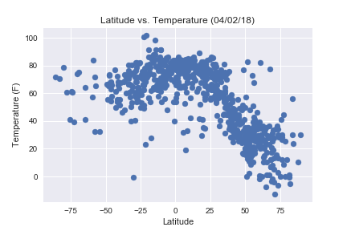
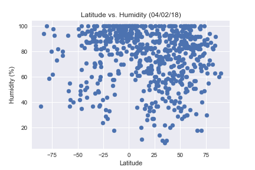

# Analysis
### 1.  Temperatures on average tend to be higher with latitudes that are closer to the equator
### 2.  Humidity on average tends to be higher with latitudes  that are closer the equator
### 3.  There is no correlation between the cloudiness and the distance

```python
#Dependencies
import openweathermapy.core as owm
import matplotlib.pyplot as plt
import seaborn as sns
import pandas as pd
import numpy as np
import json
import requests
from citipy import citipy
import random
import time as time
```


```python
#Import api_key
from config import api_key
```


```python
#Randomly select at least 500 unique (non-repeat) cities based on latitude and longitude:
    # Latitude in degrees is -90 and +90
    # Longitude is in the range -180 and +180

#Creating a dataframe to display the values
cities_df = pd.DataFrame(columns =
                            ['City',
                             'Latitudes',
                             'Longitudes',
                            ])
#Creating a list to hold the variables
lat = []
lng = []
cities = []

#Creating loops to go through random lat and lng and assigning cities based on coordinates picked
    #2000 was chosen in order to ensure that atleast 500 would be unique (non-repeat) cities
for x in range(0,2000):
    lat.append(random.uniform(-90,90))
    lng.append(random.uniform(-180,180))
cities_df['Latitudes']  = lat
cities_df['Longitudes'] = lng

for index, row in cities_df.iterrows():
    city = citipy.nearest_city(row["Latitudes"],row["Longitudes"])
    cities.append(city.city_name)
cities_df['City'] = cities

#Displaying the top five
cities_df.head()
```


<div>
<style scoped>
    .dataframe tbody tr th:only-of-type {
        vertical-align: middle;
    }

    .dataframe tbody tr th {
        vertical-align: top;
    }

    .dataframe thead th {
        text-align: right;
    }
</style>
<table border="1" class="dataframe">
  <thead>
    <tr style="text-align: right;">
      <th></th>
      <th>City</th>
      <th>Latitudes</th>
      <th>Longitudes</th>
    </tr>
  </thead>
  <tbody>
    <tr>
      <th>0</th>
      <td>port alfred</td>
      <td>-83.116052</td>
      <td>41.423236</td>
    </tr>
    <tr>
      <th>1</th>
      <td>ushuaia</td>
      <td>-72.725555</td>
      <td>-67.157955</td>
    </tr>
    <tr>
      <th>2</th>
      <td>saint-augustin</td>
      <td>55.513625</td>
      <td>-59.669481</td>
    </tr>
    <tr>
      <th>3</th>
      <td>qaqortoq</td>
      <td>56.787482</td>
      <td>-49.161251</td>
    </tr>
    <tr>
      <th>4</th>
      <td>erdenet</td>
      <td>48.236135</td>
      <td>104.984722</td>
    </tr>
  </tbody>
</table>
</div>


```python
#Dropping duplicates and NaN values from the data set
new_cities_df = cities_df.drop_duplicates("City", keep = "first")
new_cities_df =  new_cities_df.dropna(axis= 1, how = 'all')
len(new_cities_df)
```


    757


```python
#Creating empty lists to hold the information
temp = []
wind_speed = []
cloudiness = []
humidity = []

#Calling the API and creating a loop to go through all the cities and extract needed information
base_url = "http://api.openweathermap.org/data/2.5/weather?q="

counter = 0

for index, row in new_cities_df.iterrows():
    try:
        target_url = base_url + row["City"] + "&units=imperial" + "&appid="+ api_key
        time.sleep(1)
        response = requests.get(target_url).json()
        temp.append(response["main"]["temp"])
        wind_speed.append(response["wind"]["speed"])
        cloudiness.append(response["clouds"]["all"])
        humidity.append(response["main"]["humidity"])
    except:
        new_cities_df.drop(index, inplace = True)
        pass

    print("We are on city number " + str(counter))
    counter = counter + 1
    print("This is the city: " + row['City'])
    print(target_url)  
```

    We are on city number 0
    This is the city: port alfred
    http://api.openweathermap.org/data/2.5/weather?q=port alfred&units=imperial&appid=288bd40bdc806164c2b347c489a98cf6
    We are on city number 1
    This is the city: ushuaia
    http://api.openweathermap.org/data/2.5/weather?q=ushuaia&units=imperial&appid=288bd40bdc806164c2b347c489a98cf6
    We are on city number 2
    This is the city: saint-augustin
    http://api.openweathermap.org/data/2.5/weather?q=saint-augustin&units=imperial&appid=288bd40bdc806164c2b347c489a98cf6
    We are on city number 3
    This is the city: qaqortoq
    http://api.openweathermap.org/data/2.5/weather?q=qaqortoq&units=imperial&appid=288bd40bdc806164c2b347c489a98cf6
    We are on city number 4
    This is the city: erdenet
    http://api.openweathermap.org/data/2.5/weather?q=erdenet&units=imperial&appid=288bd40bdc806164c2b347c489a98cf6
    We are on city number 5
    This is the city: mataura
    http://api.openweathermap.org/data/2.5/weather?q=mataura&units=imperial&appid=288bd40bdc806164c2b347c489a98cf6
    We are on city number 6
    This is the city: tsihombe
    http://api.openweathermap.org/data/2.5/weather?q=tsihombe&units=imperial&appid=288bd40bdc806164c2b347c489a98cf6
    We are on city number 7
    This is the city: kavaratti
    http://api.openweathermap.org/data/2.5/weather?q=kavaratti&units=imperial&appid=288bd40bdc806164c2b347c489a98cf6
    We are on city number 8
    This is the city: nikolskoye
    http://api.openweathermap.org/data/2.5/weather?q=nikolskoye&units=imperial&appid=288bd40bdc806164c2b347c489a98cf6
    We are on city number 9
    This is the city: maua
    http://api.openweathermap.org/data/2.5/weather?q=maua&units=imperial&appid=288bd40bdc806164c2b347c489a98cf6
    We are on city number 10
    This is the city: albany
    http://api.openweathermap.org/data/2.5/weather?q=albany&units=imperial&appid=288bd40bdc806164c2b347c489a98cf6
    We are on city number 11
    This is the city: tiznit
    http://api.openweathermap.org/data/2.5/weather?q=tiznit&units=imperial&appid=288bd40bdc806164c2b347c489a98cf6
    We are on city number 12
    This is the city: odweyne
    http://api.openweathermap.org/data/2.5/weather?q=odweyne&units=imperial&appid=288bd40bdc806164c2b347c489a98cf6
    We are on city number 13
    This is the city: punta arenas
    http://api.openweathermap.org/data/2.5/weather?q=punta arenas&units=imperial&appid=288bd40bdc806164c2b347c489a98cf6
    We are on city number 14
    This is the city: kodiak
    http://api.openweathermap.org/data/2.5/weather?q=kodiak&units=imperial&appid=288bd40bdc806164c2b347c489a98cf6
    We are on city number 15
    This is the city: guerrero negro
    http://api.openweathermap.org/data/2.5/weather?q=guerrero negro&units=imperial&appid=288bd40bdc806164c2b347c489a98cf6
    We are on city number 16
    This is the city: ukmerge
    http://api.openweathermap.org/data/2.5/weather?q=ukmerge&units=imperial&appid=288bd40bdc806164c2b347c489a98cf6
    We are on city number 17
    This is the city: chuy
    http://api.openweathermap.org/data/2.5/weather?q=chuy&units=imperial&appid=288bd40bdc806164c2b347c489a98cf6
    We are on city number 18
    This is the city: grand-lahou
    http://api.openweathermap.org/data/2.5/weather?q=grand-lahou&units=imperial&appid=288bd40bdc806164c2b347c489a98cf6
    We are on city number 19
    This is the city: conceicao do araguaia
    http://api.openweathermap.org/data/2.5/weather?q=conceicao do araguaia&units=imperial&appid=288bd40bdc806164c2b347c489a98cf6
    We are on city number 20
    This is the city: cape town
    http://api.openweathermap.org/data/2.5/weather?q=cape town&units=imperial&appid=288bd40bdc806164c2b347c489a98cf6
    We are on city number 21
    This is the city: tsienyane
    http://api.openweathermap.org/data/2.5/weather?q=tsienyane&units=imperial&appid=288bd40bdc806164c2b347c489a98cf6
    We are on city number 22
    This is the city: swakopmund
    http://api.openweathermap.org/data/2.5/weather?q=swakopmund&units=imperial&appid=288bd40bdc806164c2b347c489a98cf6
    We are on city number 23
    This is the city: provideniya
    http://api.openweathermap.org/data/2.5/weather?q=provideniya&units=imperial&appid=288bd40bdc806164c2b347c489a98cf6
    We are on city number 24
    This is the city: saint-georges
    http://api.openweathermap.org/data/2.5/weather?q=saint-georges&units=imperial&appid=288bd40bdc806164c2b347c489a98cf6
    We are on city number 25
    This is the city: lisakovsk
    http://api.openweathermap.org/data/2.5/weather?q=lisakovsk&units=imperial&appid=288bd40bdc806164c2b347c489a98cf6
    We are on city number 26
    This is the city: hobart
    http://api.openweathermap.org/data/2.5/weather?q=hobart&units=imperial&appid=288bd40bdc806164c2b347c489a98cf6
    We are on city number 27
    This is the city: qasigiannguit
    http://api.openweathermap.org/data/2.5/weather?q=qasigiannguit&units=imperial&appid=288bd40bdc806164c2b347c489a98cf6
    We are on city number 28
    This is the city: belushya guba
    http://api.openweathermap.org/data/2.5/weather?q=belushya guba&units=imperial&appid=288bd40bdc806164c2b347c489a98cf6
    We are on city number 29
    This is the city: grand river south east
    http://api.openweathermap.org/data/2.5/weather?q=grand river south east&units=imperial&appid=288bd40bdc806164c2b347c489a98cf6
    We are on city number 30
    This is the city: puerto ayora
    http://api.openweathermap.org/data/2.5/weather?q=puerto ayora&units=imperial&appid=288bd40bdc806164c2b347c489a98cf6
    We are on city number 31
    This is the city: mount gambier
    http://api.openweathermap.org/data/2.5/weather?q=mount gambier&units=imperial&appid=288bd40bdc806164c2b347c489a98cf6
    We are on city number 32
    This is the city: havoysund
    http://api.openweathermap.org/data/2.5/weather?q=havoysund&units=imperial&appid=288bd40bdc806164c2b347c489a98cf6
    We are on city number 33
    This is the city: grindavik
    http://api.openweathermap.org/data/2.5/weather?q=grindavik&units=imperial&appid=288bd40bdc806164c2b347c489a98cf6
    We are on city number 34
    This is the city: wahpeton
    http://api.openweathermap.org/data/2.5/weather?q=wahpeton&units=imperial&appid=288bd40bdc806164c2b347c489a98cf6
    We are on city number 35
    This is the city: codrington
    http://api.openweathermap.org/data/2.5/weather?q=codrington&units=imperial&appid=288bd40bdc806164c2b347c489a98cf6
    We are on city number 36
    This is the city: butaritari
    http://api.openweathermap.org/data/2.5/weather?q=butaritari&units=imperial&appid=288bd40bdc806164c2b347c489a98cf6
    We are on city number 37
    This is the city: dormont
    http://api.openweathermap.org/data/2.5/weather?q=dormont&units=imperial&appid=288bd40bdc806164c2b347c489a98cf6
    We are on city number 38
    This is the city: pevek
    http://api.openweathermap.org/data/2.5/weather?q=pevek&units=imperial&appid=288bd40bdc806164c2b347c489a98cf6
    We are on city number 39
    This is the city: barentsburg
    http://api.openweathermap.org/data/2.5/weather?q=barentsburg&units=imperial&appid=288bd40bdc806164c2b347c489a98cf6
    We are on city number 40
    This is the city: kahului
    http://api.openweathermap.org/data/2.5/weather?q=kahului&units=imperial&appid=288bd40bdc806164c2b347c489a98cf6
    We are on city number 41
    This is the city: port hawkesbury
    http://api.openweathermap.org/data/2.5/weather?q=port hawkesbury&units=imperial&appid=288bd40bdc806164c2b347c489a98cf6
    We are on city number 42
    This is the city: ankazoabo
    http://api.openweathermap.org/data/2.5/weather?q=ankazoabo&units=imperial&appid=288bd40bdc806164c2b347c489a98cf6
    We are on city number 43
    This is the city: yanchukan
    http://api.openweathermap.org/data/2.5/weather?q=yanchukan&units=imperial&appid=288bd40bdc806164c2b347c489a98cf6
    We are on city number 44
    This is the city: rikitea
    http://api.openweathermap.org/data/2.5/weather?q=rikitea&units=imperial&appid=288bd40bdc806164c2b347c489a98cf6
    We are on city number 45
    This is the city: vanimo
    http://api.openweathermap.org/data/2.5/weather?q=vanimo&units=imperial&appid=288bd40bdc806164c2b347c489a98cf6
    We are on city number 46
    This is the city: sioux lookout
    http://api.openweathermap.org/data/2.5/weather?q=sioux lookout&units=imperial&appid=288bd40bdc806164c2b347c489a98cf6
    We are on city number 47
    This is the city: bethel
    http://api.openweathermap.org/data/2.5/weather?q=bethel&units=imperial&appid=288bd40bdc806164c2b347c489a98cf6
    We are on city number 48
    This is the city: busselton
    http://api.openweathermap.org/data/2.5/weather?q=busselton&units=imperial&appid=288bd40bdc806164c2b347c489a98cf6
    We are on city number 49
    This is the city: tiksi
    http://api.openweathermap.org/data/2.5/weather?q=tiksi&units=imperial&appid=288bd40bdc806164c2b347c489a98cf6
    We are on city number 50
    This is the city: dikson
    http://api.openweathermap.org/data/2.5/weather?q=dikson&units=imperial&appid=288bd40bdc806164c2b347c489a98cf6
    We are on city number 51
    This is the city: kaeo
    http://api.openweathermap.org/data/2.5/weather?q=kaeo&units=imperial&appid=288bd40bdc806164c2b347c489a98cf6
    We are on city number 52
    This is the city: yar-sale
    http://api.openweathermap.org/data/2.5/weather?q=yar-sale&units=imperial&appid=288bd40bdc806164c2b347c489a98cf6
    We are on city number 53
    This is the city: xinxiang
    http://api.openweathermap.org/data/2.5/weather?q=xinxiang&units=imperial&appid=288bd40bdc806164c2b347c489a98cf6
    We are on city number 54
    This is the city: thompson
    http://api.openweathermap.org/data/2.5/weather?q=thompson&units=imperial&appid=288bd40bdc806164c2b347c489a98cf6
    We are on city number 55
    This is the city: meyungs
    http://api.openweathermap.org/data/2.5/weather?q=meyungs&units=imperial&appid=288bd40bdc806164c2b347c489a98cf6
    We are on city number 56
    This is the city: jamestown
    http://api.openweathermap.org/data/2.5/weather?q=jamestown&units=imperial&appid=288bd40bdc806164c2b347c489a98cf6
    We are on city number 57
    This is the city: valdivia
    http://api.openweathermap.org/data/2.5/weather?q=valdivia&units=imperial&appid=288bd40bdc806164c2b347c489a98cf6
    We are on city number 58
    This is the city: kapaa
    http://api.openweathermap.org/data/2.5/weather?q=kapaa&units=imperial&appid=288bd40bdc806164c2b347c489a98cf6
    We are on city number 59
    This is the city: nadym
    http://api.openweathermap.org/data/2.5/weather?q=nadym&units=imperial&appid=288bd40bdc806164c2b347c489a98cf6
    We are on city number 60
    This is the city: bengkulu
    http://api.openweathermap.org/data/2.5/weather?q=bengkulu&units=imperial&appid=288bd40bdc806164c2b347c489a98cf6
    We are on city number 61
    This is the city: san cristobal
    http://api.openweathermap.org/data/2.5/weather?q=san cristobal&units=imperial&appid=288bd40bdc806164c2b347c489a98cf6
    We are on city number 62
    This is the city: tuktoyaktuk
    http://api.openweathermap.org/data/2.5/weather?q=tuktoyaktuk&units=imperial&appid=288bd40bdc806164c2b347c489a98cf6
    We are on city number 63
    This is the city: moron
    http://api.openweathermap.org/data/2.5/weather?q=moron&units=imperial&appid=288bd40bdc806164c2b347c489a98cf6
    We are on city number 64
    This is the city: bredasdorp
    http://api.openweathermap.org/data/2.5/weather?q=bredasdorp&units=imperial&appid=288bd40bdc806164c2b347c489a98cf6
    We are on city number 65
    This is the city: taolanaro
    http://api.openweathermap.org/data/2.5/weather?q=taolanaro&units=imperial&appid=288bd40bdc806164c2b347c489a98cf6
    We are on city number 66
    This is the city: juneau
    http://api.openweathermap.org/data/2.5/weather?q=juneau&units=imperial&appid=288bd40bdc806164c2b347c489a98cf6
    We are on city number 67
    This is the city: mackay
    http://api.openweathermap.org/data/2.5/weather?q=mackay&units=imperial&appid=288bd40bdc806164c2b347c489a98cf6
    We are on city number 68
    This is the city: hambantota
    http://api.openweathermap.org/data/2.5/weather?q=hambantota&units=imperial&appid=288bd40bdc806164c2b347c489a98cf6
    We are on city number 69
    This is the city: wum
    http://api.openweathermap.org/data/2.5/weather?q=wum&units=imperial&appid=288bd40bdc806164c2b347c489a98cf6
    We are on city number 70
    This is the city: calvinia
    http://api.openweathermap.org/data/2.5/weather?q=calvinia&units=imperial&appid=288bd40bdc806164c2b347c489a98cf6
    We are on city number 71
    This is the city: aykhal
    http://api.openweathermap.org/data/2.5/weather?q=aykhal&units=imperial&appid=288bd40bdc806164c2b347c489a98cf6
    We are on city number 72
    This is the city: jinchang
    http://api.openweathermap.org/data/2.5/weather?q=jinchang&units=imperial&appid=288bd40bdc806164c2b347c489a98cf6
    We are on city number 73
    This is the city: espeland
    http://api.openweathermap.org/data/2.5/weather?q=espeland&units=imperial&appid=288bd40bdc806164c2b347c489a98cf6
    We are on city number 74
    This is the city: batemans bay
    http://api.openweathermap.org/data/2.5/weather?q=batemans bay&units=imperial&appid=288bd40bdc806164c2b347c489a98cf6
    We are on city number 75
    This is the city: boulder
    http://api.openweathermap.org/data/2.5/weather?q=boulder&units=imperial&appid=288bd40bdc806164c2b347c489a98cf6
    We are on city number 76
    This is the city: sambava
    http://api.openweathermap.org/data/2.5/weather?q=sambava&units=imperial&appid=288bd40bdc806164c2b347c489a98cf6
    We are on city number 77
    This is the city: kutum
    http://api.openweathermap.org/data/2.5/weather?q=kutum&units=imperial&appid=288bd40bdc806164c2b347c489a98cf6
    We are on city number 78
    This is the city: ponta do sol
    http://api.openweathermap.org/data/2.5/weather?q=ponta do sol&units=imperial&appid=288bd40bdc806164c2b347c489a98cf6
    We are on city number 79
    This is the city: tasiilaq
    http://api.openweathermap.org/data/2.5/weather?q=tasiilaq&units=imperial&appid=288bd40bdc806164c2b347c489a98cf6
    We are on city number 80
    This is the city: muros
    http://api.openweathermap.org/data/2.5/weather?q=muros&units=imperial&appid=288bd40bdc806164c2b347c489a98cf6
    We are on city number 81
    This is the city: lishui
    http://api.openweathermap.org/data/2.5/weather?q=lishui&units=imperial&appid=288bd40bdc806164c2b347c489a98cf6
    We are on city number 82
    This is the city: moses lake
    http://api.openweathermap.org/data/2.5/weather?q=moses lake&units=imperial&appid=288bd40bdc806164c2b347c489a98cf6
    We are on city number 83
    This is the city: zhuhai
    http://api.openweathermap.org/data/2.5/weather?q=zhuhai&units=imperial&appid=288bd40bdc806164c2b347c489a98cf6
    We are on city number 84
    This is the city: ostrovnoy
    http://api.openweathermap.org/data/2.5/weather?q=ostrovnoy&units=imperial&appid=288bd40bdc806164c2b347c489a98cf6
    We are on city number 85
    This is the city: avarua
    http://api.openweathermap.org/data/2.5/weather?q=avarua&units=imperial&appid=288bd40bdc806164c2b347c489a98cf6
    We are on city number 86
    This is the city: torbay
    http://api.openweathermap.org/data/2.5/weather?q=torbay&units=imperial&appid=288bd40bdc806164c2b347c489a98cf6
    We are on city number 87
    This is the city: mar del plata
    http://api.openweathermap.org/data/2.5/weather?q=mar del plata&units=imperial&appid=288bd40bdc806164c2b347c489a98cf6
    We are on city number 88
    This is the city: hay river
    http://api.openweathermap.org/data/2.5/weather?q=hay river&units=imperial&appid=288bd40bdc806164c2b347c489a98cf6
    We are on city number 89
    This is the city: hermanus
    http://api.openweathermap.org/data/2.5/weather?q=hermanus&units=imperial&appid=288bd40bdc806164c2b347c489a98cf6
    We are on city number 90
    This is the city: maltahohe
    http://api.openweathermap.org/data/2.5/weather?q=maltahohe&units=imperial&appid=288bd40bdc806164c2b347c489a98cf6
    We are on city number 91
    This is the city: narsaq
    http://api.openweathermap.org/data/2.5/weather?q=narsaq&units=imperial&appid=288bd40bdc806164c2b347c489a98cf6
    We are on city number 92
    This is the city: lasa
    http://api.openweathermap.org/data/2.5/weather?q=lasa&units=imperial&appid=288bd40bdc806164c2b347c489a98cf6
    We are on city number 93
    This is the city: anadyr
    http://api.openweathermap.org/data/2.5/weather?q=anadyr&units=imperial&appid=288bd40bdc806164c2b347c489a98cf6
    We are on city number 94
    This is the city: yuzhno-sukhokumsk
    http://api.openweathermap.org/data/2.5/weather?q=yuzhno-sukhokumsk&units=imperial&appid=288bd40bdc806164c2b347c489a98cf6
    We are on city number 95
    This is the city: klaksvik
    http://api.openweathermap.org/data/2.5/weather?q=klaksvik&units=imperial&appid=288bd40bdc806164c2b347c489a98cf6
    We are on city number 96
    This is the city: isangel
    http://api.openweathermap.org/data/2.5/weather?q=isangel&units=imperial&appid=288bd40bdc806164c2b347c489a98cf6
    We are on city number 97
    This is the city: port elizabeth
    http://api.openweathermap.org/data/2.5/weather?q=port elizabeth&units=imperial&appid=288bd40bdc806164c2b347c489a98cf6
    We are on city number 98
    This is the city: hilo
    http://api.openweathermap.org/data/2.5/weather?q=hilo&units=imperial&appid=288bd40bdc806164c2b347c489a98cf6
    We are on city number 99
    This is the city: lorengau
    http://api.openweathermap.org/data/2.5/weather?q=lorengau&units=imperial&appid=288bd40bdc806164c2b347c489a98cf6
    We are on city number 100
    This is the city: nanortalik
    http://api.openweathermap.org/data/2.5/weather?q=nanortalik&units=imperial&appid=288bd40bdc806164c2b347c489a98cf6
    We are on city number 101
    This is the city: kisangani
    http://api.openweathermap.org/data/2.5/weather?q=kisangani&units=imperial&appid=288bd40bdc806164c2b347c489a98cf6
    We are on city number 102
    This is the city: bluff
    http://api.openweathermap.org/data/2.5/weather?q=bluff&units=imperial&appid=288bd40bdc806164c2b347c489a98cf6
    We are on city number 103
    This is the city: tuatapere
    http://api.openweathermap.org/data/2.5/weather?q=tuatapere&units=imperial&appid=288bd40bdc806164c2b347c489a98cf6
    We are on city number 104
    This is the city: gobabis
    http://api.openweathermap.org/data/2.5/weather?q=gobabis&units=imperial&appid=288bd40bdc806164c2b347c489a98cf6
    We are on city number 105
    This is the city: aquiraz
    http://api.openweathermap.org/data/2.5/weather?q=aquiraz&units=imperial&appid=288bd40bdc806164c2b347c489a98cf6
    We are on city number 106
    This is the city: guaymas
    http://api.openweathermap.org/data/2.5/weather?q=guaymas&units=imperial&appid=288bd40bdc806164c2b347c489a98cf6
    We are on city number 107
    This is the city: castro
    http://api.openweathermap.org/data/2.5/weather?q=castro&units=imperial&appid=288bd40bdc806164c2b347c489a98cf6
    We are on city number 108
    This is the city: pogradec
    http://api.openweathermap.org/data/2.5/weather?q=pogradec&units=imperial&appid=288bd40bdc806164c2b347c489a98cf6
    We are on city number 109
    This is the city: las palmas
    http://api.openweathermap.org/data/2.5/weather?q=las palmas&units=imperial&appid=288bd40bdc806164c2b347c489a98cf6
    We are on city number 110
    This is the city: cherskiy
    http://api.openweathermap.org/data/2.5/weather?q=cherskiy&units=imperial&appid=288bd40bdc806164c2b347c489a98cf6
    We are on city number 111
    This is the city: cidreira
    http://api.openweathermap.org/data/2.5/weather?q=cidreira&units=imperial&appid=288bd40bdc806164c2b347c489a98cf6
    We are on city number 112
    This is the city: komsomolskiy
    http://api.openweathermap.org/data/2.5/weather?q=komsomolskiy&units=imperial&appid=288bd40bdc806164c2b347c489a98cf6
    We are on city number 113
    This is the city: mys shmidta
    http://api.openweathermap.org/data/2.5/weather?q=mys shmidta&units=imperial&appid=288bd40bdc806164c2b347c489a98cf6
    We are on city number 114
    This is the city: barrow
    http://api.openweathermap.org/data/2.5/weather?q=barrow&units=imperial&appid=288bd40bdc806164c2b347c489a98cf6
    We are on city number 115
    This is the city: hasaki
    http://api.openweathermap.org/data/2.5/weather?q=hasaki&units=imperial&appid=288bd40bdc806164c2b347c489a98cf6
    We are on city number 116
    This is the city: jutai
    http://api.openweathermap.org/data/2.5/weather?q=jutai&units=imperial&appid=288bd40bdc806164c2b347c489a98cf6
    We are on city number 117
    This is the city: sentyabrskiy
    http://api.openweathermap.org/data/2.5/weather?q=sentyabrskiy&units=imperial&appid=288bd40bdc806164c2b347c489a98cf6
    We are on city number 118
    This is the city: fernandopolis
    http://api.openweathermap.org/data/2.5/weather?q=fernandopolis&units=imperial&appid=288bd40bdc806164c2b347c489a98cf6
    We are on city number 119
    This is the city: itaueira
    http://api.openweathermap.org/data/2.5/weather?q=itaueira&units=imperial&appid=288bd40bdc806164c2b347c489a98cf6
    We are on city number 120
    This is the city: sorvag
    http://api.openweathermap.org/data/2.5/weather?q=sorvag&units=imperial&appid=288bd40bdc806164c2b347c489a98cf6
    We are on city number 121
    This is the city: la paz
    http://api.openweathermap.org/data/2.5/weather?q=la paz&units=imperial&appid=288bd40bdc806164c2b347c489a98cf6
    We are on city number 122
    This is the city: fairbanks
    http://api.openweathermap.org/data/2.5/weather?q=fairbanks&units=imperial&appid=288bd40bdc806164c2b347c489a98cf6
    We are on city number 123
    This is the city: sabang
    http://api.openweathermap.org/data/2.5/weather?q=sabang&units=imperial&appid=288bd40bdc806164c2b347c489a98cf6
    We are on city number 124
    This is the city: baykit
    http://api.openweathermap.org/data/2.5/weather?q=baykit&units=imperial&appid=288bd40bdc806164c2b347c489a98cf6
    We are on city number 125
    This is the city: mwinilunga
    http://api.openweathermap.org/data/2.5/weather?q=mwinilunga&units=imperial&appid=288bd40bdc806164c2b347c489a98cf6
    We are on city number 126
    This is the city: qaanaaq
    http://api.openweathermap.org/data/2.5/weather?q=qaanaaq&units=imperial&appid=288bd40bdc806164c2b347c489a98cf6
    We are on city number 127
    This is the city: warqla
    http://api.openweathermap.org/data/2.5/weather?q=warqla&units=imperial&appid=288bd40bdc806164c2b347c489a98cf6
    We are on city number 128
    This is the city: mullaitivu
    http://api.openweathermap.org/data/2.5/weather?q=mullaitivu&units=imperial&appid=288bd40bdc806164c2b347c489a98cf6
    We are on city number 129
    This is the city: kaitangata
    http://api.openweathermap.org/data/2.5/weather?q=kaitangata&units=imperial&appid=288bd40bdc806164c2b347c489a98cf6
    We are on city number 130
    This is the city: sompeta
    http://api.openweathermap.org/data/2.5/weather?q=sompeta&units=imperial&appid=288bd40bdc806164c2b347c489a98cf6
    We are on city number 131
    This is the city: sorland
    http://api.openweathermap.org/data/2.5/weather?q=sorland&units=imperial&appid=288bd40bdc806164c2b347c489a98cf6
    We are on city number 132
    This is the city: venice
    http://api.openweathermap.org/data/2.5/weather?q=venice&units=imperial&appid=288bd40bdc806164c2b347c489a98cf6
    We are on city number 133
    This is the city: grootegast
    http://api.openweathermap.org/data/2.5/weather?q=grootegast&units=imperial&appid=288bd40bdc806164c2b347c489a98cf6
    We are on city number 134
    This is the city: abulug
    http://api.openweathermap.org/data/2.5/weather?q=abulug&units=imperial&appid=288bd40bdc806164c2b347c489a98cf6
    We are on city number 135
    This is the city: karkaralinsk
    http://api.openweathermap.org/data/2.5/weather?q=karkaralinsk&units=imperial&appid=288bd40bdc806164c2b347c489a98cf6
    We are on city number 136
    This is the city: new norfolk
    http://api.openweathermap.org/data/2.5/weather?q=new norfolk&units=imperial&appid=288bd40bdc806164c2b347c489a98cf6
    We are on city number 137
    This is the city: saint-philippe
    http://api.openweathermap.org/data/2.5/weather?q=saint-philippe&units=imperial&appid=288bd40bdc806164c2b347c489a98cf6
    We are on city number 138
    This is the city: sinop
    http://api.openweathermap.org/data/2.5/weather?q=sinop&units=imperial&appid=288bd40bdc806164c2b347c489a98cf6
    We are on city number 139
    This is the city: ust-nera
    http://api.openweathermap.org/data/2.5/weather?q=ust-nera&units=imperial&appid=288bd40bdc806164c2b347c489a98cf6
    We are on city number 140
    This is the city: labuhan
    http://api.openweathermap.org/data/2.5/weather?q=labuhan&units=imperial&appid=288bd40bdc806164c2b347c489a98cf6
    We are on city number 141
    This is the city: attawapiskat
    http://api.openweathermap.org/data/2.5/weather?q=attawapiskat&units=imperial&appid=288bd40bdc806164c2b347c489a98cf6
    We are on city number 142
    This is the city: touros
    http://api.openweathermap.org/data/2.5/weather?q=touros&units=imperial&appid=288bd40bdc806164c2b347c489a98cf6
    We are on city number 143
    This is the city: oranjemund
    http://api.openweathermap.org/data/2.5/weather?q=oranjemund&units=imperial&appid=288bd40bdc806164c2b347c489a98cf6
    We are on city number 144
    This is the city: dunedin
    http://api.openweathermap.org/data/2.5/weather?q=dunedin&units=imperial&appid=288bd40bdc806164c2b347c489a98cf6
    We are on city number 145
    This is the city: a
    http://api.openweathermap.org/data/2.5/weather?q=a&units=imperial&appid=288bd40bdc806164c2b347c489a98cf6
    We are on city number 146
    This is the city: bloemfontein
    http://api.openweathermap.org/data/2.5/weather?q=bloemfontein&units=imperial&appid=288bd40bdc806164c2b347c489a98cf6
    We are on city number 147
    This is the city: sioni
    http://api.openweathermap.org/data/2.5/weather?q=sioni&units=imperial&appid=288bd40bdc806164c2b347c489a98cf6
    We are on city number 148
    This is the city: ancud
    http://api.openweathermap.org/data/2.5/weather?q=ancud&units=imperial&appid=288bd40bdc806164c2b347c489a98cf6
    We are on city number 149
    This is the city: asheboro
    http://api.openweathermap.org/data/2.5/weather?q=asheboro&units=imperial&appid=288bd40bdc806164c2b347c489a98cf6
    We are on city number 150
    This is the city: balykshi
    http://api.openweathermap.org/data/2.5/weather?q=balykshi&units=imperial&appid=288bd40bdc806164c2b347c489a98cf6
    We are on city number 151
    This is the city: xichang
    http://api.openweathermap.org/data/2.5/weather?q=xichang&units=imperial&appid=288bd40bdc806164c2b347c489a98cf6
    We are on city number 152
    This is the city: chimbote
    http://api.openweathermap.org/data/2.5/weather?q=chimbote&units=imperial&appid=288bd40bdc806164c2b347c489a98cf6
    We are on city number 153
    This is the city: carnarvon
    http://api.openweathermap.org/data/2.5/weather?q=carnarvon&units=imperial&appid=288bd40bdc806164c2b347c489a98cf6
    We are on city number 154
    This is the city: husavik
    http://api.openweathermap.org/data/2.5/weather?q=husavik&units=imperial&appid=288bd40bdc806164c2b347c489a98cf6
    We are on city number 155
    This is the city: yellowknife
    http://api.openweathermap.org/data/2.5/weather?q=yellowknife&units=imperial&appid=288bd40bdc806164c2b347c489a98cf6
    We are on city number 156
    This is the city: shelburne
    http://api.openweathermap.org/data/2.5/weather?q=shelburne&units=imperial&appid=288bd40bdc806164c2b347c489a98cf6
    We are on city number 157
    This is the city: grand gaube
    http://api.openweathermap.org/data/2.5/weather?q=grand gaube&units=imperial&appid=288bd40bdc806164c2b347c489a98cf6
    We are on city number 158
    This is the city: egvekinot
    http://api.openweathermap.org/data/2.5/weather?q=egvekinot&units=imperial&appid=288bd40bdc806164c2b347c489a98cf6
    We are on city number 159
    This is the city: poum
    http://api.openweathermap.org/data/2.5/weather?q=poum&units=imperial&appid=288bd40bdc806164c2b347c489a98cf6
    We are on city number 160
    This is the city: kangaatsiaq
    http://api.openweathermap.org/data/2.5/weather?q=kangaatsiaq&units=imperial&appid=288bd40bdc806164c2b347c489a98cf6
    We are on city number 161
    This is the city: ponta delgada
    http://api.openweathermap.org/data/2.5/weather?q=ponta delgada&units=imperial&appid=288bd40bdc806164c2b347c489a98cf6
    We are on city number 162
    This is the city: linguere
    http://api.openweathermap.org/data/2.5/weather?q=linguere&units=imperial&appid=288bd40bdc806164c2b347c489a98cf6
    We are on city number 163
    This is the city: atar
    http://api.openweathermap.org/data/2.5/weather?q=atar&units=imperial&appid=288bd40bdc806164c2b347c489a98cf6
    We are on city number 164
    This is the city: samusu
    http://api.openweathermap.org/data/2.5/weather?q=samusu&units=imperial&appid=288bd40bdc806164c2b347c489a98cf6
    We are on city number 165
    This is the city: arraial do cabo
    http://api.openweathermap.org/data/2.5/weather?q=arraial do cabo&units=imperial&appid=288bd40bdc806164c2b347c489a98cf6
    We are on city number 166
    This is the city: mahebourg
    http://api.openweathermap.org/data/2.5/weather?q=mahebourg&units=imperial&appid=288bd40bdc806164c2b347c489a98cf6
    We are on city number 167
    This is the city: victoria
    http://api.openweathermap.org/data/2.5/weather?q=victoria&units=imperial&appid=288bd40bdc806164c2b347c489a98cf6
    We are on city number 168
    This is the city: illoqqortoormiut
    http://api.openweathermap.org/data/2.5/weather?q=illoqqortoormiut&units=imperial&appid=288bd40bdc806164c2b347c489a98cf6
    We are on city number 169
    This is the city: saldanha
    http://api.openweathermap.org/data/2.5/weather?q=saldanha&units=imperial&appid=288bd40bdc806164c2b347c489a98cf6
    We are on city number 170
    This is the city: sao joao da barra
    http://api.openweathermap.org/data/2.5/weather?q=sao joao da barra&units=imperial&appid=288bd40bdc806164c2b347c489a98cf6
    We are on city number 171
    This is the city: chokurdakh
    http://api.openweathermap.org/data/2.5/weather?q=chokurdakh&units=imperial&appid=288bd40bdc806164c2b347c489a98cf6
    We are on city number 172
    This is the city: rungata
    http://api.openweathermap.org/data/2.5/weather?q=rungata&units=imperial&appid=288bd40bdc806164c2b347c489a98cf6
    We are on city number 173
    This is the city: bambanglipuro
    http://api.openweathermap.org/data/2.5/weather?q=bambanglipuro&units=imperial&appid=288bd40bdc806164c2b347c489a98cf6
    We are on city number 174
    This is the city: ribeira grande
    http://api.openweathermap.org/data/2.5/weather?q=ribeira grande&units=imperial&appid=288bd40bdc806164c2b347c489a98cf6
    We are on city number 175
    This is the city: isla mujeres
    http://api.openweathermap.org/data/2.5/weather?q=isla mujeres&units=imperial&appid=288bd40bdc806164c2b347c489a98cf6
    We are on city number 176
    This is the city: atuona
    http://api.openweathermap.org/data/2.5/weather?q=atuona&units=imperial&appid=288bd40bdc806164c2b347c489a98cf6
    We are on city number 177
    This is the city: launceston
    http://api.openweathermap.org/data/2.5/weather?q=launceston&units=imperial&appid=288bd40bdc806164c2b347c489a98cf6
    We are on city number 178
    This is the city: ojinaga
    http://api.openweathermap.org/data/2.5/weather?q=ojinaga&units=imperial&appid=288bd40bdc806164c2b347c489a98cf6
    We are on city number 179
    This is the city: pangnirtung
    http://api.openweathermap.org/data/2.5/weather?q=pangnirtung&units=imperial&appid=288bd40bdc806164c2b347c489a98cf6
    We are on city number 180
    This is the city: samarai
    http://api.openweathermap.org/data/2.5/weather?q=samarai&units=imperial&appid=288bd40bdc806164c2b347c489a98cf6
    We are on city number 181
    This is the city: cabo san lucas
    http://api.openweathermap.org/data/2.5/weather?q=cabo san lucas&units=imperial&appid=288bd40bdc806164c2b347c489a98cf6
    We are on city number 182
    This is the city: kavieng
    http://api.openweathermap.org/data/2.5/weather?q=kavieng&units=imperial&appid=288bd40bdc806164c2b347c489a98cf6
    We are on city number 183
    This is the city: agua verde
    http://api.openweathermap.org/data/2.5/weather?q=agua verde&units=imperial&appid=288bd40bdc806164c2b347c489a98cf6
    We are on city number 184
    This is the city: blackfoot
    http://api.openweathermap.org/data/2.5/weather?q=blackfoot&units=imperial&appid=288bd40bdc806164c2b347c489a98cf6
    We are on city number 185
    This is the city: peniche
    http://api.openweathermap.org/data/2.5/weather?q=peniche&units=imperial&appid=288bd40bdc806164c2b347c489a98cf6
    We are on city number 186
    This is the city: kholtoson
    http://api.openweathermap.org/data/2.5/weather?q=kholtoson&units=imperial&appid=288bd40bdc806164c2b347c489a98cf6
    We are on city number 187
    This is the city: kayes
    http://api.openweathermap.org/data/2.5/weather?q=kayes&units=imperial&appid=288bd40bdc806164c2b347c489a98cf6
    We are on city number 188
    This is the city: wiang sa
    http://api.openweathermap.org/data/2.5/weather?q=wiang sa&units=imperial&appid=288bd40bdc806164c2b347c489a98cf6
    We are on city number 189
    This is the city: vaini
    http://api.openweathermap.org/data/2.5/weather?q=vaini&units=imperial&appid=288bd40bdc806164c2b347c489a98cf6
    We are on city number 190
    This is the city: ilula
    http://api.openweathermap.org/data/2.5/weather?q=ilula&units=imperial&appid=288bd40bdc806164c2b347c489a98cf6
    We are on city number 191
    This is the city: termiz
    http://api.openweathermap.org/data/2.5/weather?q=termiz&units=imperial&appid=288bd40bdc806164c2b347c489a98cf6
    We are on city number 192
    This is the city: georgetown
    http://api.openweathermap.org/data/2.5/weather?q=georgetown&units=imperial&appid=288bd40bdc806164c2b347c489a98cf6
    We are on city number 193
    This is the city: salalah
    http://api.openweathermap.org/data/2.5/weather?q=salalah&units=imperial&appid=288bd40bdc806164c2b347c489a98cf6
    We are on city number 194
    This is the city: kiruna
    http://api.openweathermap.org/data/2.5/weather?q=kiruna&units=imperial&appid=288bd40bdc806164c2b347c489a98cf6
    We are on city number 195
    This is the city: upernavik
    http://api.openweathermap.org/data/2.5/weather?q=upernavik&units=imperial&appid=288bd40bdc806164c2b347c489a98cf6
    We are on city number 196
    This is the city: richards bay
    http://api.openweathermap.org/data/2.5/weather?q=richards bay&units=imperial&appid=288bd40bdc806164c2b347c489a98cf6
    We are on city number 197
    This is the city: independence
    http://api.openweathermap.org/data/2.5/weather?q=independence&units=imperial&appid=288bd40bdc806164c2b347c489a98cf6
    We are on city number 198
    This is the city: mount isa
    http://api.openweathermap.org/data/2.5/weather?q=mount isa&units=imperial&appid=288bd40bdc806164c2b347c489a98cf6
    We are on city number 199
    This is the city: visconde do rio branco
    http://api.openweathermap.org/data/2.5/weather?q=visconde do rio branco&units=imperial&appid=288bd40bdc806164c2b347c489a98cf6
    We are on city number 200
    This is the city: san quintin
    http://api.openweathermap.org/data/2.5/weather?q=san quintin&units=imperial&appid=288bd40bdc806164c2b347c489a98cf6
    We are on city number 201
    This is the city: meulaboh
    http://api.openweathermap.org/data/2.5/weather?q=meulaboh&units=imperial&appid=288bd40bdc806164c2b347c489a98cf6
    We are on city number 202
    This is the city: berbera
    http://api.openweathermap.org/data/2.5/weather?q=berbera&units=imperial&appid=288bd40bdc806164c2b347c489a98cf6
    We are on city number 203
    This is the city: matiguas
    http://api.openweathermap.org/data/2.5/weather?q=matiguas&units=imperial&appid=288bd40bdc806164c2b347c489a98cf6
    We are on city number 204
    This is the city: miri
    http://api.openweathermap.org/data/2.5/weather?q=miri&units=imperial&appid=288bd40bdc806164c2b347c489a98cf6
    We are on city number 205
    This is the city: asau
    http://api.openweathermap.org/data/2.5/weather?q=asau&units=imperial&appid=288bd40bdc806164c2b347c489a98cf6
    We are on city number 206
    This is the city: lujan
    http://api.openweathermap.org/data/2.5/weather?q=lujan&units=imperial&appid=288bd40bdc806164c2b347c489a98cf6
    We are on city number 207
    This is the city: kruisfontein
    http://api.openweathermap.org/data/2.5/weather?q=kruisfontein&units=imperial&appid=288bd40bdc806164c2b347c489a98cf6
    We are on city number 208
    This is the city: hithadhoo
    http://api.openweathermap.org/data/2.5/weather?q=hithadhoo&units=imperial&appid=288bd40bdc806164c2b347c489a98cf6
    We are on city number 209
    This is the city: bar harbor
    http://api.openweathermap.org/data/2.5/weather?q=bar harbor&units=imperial&appid=288bd40bdc806164c2b347c489a98cf6
    We are on city number 210
    This is the city: bilma
    http://api.openweathermap.org/data/2.5/weather?q=bilma&units=imperial&appid=288bd40bdc806164c2b347c489a98cf6
    We are on city number 211
    This is the city: byron bay
    http://api.openweathermap.org/data/2.5/weather?q=byron bay&units=imperial&appid=288bd40bdc806164c2b347c489a98cf6
    We are on city number 212
    This is the city: kailua
    http://api.openweathermap.org/data/2.5/weather?q=kailua&units=imperial&appid=288bd40bdc806164c2b347c489a98cf6
    We are on city number 213
    This is the city: winneba
    http://api.openweathermap.org/data/2.5/weather?q=winneba&units=imperial&appid=288bd40bdc806164c2b347c489a98cf6
    We are on city number 214
    This is the city: andapa
    http://api.openweathermap.org/data/2.5/weather?q=andapa&units=imperial&appid=288bd40bdc806164c2b347c489a98cf6
    We are on city number 215
    This is the city: tacuarembo
    http://api.openweathermap.org/data/2.5/weather?q=tacuarembo&units=imperial&appid=288bd40bdc806164c2b347c489a98cf6
    We are on city number 216
    This is the city: naze
    http://api.openweathermap.org/data/2.5/weather?q=naze&units=imperial&appid=288bd40bdc806164c2b347c489a98cf6
    We are on city number 217
    This is the city: khatanga
    http://api.openweathermap.org/data/2.5/weather?q=khatanga&units=imperial&appid=288bd40bdc806164c2b347c489a98cf6
    We are on city number 218
    This is the city: aklavik
    http://api.openweathermap.org/data/2.5/weather?q=aklavik&units=imperial&appid=288bd40bdc806164c2b347c489a98cf6
    We are on city number 219
    This is the city: paciran
    http://api.openweathermap.org/data/2.5/weather?q=paciran&units=imperial&appid=288bd40bdc806164c2b347c489a98cf6
    We are on city number 220
    This is the city: alotau
    http://api.openweathermap.org/data/2.5/weather?q=alotau&units=imperial&appid=288bd40bdc806164c2b347c489a98cf6
    We are on city number 221
    This is the city: juba
    http://api.openweathermap.org/data/2.5/weather?q=juba&units=imperial&appid=288bd40bdc806164c2b347c489a98cf6
    We are on city number 222
    This is the city: mulatupo
    http://api.openweathermap.org/data/2.5/weather?q=mulatupo&units=imperial&appid=288bd40bdc806164c2b347c489a98cf6
    We are on city number 223
    This is the city: cubulero
    http://api.openweathermap.org/data/2.5/weather?q=cubulero&units=imperial&appid=288bd40bdc806164c2b347c489a98cf6
    We are on city number 224
    This is the city: porbandar
    http://api.openweathermap.org/data/2.5/weather?q=porbandar&units=imperial&appid=288bd40bdc806164c2b347c489a98cf6
    We are on city number 225
    This is the city: vizinga
    http://api.openweathermap.org/data/2.5/weather?q=vizinga&units=imperial&appid=288bd40bdc806164c2b347c489a98cf6
    We are on city number 226
    This is the city: katsuura
    http://api.openweathermap.org/data/2.5/weather?q=katsuura&units=imperial&appid=288bd40bdc806164c2b347c489a98cf6
    We are on city number 227
    This is the city: ayan
    http://api.openweathermap.org/data/2.5/weather?q=ayan&units=imperial&appid=288bd40bdc806164c2b347c489a98cf6
    We are on city number 228
    This is the city: soyo
    http://api.openweathermap.org/data/2.5/weather?q=soyo&units=imperial&appid=288bd40bdc806164c2b347c489a98cf6
    We are on city number 229
    This is the city: shubarshi
    http://api.openweathermap.org/data/2.5/weather?q=shubarshi&units=imperial&appid=288bd40bdc806164c2b347c489a98cf6
    We are on city number 230
    This is the city: clyde river
    http://api.openweathermap.org/data/2.5/weather?q=clyde river&units=imperial&appid=288bd40bdc806164c2b347c489a98cf6
    We are on city number 231
    This is the city: hervey bay
    http://api.openweathermap.org/data/2.5/weather?q=hervey bay&units=imperial&appid=288bd40bdc806164c2b347c489a98cf6
    We are on city number 232
    This is the city: jalu
    http://api.openweathermap.org/data/2.5/weather?q=jalu&units=imperial&appid=288bd40bdc806164c2b347c489a98cf6
    We are on city number 233
    This is the city: tawkar
    http://api.openweathermap.org/data/2.5/weather?q=tawkar&units=imperial&appid=288bd40bdc806164c2b347c489a98cf6
    We are on city number 234
    This is the city: geraldton
    http://api.openweathermap.org/data/2.5/weather?q=geraldton&units=imperial&appid=288bd40bdc806164c2b347c489a98cf6
    We are on city number 235
    This is the city: umm lajj
    http://api.openweathermap.org/data/2.5/weather?q=umm lajj&units=imperial&appid=288bd40bdc806164c2b347c489a98cf6
    We are on city number 236
    This is the city: okhotsk
    http://api.openweathermap.org/data/2.5/weather?q=okhotsk&units=imperial&appid=288bd40bdc806164c2b347c489a98cf6
    We are on city number 237
    This is the city: necochea
    http://api.openweathermap.org/data/2.5/weather?q=necochea&units=imperial&appid=288bd40bdc806164c2b347c489a98cf6
    We are on city number 238
    This is the city: half moon bay
    http://api.openweathermap.org/data/2.5/weather?q=half moon bay&units=imperial&appid=288bd40bdc806164c2b347c489a98cf6
    We are on city number 239
    This is the city: zaozerne
    http://api.openweathermap.org/data/2.5/weather?q=zaozerne&units=imperial&appid=288bd40bdc806164c2b347c489a98cf6
    We are on city number 240
    This is the city: klyuchi
    http://api.openweathermap.org/data/2.5/weather?q=klyuchi&units=imperial&appid=288bd40bdc806164c2b347c489a98cf6
    We are on city number 241
    This is the city: kitimat
    http://api.openweathermap.org/data/2.5/weather?q=kitimat&units=imperial&appid=288bd40bdc806164c2b347c489a98cf6
    We are on city number 242
    This is the city: luzilandia
    http://api.openweathermap.org/data/2.5/weather?q=luzilandia&units=imperial&appid=288bd40bdc806164c2b347c489a98cf6
    We are on city number 243
    This is the city: lebu
    http://api.openweathermap.org/data/2.5/weather?q=lebu&units=imperial&appid=288bd40bdc806164c2b347c489a98cf6
    We are on city number 244
    This is the city: minab
    http://api.openweathermap.org/data/2.5/weather?q=minab&units=imperial&appid=288bd40bdc806164c2b347c489a98cf6
    We are on city number 245
    This is the city: namatanai
    http://api.openweathermap.org/data/2.5/weather?q=namatanai&units=imperial&appid=288bd40bdc806164c2b347c489a98cf6
    We are on city number 246
    This is the city: mareeba
    http://api.openweathermap.org/data/2.5/weather?q=mareeba&units=imperial&appid=288bd40bdc806164c2b347c489a98cf6
    We are on city number 247
    This is the city: kpalime
    http://api.openweathermap.org/data/2.5/weather?q=kpalime&units=imperial&appid=288bd40bdc806164c2b347c489a98cf6
    We are on city number 248
    This is the city: martano
    http://api.openweathermap.org/data/2.5/weather?q=martano&units=imperial&appid=288bd40bdc806164c2b347c489a98cf6
    We are on city number 249
    This is the city: pathein
    http://api.openweathermap.org/data/2.5/weather?q=pathein&units=imperial&appid=288bd40bdc806164c2b347c489a98cf6
    We are on city number 250
    This is the city: seabrook
    http://api.openweathermap.org/data/2.5/weather?q=seabrook&units=imperial&appid=288bd40bdc806164c2b347c489a98cf6
    We are on city number 251
    This is the city: maniitsoq
    http://api.openweathermap.org/data/2.5/weather?q=maniitsoq&units=imperial&appid=288bd40bdc806164c2b347c489a98cf6
    We are on city number 252
    This is the city: tromso
    http://api.openweathermap.org/data/2.5/weather?q=tromso&units=imperial&appid=288bd40bdc806164c2b347c489a98cf6
    We are on city number 253
    This is the city: plettenberg bay
    http://api.openweathermap.org/data/2.5/weather?q=plettenberg bay&units=imperial&appid=288bd40bdc806164c2b347c489a98cf6
    We are on city number 254
    This is the city: niono
    http://api.openweathermap.org/data/2.5/weather?q=niono&units=imperial&appid=288bd40bdc806164c2b347c489a98cf6
    We are on city number 255
    This is the city: bambous virieux
    http://api.openweathermap.org/data/2.5/weather?q=bambous virieux&units=imperial&appid=288bd40bdc806164c2b347c489a98cf6
    We are on city number 256
    This is the city: jumla
    http://api.openweathermap.org/data/2.5/weather?q=jumla&units=imperial&appid=288bd40bdc806164c2b347c489a98cf6
    We are on city number 257
    This is the city: sao jose da coroa grande
    http://api.openweathermap.org/data/2.5/weather?q=sao jose da coroa grande&units=imperial&appid=288bd40bdc806164c2b347c489a98cf6
    We are on city number 258
    This is the city: kralendijk
    http://api.openweathermap.org/data/2.5/weather?q=kralendijk&units=imperial&appid=288bd40bdc806164c2b347c489a98cf6
    We are on city number 259
    This is the city: saskylakh
    http://api.openweathermap.org/data/2.5/weather?q=saskylakh&units=imperial&appid=288bd40bdc806164c2b347c489a98cf6
    We are on city number 260
    This is the city: bombay
    http://api.openweathermap.org/data/2.5/weather?q=bombay&units=imperial&appid=288bd40bdc806164c2b347c489a98cf6
    We are on city number 261
    This is the city: tumannyy
    http://api.openweathermap.org/data/2.5/weather?q=tumannyy&units=imperial&appid=288bd40bdc806164c2b347c489a98cf6
    We are on city number 262
    This is the city: lotoshino
    http://api.openweathermap.org/data/2.5/weather?q=lotoshino&units=imperial&appid=288bd40bdc806164c2b347c489a98cf6
    We are on city number 263
    This is the city: amderma
    http://api.openweathermap.org/data/2.5/weather?q=amderma&units=imperial&appid=288bd40bdc806164c2b347c489a98cf6
    We are on city number 264
    This is the city: dwarka
    http://api.openweathermap.org/data/2.5/weather?q=dwarka&units=imperial&appid=288bd40bdc806164c2b347c489a98cf6
    We are on city number 265
    This is the city: marondera
    http://api.openweathermap.org/data/2.5/weather?q=marondera&units=imperial&appid=288bd40bdc806164c2b347c489a98cf6
    We are on city number 266
    This is the city: muncar
    http://api.openweathermap.org/data/2.5/weather?q=muncar&units=imperial&appid=288bd40bdc806164c2b347c489a98cf6
    We are on city number 267
    This is the city: bonavista
    http://api.openweathermap.org/data/2.5/weather?q=bonavista&units=imperial&appid=288bd40bdc806164c2b347c489a98cf6
    We are on city number 268
    This is the city: luanda
    http://api.openweathermap.org/data/2.5/weather?q=luanda&units=imperial&appid=288bd40bdc806164c2b347c489a98cf6
    We are on city number 269
    This is the city: klichka
    http://api.openweathermap.org/data/2.5/weather?q=klichka&units=imperial&appid=288bd40bdc806164c2b347c489a98cf6
    We are on city number 270
    This is the city: bullhead city
    http://api.openweathermap.org/data/2.5/weather?q=bullhead city&units=imperial&appid=288bd40bdc806164c2b347c489a98cf6
    We are on city number 271
    This is the city: ankang
    http://api.openweathermap.org/data/2.5/weather?q=ankang&units=imperial&appid=288bd40bdc806164c2b347c489a98cf6
    We are on city number 272
    This is the city: mmathubudukwane
    http://api.openweathermap.org/data/2.5/weather?q=mmathubudukwane&units=imperial&appid=288bd40bdc806164c2b347c489a98cf6
    We are on city number 273
    This is the city: darnah
    http://api.openweathermap.org/data/2.5/weather?q=darnah&units=imperial&appid=288bd40bdc806164c2b347c489a98cf6
    We are on city number 274
    This is the city: havelock
    http://api.openweathermap.org/data/2.5/weather?q=havelock&units=imperial&appid=288bd40bdc806164c2b347c489a98cf6
    We are on city number 275
    This is the city: balgazyn
    http://api.openweathermap.org/data/2.5/weather?q=balgazyn&units=imperial&appid=288bd40bdc806164c2b347c489a98cf6
    We are on city number 276
    This is the city: jardim
    http://api.openweathermap.org/data/2.5/weather?q=jardim&units=imperial&appid=288bd40bdc806164c2b347c489a98cf6
    We are on city number 277
    This is the city: saint george
    http://api.openweathermap.org/data/2.5/weather?q=saint george&units=imperial&appid=288bd40bdc806164c2b347c489a98cf6
    We are on city number 278
    This is the city: teahupoo
    http://api.openweathermap.org/data/2.5/weather?q=teahupoo&units=imperial&appid=288bd40bdc806164c2b347c489a98cf6
    We are on city number 279
    This is the city: contamana
    http://api.openweathermap.org/data/2.5/weather?q=contamana&units=imperial&appid=288bd40bdc806164c2b347c489a98cf6
    We are on city number 280
    This is the city: jaroslaw
    http://api.openweathermap.org/data/2.5/weather?q=jaroslaw&units=imperial&appid=288bd40bdc806164c2b347c489a98cf6
    We are on city number 281
    This is the city: vygonichi
    http://api.openweathermap.org/data/2.5/weather?q=vygonichi&units=imperial&appid=288bd40bdc806164c2b347c489a98cf6
    We are on city number 282
    This is the city: haines junction
    http://api.openweathermap.org/data/2.5/weather?q=haines junction&units=imperial&appid=288bd40bdc806164c2b347c489a98cf6
    We are on city number 283
    This is the city: upata
    http://api.openweathermap.org/data/2.5/weather?q=upata&units=imperial&appid=288bd40bdc806164c2b347c489a98cf6
    We are on city number 284
    This is the city: viransehir
    http://api.openweathermap.org/data/2.5/weather?q=viransehir&units=imperial&appid=288bd40bdc806164c2b347c489a98cf6
    We are on city number 285
    This is the city: esperance
    http://api.openweathermap.org/data/2.5/weather?q=esperance&units=imperial&appid=288bd40bdc806164c2b347c489a98cf6
    We are on city number 286
    This is the city: dodoma
    http://api.openweathermap.org/data/2.5/weather?q=dodoma&units=imperial&appid=288bd40bdc806164c2b347c489a98cf6
    We are on city number 287
    This is the city: hue
    http://api.openweathermap.org/data/2.5/weather?q=hue&units=imperial&appid=288bd40bdc806164c2b347c489a98cf6
    We are on city number 288
    This is the city: galesong
    http://api.openweathermap.org/data/2.5/weather?q=galesong&units=imperial&appid=288bd40bdc806164c2b347c489a98cf6
    We are on city number 289
    This is the city: sol-iletsk
    http://api.openweathermap.org/data/2.5/weather?q=sol-iletsk&units=imperial&appid=288bd40bdc806164c2b347c489a98cf6
    We are on city number 290
    This is the city: qinzhou
    http://api.openweathermap.org/data/2.5/weather?q=qinzhou&units=imperial&appid=288bd40bdc806164c2b347c489a98cf6
    We are on city number 291
    This is the city: wanning
    http://api.openweathermap.org/data/2.5/weather?q=wanning&units=imperial&appid=288bd40bdc806164c2b347c489a98cf6
    We are on city number 292
    This is the city: hami
    http://api.openweathermap.org/data/2.5/weather?q=hami&units=imperial&appid=288bd40bdc806164c2b347c489a98cf6
    We are on city number 293
    This is the city: san carlos del zulia
    http://api.openweathermap.org/data/2.5/weather?q=san carlos del zulia&units=imperial&appid=288bd40bdc806164c2b347c489a98cf6
    We are on city number 294
    This is the city: roald
    http://api.openweathermap.org/data/2.5/weather?q=roald&units=imperial&appid=288bd40bdc806164c2b347c489a98cf6
    We are on city number 295
    This is the city: longyearbyen
    http://api.openweathermap.org/data/2.5/weather?q=longyearbyen&units=imperial&appid=288bd40bdc806164c2b347c489a98cf6
    We are on city number 296
    This is the city: mogadishu
    http://api.openweathermap.org/data/2.5/weather?q=mogadishu&units=imperial&appid=288bd40bdc806164c2b347c489a98cf6
    We are on city number 297
    This is the city: faya
    http://api.openweathermap.org/data/2.5/weather?q=faya&units=imperial&appid=288bd40bdc806164c2b347c489a98cf6
    We are on city number 298
    This is the city: basco
    http://api.openweathermap.org/data/2.5/weather?q=basco&units=imperial&appid=288bd40bdc806164c2b347c489a98cf6
    We are on city number 299
    This is the city: tautira
    http://api.openweathermap.org/data/2.5/weather?q=tautira&units=imperial&appid=288bd40bdc806164c2b347c489a98cf6
    We are on city number 300
    This is the city: wad rawah
    http://api.openweathermap.org/data/2.5/weather?q=wad rawah&units=imperial&appid=288bd40bdc806164c2b347c489a98cf6
    We are on city number 301
    This is the city: kasongo-lunda
    http://api.openweathermap.org/data/2.5/weather?q=kasongo-lunda&units=imperial&appid=288bd40bdc806164c2b347c489a98cf6
    We are on city number 302
    This is the city: hirara
    http://api.openweathermap.org/data/2.5/weather?q=hirara&units=imperial&appid=288bd40bdc806164c2b347c489a98cf6
    We are on city number 303
    This is the city: baghdad
    http://api.openweathermap.org/data/2.5/weather?q=baghdad&units=imperial&appid=288bd40bdc806164c2b347c489a98cf6
    We are on city number 304
    This is the city: ereymentau
    http://api.openweathermap.org/data/2.5/weather?q=ereymentau&units=imperial&appid=288bd40bdc806164c2b347c489a98cf6
    We are on city number 305
    This is the city: travnik
    http://api.openweathermap.org/data/2.5/weather?q=travnik&units=imperial&appid=288bd40bdc806164c2b347c489a98cf6
    We are on city number 306
    This is the city: east london
    http://api.openweathermap.org/data/2.5/weather?q=east london&units=imperial&appid=288bd40bdc806164c2b347c489a98cf6
    We are on city number 307
    This is the city: lichinga
    http://api.openweathermap.org/data/2.5/weather?q=lichinga&units=imperial&appid=288bd40bdc806164c2b347c489a98cf6
    We are on city number 308
    This is the city: caravelas
    http://api.openweathermap.org/data/2.5/weather?q=caravelas&units=imperial&appid=288bd40bdc806164c2b347c489a98cf6
    We are on city number 309
    This is the city: morris
    http://api.openweathermap.org/data/2.5/weather?q=morris&units=imperial&appid=288bd40bdc806164c2b347c489a98cf6
    We are on city number 310
    This is the city: marsabit
    http://api.openweathermap.org/data/2.5/weather?q=marsabit&units=imperial&appid=288bd40bdc806164c2b347c489a98cf6
    We are on city number 311
    This is the city: turukhansk
    http://api.openweathermap.org/data/2.5/weather?q=turukhansk&units=imperial&appid=288bd40bdc806164c2b347c489a98cf6
    We are on city number 312
    This is the city: constitucion
    http://api.openweathermap.org/data/2.5/weather?q=constitucion&units=imperial&appid=288bd40bdc806164c2b347c489a98cf6
    We are on city number 313
    This is the city: hokitika
    http://api.openweathermap.org/data/2.5/weather?q=hokitika&units=imperial&appid=288bd40bdc806164c2b347c489a98cf6
    We are on city number 314
    This is the city: matara
    http://api.openweathermap.org/data/2.5/weather?q=matara&units=imperial&appid=288bd40bdc806164c2b347c489a98cf6
    We are on city number 315
    This is the city: maningrida
    http://api.openweathermap.org/data/2.5/weather?q=maningrida&units=imperial&appid=288bd40bdc806164c2b347c489a98cf6
    We are on city number 316
    This is the city: tura
    http://api.openweathermap.org/data/2.5/weather?q=tura&units=imperial&appid=288bd40bdc806164c2b347c489a98cf6
    We are on city number 317
    This is the city: kismayo
    http://api.openweathermap.org/data/2.5/weather?q=kismayo&units=imperial&appid=288bd40bdc806164c2b347c489a98cf6
    We are on city number 318
    This is the city: papara
    http://api.openweathermap.org/data/2.5/weather?q=papara&units=imperial&appid=288bd40bdc806164c2b347c489a98cf6
    We are on city number 319
    This is the city: rocha
    http://api.openweathermap.org/data/2.5/weather?q=rocha&units=imperial&appid=288bd40bdc806164c2b347c489a98cf6
    We are on city number 320
    This is the city: port-gentil
    http://api.openweathermap.org/data/2.5/weather?q=port-gentil&units=imperial&appid=288bd40bdc806164c2b347c489a98cf6
    We are on city number 321
    This is the city: gormi
    http://api.openweathermap.org/data/2.5/weather?q=gormi&units=imperial&appid=288bd40bdc806164c2b347c489a98cf6
    We are on city number 322
    This is the city: shelopugino
    http://api.openweathermap.org/data/2.5/weather?q=shelopugino&units=imperial&appid=288bd40bdc806164c2b347c489a98cf6
    We are on city number 323
    This is the city: los llanos de aridane
    http://api.openweathermap.org/data/2.5/weather?q=los llanos de aridane&units=imperial&appid=288bd40bdc806164c2b347c489a98cf6
    We are on city number 324
    This is the city: ulagan
    http://api.openweathermap.org/data/2.5/weather?q=ulagan&units=imperial&appid=288bd40bdc806164c2b347c489a98cf6
    We are on city number 325
    This is the city: karratha
    http://api.openweathermap.org/data/2.5/weather?q=karratha&units=imperial&appid=288bd40bdc806164c2b347c489a98cf6
    We are on city number 326
    This is the city: vangaindrano
    http://api.openweathermap.org/data/2.5/weather?q=vangaindrano&units=imperial&appid=288bd40bdc806164c2b347c489a98cf6
    We are on city number 327
    This is the city: loandjili
    http://api.openweathermap.org/data/2.5/weather?q=loandjili&units=imperial&appid=288bd40bdc806164c2b347c489a98cf6
    We are on city number 328
    This is the city: bolshiye saly
    http://api.openweathermap.org/data/2.5/weather?q=bolshiye saly&units=imperial&appid=288bd40bdc806164c2b347c489a98cf6
    We are on city number 329
    This is the city: portland
    http://api.openweathermap.org/data/2.5/weather?q=portland&units=imperial&appid=288bd40bdc806164c2b347c489a98cf6
    We are on city number 330
    This is the city: mabaruma
    http://api.openweathermap.org/data/2.5/weather?q=mabaruma&units=imperial&appid=288bd40bdc806164c2b347c489a98cf6
    We are on city number 331
    This is the city: hennebont
    http://api.openweathermap.org/data/2.5/weather?q=hennebont&units=imperial&appid=288bd40bdc806164c2b347c489a98cf6
    We are on city number 332
    This is the city: hanzhong
    http://api.openweathermap.org/data/2.5/weather?q=hanzhong&units=imperial&appid=288bd40bdc806164c2b347c489a98cf6
    We are on city number 333
    This is the city: ballina
    http://api.openweathermap.org/data/2.5/weather?q=ballina&units=imperial&appid=288bd40bdc806164c2b347c489a98cf6
    We are on city number 334
    This is the city: tambovka
    http://api.openweathermap.org/data/2.5/weather?q=tambovka&units=imperial&appid=288bd40bdc806164c2b347c489a98cf6
    We are on city number 335
    This is the city: khuzhir
    http://api.openweathermap.org/data/2.5/weather?q=khuzhir&units=imperial&appid=288bd40bdc806164c2b347c489a98cf6
    We are on city number 336
    This is the city: kumluca
    http://api.openweathermap.org/data/2.5/weather?q=kumluca&units=imperial&appid=288bd40bdc806164c2b347c489a98cf6
    We are on city number 337
    This is the city: yakeshi
    http://api.openweathermap.org/data/2.5/weather?q=yakeshi&units=imperial&appid=288bd40bdc806164c2b347c489a98cf6
    We are on city number 338
    This is the city: srednekolymsk
    http://api.openweathermap.org/data/2.5/weather?q=srednekolymsk&units=imperial&appid=288bd40bdc806164c2b347c489a98cf6
    We are on city number 339
    This is the city: sindou
    http://api.openweathermap.org/data/2.5/weather?q=sindou&units=imperial&appid=288bd40bdc806164c2b347c489a98cf6
    We are on city number 340
    This is the city: abu dhabi
    http://api.openweathermap.org/data/2.5/weather?q=abu dhabi&units=imperial&appid=288bd40bdc806164c2b347c489a98cf6
    We are on city number 341
    This is the city: korla
    http://api.openweathermap.org/data/2.5/weather?q=korla&units=imperial&appid=288bd40bdc806164c2b347c489a98cf6
    We are on city number 342
    This is the city: poronaysk
    http://api.openweathermap.org/data/2.5/weather?q=poronaysk&units=imperial&appid=288bd40bdc806164c2b347c489a98cf6
    We are on city number 343
    This is the city: hihifo
    http://api.openweathermap.org/data/2.5/weather?q=hihifo&units=imperial&appid=288bd40bdc806164c2b347c489a98cf6
    We are on city number 344
    This is the city: zaraza
    http://api.openweathermap.org/data/2.5/weather?q=zaraza&units=imperial&appid=288bd40bdc806164c2b347c489a98cf6
    We are on city number 345
    This is the city: batangafo
    http://api.openweathermap.org/data/2.5/weather?q=batangafo&units=imperial&appid=288bd40bdc806164c2b347c489a98cf6
    We are on city number 346
    This is the city: xinmin
    http://api.openweathermap.org/data/2.5/weather?q=xinmin&units=imperial&appid=288bd40bdc806164c2b347c489a98cf6
    We are on city number 347
    This is the city: novyy urengoy
    http://api.openweathermap.org/data/2.5/weather?q=novyy urengoy&units=imperial&appid=288bd40bdc806164c2b347c489a98cf6
    We are on city number 348
    This is the city: beloha
    http://api.openweathermap.org/data/2.5/weather?q=beloha&units=imperial&appid=288bd40bdc806164c2b347c489a98cf6
    We are on city number 349
    This is the city: nouadhibou
    http://api.openweathermap.org/data/2.5/weather?q=nouadhibou&units=imperial&appid=288bd40bdc806164c2b347c489a98cf6
    We are on city number 350
    This is the city: tezu
    http://api.openweathermap.org/data/2.5/weather?q=tezu&units=imperial&appid=288bd40bdc806164c2b347c489a98cf6
    We are on city number 351
    This is the city: cairns
    http://api.openweathermap.org/data/2.5/weather?q=cairns&units=imperial&appid=288bd40bdc806164c2b347c489a98cf6
    We are on city number 352
    This is the city: lira
    http://api.openweathermap.org/data/2.5/weather?q=lira&units=imperial&appid=288bd40bdc806164c2b347c489a98cf6
    We are on city number 353
    This is the city: tokur
    http://api.openweathermap.org/data/2.5/weather?q=tokur&units=imperial&appid=288bd40bdc806164c2b347c489a98cf6
    We are on city number 354
    This is the city: ardesen
    http://api.openweathermap.org/data/2.5/weather?q=ardesen&units=imperial&appid=288bd40bdc806164c2b347c489a98cf6
    We are on city number 355
    This is the city: vagur
    http://api.openweathermap.org/data/2.5/weather?q=vagur&units=imperial&appid=288bd40bdc806164c2b347c489a98cf6
    We are on city number 356
    This is the city: marijampole
    http://api.openweathermap.org/data/2.5/weather?q=marijampole&units=imperial&appid=288bd40bdc806164c2b347c489a98cf6
    We are on city number 357
    This is the city: woodward
    http://api.openweathermap.org/data/2.5/weather?q=woodward&units=imperial&appid=288bd40bdc806164c2b347c489a98cf6
    We are on city number 358
    This is the city: hendek
    http://api.openweathermap.org/data/2.5/weather?q=hendek&units=imperial&appid=288bd40bdc806164c2b347c489a98cf6
    We are on city number 359
    This is the city: evensk
    http://api.openweathermap.org/data/2.5/weather?q=evensk&units=imperial&appid=288bd40bdc806164c2b347c489a98cf6
    We are on city number 360
    This is the city: souillac
    http://api.openweathermap.org/data/2.5/weather?q=souillac&units=imperial&appid=288bd40bdc806164c2b347c489a98cf6
    We are on city number 361
    This is the city: bathsheba
    http://api.openweathermap.org/data/2.5/weather?q=bathsheba&units=imperial&appid=288bd40bdc806164c2b347c489a98cf6
    We are on city number 362
    This is the city: olafsvik
    http://api.openweathermap.org/data/2.5/weather?q=olafsvik&units=imperial&appid=288bd40bdc806164c2b347c489a98cf6
    We are on city number 363
    This is the city: wilkie
    http://api.openweathermap.org/data/2.5/weather?q=wilkie&units=imperial&appid=288bd40bdc806164c2b347c489a98cf6
    We are on city number 364
    This is the city: nguiu
    http://api.openweathermap.org/data/2.5/weather?q=nguiu&units=imperial&appid=288bd40bdc806164c2b347c489a98cf6
    We are on city number 365
    This is the city: khasan
    http://api.openweathermap.org/data/2.5/weather?q=khasan&units=imperial&appid=288bd40bdc806164c2b347c489a98cf6
    We are on city number 366
    This is the city: lansing
    http://api.openweathermap.org/data/2.5/weather?q=lansing&units=imperial&appid=288bd40bdc806164c2b347c489a98cf6
    We are on city number 367
    This is the city: ilulissat
    http://api.openweathermap.org/data/2.5/weather?q=ilulissat&units=imperial&appid=288bd40bdc806164c2b347c489a98cf6
    We are on city number 368
    This is the city: brokopondo
    http://api.openweathermap.org/data/2.5/weather?q=brokopondo&units=imperial&appid=288bd40bdc806164c2b347c489a98cf6
    We are on city number 369
    This is the city: ust-kamchatsk
    http://api.openweathermap.org/data/2.5/weather?q=ust-kamchatsk&units=imperial&appid=288bd40bdc806164c2b347c489a98cf6
    We are on city number 370
    This is the city: berlevag
    http://api.openweathermap.org/data/2.5/weather?q=berlevag&units=imperial&appid=288bd40bdc806164c2b347c489a98cf6
    We are on city number 371
    This is the city: krasnoselkup
    http://api.openweathermap.org/data/2.5/weather?q=krasnoselkup&units=imperial&appid=288bd40bdc806164c2b347c489a98cf6
    We are on city number 372
    This is the city: luderitz
    http://api.openweathermap.org/data/2.5/weather?q=luderitz&units=imperial&appid=288bd40bdc806164c2b347c489a98cf6
    We are on city number 373
    This is the city: ilo
    http://api.openweathermap.org/data/2.5/weather?q=ilo&units=imperial&appid=288bd40bdc806164c2b347c489a98cf6
    We are on city number 374
    This is the city: nanakuli
    http://api.openweathermap.org/data/2.5/weather?q=nanakuli&units=imperial&appid=288bd40bdc806164c2b347c489a98cf6
    We are on city number 375
    This is the city: storforshei
    http://api.openweathermap.org/data/2.5/weather?q=storforshei&units=imperial&appid=288bd40bdc806164c2b347c489a98cf6
    We are on city number 376
    This is the city: shaunavon
    http://api.openweathermap.org/data/2.5/weather?q=shaunavon&units=imperial&appid=288bd40bdc806164c2b347c489a98cf6
    We are on city number 377
    This is the city: sibolga
    http://api.openweathermap.org/data/2.5/weather?q=sibolga&units=imperial&appid=288bd40bdc806164c2b347c489a98cf6
    We are on city number 378
    This is the city: lagoa
    http://api.openweathermap.org/data/2.5/weather?q=lagoa&units=imperial&appid=288bd40bdc806164c2b347c489a98cf6
    We are on city number 379
    This is the city: broome
    http://api.openweathermap.org/data/2.5/weather?q=broome&units=imperial&appid=288bd40bdc806164c2b347c489a98cf6
    We are on city number 380
    This is the city: killybegs
    http://api.openweathermap.org/data/2.5/weather?q=killybegs&units=imperial&appid=288bd40bdc806164c2b347c489a98cf6
    We are on city number 381
    This is the city: caceres
    http://api.openweathermap.org/data/2.5/weather?q=caceres&units=imperial&appid=288bd40bdc806164c2b347c489a98cf6
    We are on city number 382
    This is the city: aklera
    http://api.openweathermap.org/data/2.5/weather?q=aklera&units=imperial&appid=288bd40bdc806164c2b347c489a98cf6
    We are on city number 383
    This is the city: lolua
    http://api.openweathermap.org/data/2.5/weather?q=lolua&units=imperial&appid=288bd40bdc806164c2b347c489a98cf6
    We are on city number 384
    This is the city: san luis
    http://api.openweathermap.org/data/2.5/weather?q=san luis&units=imperial&appid=288bd40bdc806164c2b347c489a98cf6
    We are on city number 385
    This is the city: vardo
    http://api.openweathermap.org/data/2.5/weather?q=vardo&units=imperial&appid=288bd40bdc806164c2b347c489a98cf6
    We are on city number 386
    This is the city: miraflores
    http://api.openweathermap.org/data/2.5/weather?q=miraflores&units=imperial&appid=288bd40bdc806164c2b347c489a98cf6
    We are on city number 387
    This is the city: port hedland
    http://api.openweathermap.org/data/2.5/weather?q=port hedland&units=imperial&appid=288bd40bdc806164c2b347c489a98cf6
    We are on city number 388
    This is the city: aflu
    http://api.openweathermap.org/data/2.5/weather?q=aflu&units=imperial&appid=288bd40bdc806164c2b347c489a98cf6
    We are on city number 389
    This is the city: laguna
    http://api.openweathermap.org/data/2.5/weather?q=laguna&units=imperial&appid=288bd40bdc806164c2b347c489a98cf6
    We are on city number 390
    This is the city: barawe
    http://api.openweathermap.org/data/2.5/weather?q=barawe&units=imperial&appid=288bd40bdc806164c2b347c489a98cf6
    We are on city number 391
    This is the city: isparta
    http://api.openweathermap.org/data/2.5/weather?q=isparta&units=imperial&appid=288bd40bdc806164c2b347c489a98cf6
    We are on city number 392
    This is the city: yaan
    http://api.openweathermap.org/data/2.5/weather?q=yaan&units=imperial&appid=288bd40bdc806164c2b347c489a98cf6
    We are on city number 393
    This is the city: fauske
    http://api.openweathermap.org/data/2.5/weather?q=fauske&units=imperial&appid=288bd40bdc806164c2b347c489a98cf6
    We are on city number 394
    This is the city: pirovskoye
    http://api.openweathermap.org/data/2.5/weather?q=pirovskoye&units=imperial&appid=288bd40bdc806164c2b347c489a98cf6
    We are on city number 395
    This is the city: eyl
    http://api.openweathermap.org/data/2.5/weather?q=eyl&units=imperial&appid=288bd40bdc806164c2b347c489a98cf6
    We are on city number 396
    This is the city: taloqan
    http://api.openweathermap.org/data/2.5/weather?q=taloqan&units=imperial&appid=288bd40bdc806164c2b347c489a98cf6
    We are on city number 397
    This is the city: cesvaine
    http://api.openweathermap.org/data/2.5/weather?q=cesvaine&units=imperial&appid=288bd40bdc806164c2b347c489a98cf6
    We are on city number 398
    This is the city: kalmunai
    http://api.openweathermap.org/data/2.5/weather?q=kalmunai&units=imperial&appid=288bd40bdc806164c2b347c489a98cf6
    We are on city number 399
    This is the city: nhulunbuy
    http://api.openweathermap.org/data/2.5/weather?q=nhulunbuy&units=imperial&appid=288bd40bdc806164c2b347c489a98cf6
    We are on city number 400
    This is the city: airai
    http://api.openweathermap.org/data/2.5/weather?q=airai&units=imperial&appid=288bd40bdc806164c2b347c489a98cf6
    We are on city number 401
    This is the city: leningradskiy
    http://api.openweathermap.org/data/2.5/weather?q=leningradskiy&units=imperial&appid=288bd40bdc806164c2b347c489a98cf6
    We are on city number 402
    This is the city: waverly
    http://api.openweathermap.org/data/2.5/weather?q=waverly&units=imperial&appid=288bd40bdc806164c2b347c489a98cf6
    We are on city number 403
    This is the city: san patricio
    http://api.openweathermap.org/data/2.5/weather?q=san patricio&units=imperial&appid=288bd40bdc806164c2b347c489a98cf6
    We are on city number 404
    This is the city: cao bang
    http://api.openweathermap.org/data/2.5/weather?q=cao bang&units=imperial&appid=288bd40bdc806164c2b347c489a98cf6
    We are on city number 405
    This is the city: tunxi
    http://api.openweathermap.org/data/2.5/weather?q=tunxi&units=imperial&appid=288bd40bdc806164c2b347c489a98cf6
    We are on city number 406
    This is the city: fort nelson
    http://api.openweathermap.org/data/2.5/weather?q=fort nelson&units=imperial&appid=288bd40bdc806164c2b347c489a98cf6
    We are on city number 407
    This is the city: mombetsu
    http://api.openweathermap.org/data/2.5/weather?q=mombetsu&units=imperial&appid=288bd40bdc806164c2b347c489a98cf6
    We are on city number 408
    This is the city: phan thiet
    http://api.openweathermap.org/data/2.5/weather?q=phan thiet&units=imperial&appid=288bd40bdc806164c2b347c489a98cf6
    We are on city number 409
    This is the city: vaitupu
    http://api.openweathermap.org/data/2.5/weather?q=vaitupu&units=imperial&appid=288bd40bdc806164c2b347c489a98cf6
    We are on city number 410
    This is the city: coromandel
    http://api.openweathermap.org/data/2.5/weather?q=coromandel&units=imperial&appid=288bd40bdc806164c2b347c489a98cf6
    We are on city number 411
    This is the city: drayton valley
    http://api.openweathermap.org/data/2.5/weather?q=drayton valley&units=imperial&appid=288bd40bdc806164c2b347c489a98cf6
    We are on city number 412
    This is the city: marcona
    http://api.openweathermap.org/data/2.5/weather?q=marcona&units=imperial&appid=288bd40bdc806164c2b347c489a98cf6
    We are on city number 413
    This is the city: kropotkin
    http://api.openweathermap.org/data/2.5/weather?q=kropotkin&units=imperial&appid=288bd40bdc806164c2b347c489a98cf6
    We are on city number 414
    This is the city: yamada
    http://api.openweathermap.org/data/2.5/weather?q=yamada&units=imperial&appid=288bd40bdc806164c2b347c489a98cf6
    We are on city number 415
    This is the city: deer lake
    http://api.openweathermap.org/data/2.5/weather?q=deer lake&units=imperial&appid=288bd40bdc806164c2b347c489a98cf6
    We are on city number 416
    This is the city: rong kwang
    http://api.openweathermap.org/data/2.5/weather?q=rong kwang&units=imperial&appid=288bd40bdc806164c2b347c489a98cf6
    We are on city number 417
    This is the city: acacias
    http://api.openweathermap.org/data/2.5/weather?q=acacias&units=imperial&appid=288bd40bdc806164c2b347c489a98cf6
    We are on city number 418
    This is the city: alofi
    http://api.openweathermap.org/data/2.5/weather?q=alofi&units=imperial&appid=288bd40bdc806164c2b347c489a98cf6
    We are on city number 419
    This is the city: nichinan
    http://api.openweathermap.org/data/2.5/weather?q=nichinan&units=imperial&appid=288bd40bdc806164c2b347c489a98cf6
    We are on city number 420
    This is the city: pisco
    http://api.openweathermap.org/data/2.5/weather?q=pisco&units=imperial&appid=288bd40bdc806164c2b347c489a98cf6
    We are on city number 421
    This is the city: sao felix do xingu
    http://api.openweathermap.org/data/2.5/weather?q=sao felix do xingu&units=imperial&appid=288bd40bdc806164c2b347c489a98cf6
    We are on city number 422
    This is the city: walvis bay
    http://api.openweathermap.org/data/2.5/weather?q=walvis bay&units=imperial&appid=288bd40bdc806164c2b347c489a98cf6
    We are on city number 423
    This is the city: danielskuil
    http://api.openweathermap.org/data/2.5/weather?q=danielskuil&units=imperial&appid=288bd40bdc806164c2b347c489a98cf6
    We are on city number 424
    This is the city: benjamin aceval
    http://api.openweathermap.org/data/2.5/weather?q=benjamin aceval&units=imperial&appid=288bd40bdc806164c2b347c489a98cf6
    We are on city number 425
    This is the city: socorro
    http://api.openweathermap.org/data/2.5/weather?q=socorro&units=imperial&appid=288bd40bdc806164c2b347c489a98cf6
    We are on city number 426
    This is the city: flinders
    http://api.openweathermap.org/data/2.5/weather?q=flinders&units=imperial&appid=288bd40bdc806164c2b347c489a98cf6
    We are on city number 427
    This is the city: copiapo
    http://api.openweathermap.org/data/2.5/weather?q=copiapo&units=imperial&appid=288bd40bdc806164c2b347c489a98cf6
    We are on city number 428
    This is the city: severo-kurilsk
    http://api.openweathermap.org/data/2.5/weather?q=severo-kurilsk&units=imperial&appid=288bd40bdc806164c2b347c489a98cf6
    We are on city number 429
    This is the city: mbanza-ngungu
    http://api.openweathermap.org/data/2.5/weather?q=mbanza-ngungu&units=imperial&appid=288bd40bdc806164c2b347c489a98cf6
    We are on city number 430
    This is the city: rudbar
    http://api.openweathermap.org/data/2.5/weather?q=rudbar&units=imperial&appid=288bd40bdc806164c2b347c489a98cf6
    We are on city number 431
    This is the city: puerto narino
    http://api.openweathermap.org/data/2.5/weather?q=puerto narino&units=imperial&appid=288bd40bdc806164c2b347c489a98cf6
    We are on city number 432
    This is the city: calama
    http://api.openweathermap.org/data/2.5/weather?q=calama&units=imperial&appid=288bd40bdc806164c2b347c489a98cf6
    We are on city number 433
    This is the city: goderich
    http://api.openweathermap.org/data/2.5/weather?q=goderich&units=imperial&appid=288bd40bdc806164c2b347c489a98cf6
    We are on city number 434
    This is the city: anori
    http://api.openweathermap.org/data/2.5/weather?q=anori&units=imperial&appid=288bd40bdc806164c2b347c489a98cf6
    We are on city number 435
    This is the city: ambulu
    http://api.openweathermap.org/data/2.5/weather?q=ambulu&units=imperial&appid=288bd40bdc806164c2b347c489a98cf6
    We are on city number 436
    This is the city: myre
    http://api.openweathermap.org/data/2.5/weather?q=myre&units=imperial&appid=288bd40bdc806164c2b347c489a98cf6
    We are on city number 437
    This is the city: blackwater
    http://api.openweathermap.org/data/2.5/weather?q=blackwater&units=imperial&appid=288bd40bdc806164c2b347c489a98cf6
    We are on city number 438
    This is the city: yantai
    http://api.openweathermap.org/data/2.5/weather?q=yantai&units=imperial&appid=288bd40bdc806164c2b347c489a98cf6
    We are on city number 439
    This is the city: requena
    http://api.openweathermap.org/data/2.5/weather?q=requena&units=imperial&appid=288bd40bdc806164c2b347c489a98cf6
    We are on city number 440
    This is the city: teya
    http://api.openweathermap.org/data/2.5/weather?q=teya&units=imperial&appid=288bd40bdc806164c2b347c489a98cf6
    We are on city number 441
    This is the city: lompoc
    http://api.openweathermap.org/data/2.5/weather?q=lompoc&units=imperial&appid=288bd40bdc806164c2b347c489a98cf6
    We are on city number 442
    This is the city: brewster
    http://api.openweathermap.org/data/2.5/weather?q=brewster&units=imperial&appid=288bd40bdc806164c2b347c489a98cf6
    We are on city number 443
    This is the city: sitka
    http://api.openweathermap.org/data/2.5/weather?q=sitka&units=imperial&appid=288bd40bdc806164c2b347c489a98cf6
    We are on city number 444
    This is the city: south daytona
    http://api.openweathermap.org/data/2.5/weather?q=south daytona&units=imperial&appid=288bd40bdc806164c2b347c489a98cf6
    We are on city number 445
    This is the city: asheville
    http://api.openweathermap.org/data/2.5/weather?q=asheville&units=imperial&appid=288bd40bdc806164c2b347c489a98cf6
    We are on city number 446
    This is the city: faanui
    http://api.openweathermap.org/data/2.5/weather?q=faanui&units=imperial&appid=288bd40bdc806164c2b347c489a98cf6
    We are on city number 447
    This is the city: puerto del rosario
    http://api.openweathermap.org/data/2.5/weather?q=puerto del rosario&units=imperial&appid=288bd40bdc806164c2b347c489a98cf6
    We are on city number 448
    This is the city: ondorhaan
    http://api.openweathermap.org/data/2.5/weather?q=ondorhaan&units=imperial&appid=288bd40bdc806164c2b347c489a98cf6
    We are on city number 449
    This is the city: nara
    http://api.openweathermap.org/data/2.5/weather?q=nara&units=imperial&appid=288bd40bdc806164c2b347c489a98cf6
    We are on city number 450
    This is the city: cartagena
    http://api.openweathermap.org/data/2.5/weather?q=cartagena&units=imperial&appid=288bd40bdc806164c2b347c489a98cf6
    We are on city number 451
    This is the city: umzimvubu
    http://api.openweathermap.org/data/2.5/weather?q=umzimvubu&units=imperial&appid=288bd40bdc806164c2b347c489a98cf6
    We are on city number 452
    This is the city: alta floresta
    http://api.openweathermap.org/data/2.5/weather?q=alta floresta&units=imperial&appid=288bd40bdc806164c2b347c489a98cf6
    We are on city number 453
    This is the city: atka
    http://api.openweathermap.org/data/2.5/weather?q=atka&units=imperial&appid=288bd40bdc806164c2b347c489a98cf6
    We are on city number 454
    This is the city: axim
    http://api.openweathermap.org/data/2.5/weather?q=axim&units=imperial&appid=288bd40bdc806164c2b347c489a98cf6
    We are on city number 455
    This is the city: solnechnyy
    http://api.openweathermap.org/data/2.5/weather?q=solnechnyy&units=imperial&appid=288bd40bdc806164c2b347c489a98cf6
    We are on city number 456
    This is the city: rawson
    http://api.openweathermap.org/data/2.5/weather?q=rawson&units=imperial&appid=288bd40bdc806164c2b347c489a98cf6
    We are on city number 457
    This is the city: avera
    http://api.openweathermap.org/data/2.5/weather?q=avera&units=imperial&appid=288bd40bdc806164c2b347c489a98cf6
    We are on city number 458
    This is the city: hualmay
    http://api.openweathermap.org/data/2.5/weather?q=hualmay&units=imperial&appid=288bd40bdc806164c2b347c489a98cf6
    We are on city number 459
    This is the city: beisfjord
    http://api.openweathermap.org/data/2.5/weather?q=beisfjord&units=imperial&appid=288bd40bdc806164c2b347c489a98cf6
    We are on city number 460
    This is the city: nauta
    http://api.openweathermap.org/data/2.5/weather?q=nauta&units=imperial&appid=288bd40bdc806164c2b347c489a98cf6
    We are on city number 461
    This is the city: saint-joseph
    http://api.openweathermap.org/data/2.5/weather?q=saint-joseph&units=imperial&appid=288bd40bdc806164c2b347c489a98cf6
    We are on city number 462
    This is the city: cosala
    http://api.openweathermap.org/data/2.5/weather?q=cosala&units=imperial&appid=288bd40bdc806164c2b347c489a98cf6
    We are on city number 463
    This is the city: bramming
    http://api.openweathermap.org/data/2.5/weather?q=bramming&units=imperial&appid=288bd40bdc806164c2b347c489a98cf6
    We are on city number 464
    This is the city: urusha
    http://api.openweathermap.org/data/2.5/weather?q=urusha&units=imperial&appid=288bd40bdc806164c2b347c489a98cf6
    We are on city number 465
    This is the city: linao
    http://api.openweathermap.org/data/2.5/weather?q=linao&units=imperial&appid=288bd40bdc806164c2b347c489a98cf6
    We are on city number 466
    This is the city: henties bay
    http://api.openweathermap.org/data/2.5/weather?q=henties bay&units=imperial&appid=288bd40bdc806164c2b347c489a98cf6
    We are on city number 467
    This is the city: shitanjing
    http://api.openweathermap.org/data/2.5/weather?q=shitanjing&units=imperial&appid=288bd40bdc806164c2b347c489a98cf6
    We are on city number 468
    This is the city: romny
    http://api.openweathermap.org/data/2.5/weather?q=romny&units=imperial&appid=288bd40bdc806164c2b347c489a98cf6
    We are on city number 469
    This is the city: raudeberg
    http://api.openweathermap.org/data/2.5/weather?q=raudeberg&units=imperial&appid=288bd40bdc806164c2b347c489a98cf6
    We are on city number 470
    This is the city: la orilla
    http://api.openweathermap.org/data/2.5/weather?q=la orilla&units=imperial&appid=288bd40bdc806164c2b347c489a98cf6
    We are on city number 471
    This is the city: kutahya
    http://api.openweathermap.org/data/2.5/weather?q=kutahya&units=imperial&appid=288bd40bdc806164c2b347c489a98cf6
    We are on city number 472
    This is the city: manhattan
    http://api.openweathermap.org/data/2.5/weather?q=manhattan&units=imperial&appid=288bd40bdc806164c2b347c489a98cf6
    We are on city number 473
    This is the city: biak
    http://api.openweathermap.org/data/2.5/weather?q=biak&units=imperial&appid=288bd40bdc806164c2b347c489a98cf6
    We are on city number 474
    This is the city: asmara
    http://api.openweathermap.org/data/2.5/weather?q=asmara&units=imperial&appid=288bd40bdc806164c2b347c489a98cf6
    We are on city number 475
    This is the city: dharchula
    http://api.openweathermap.org/data/2.5/weather?q=dharchula&units=imperial&appid=288bd40bdc806164c2b347c489a98cf6
    We are on city number 476
    This is the city: doaba
    http://api.openweathermap.org/data/2.5/weather?q=doaba&units=imperial&appid=288bd40bdc806164c2b347c489a98cf6
    We are on city number 477
    This is the city: temaraia
    http://api.openweathermap.org/data/2.5/weather?q=temaraia&units=imperial&appid=288bd40bdc806164c2b347c489a98cf6
    We are on city number 478
    This is the city: bondoukou
    http://api.openweathermap.org/data/2.5/weather?q=bondoukou&units=imperial&appid=288bd40bdc806164c2b347c489a98cf6
    We are on city number 479
    This is the city: ituacu
    http://api.openweathermap.org/data/2.5/weather?q=ituacu&units=imperial&appid=288bd40bdc806164c2b347c489a98cf6
    We are on city number 480
    This is the city: lubango
    http://api.openweathermap.org/data/2.5/weather?q=lubango&units=imperial&appid=288bd40bdc806164c2b347c489a98cf6
    We are on city number 481
    This is the city: coronado
    http://api.openweathermap.org/data/2.5/weather?q=coronado&units=imperial&appid=288bd40bdc806164c2b347c489a98cf6
    We are on city number 482
    This is the city: nemuro
    http://api.openweathermap.org/data/2.5/weather?q=nemuro&units=imperial&appid=288bd40bdc806164c2b347c489a98cf6
    We are on city number 483
    This is the city: xunchang
    http://api.openweathermap.org/data/2.5/weather?q=xunchang&units=imperial&appid=288bd40bdc806164c2b347c489a98cf6
    We are on city number 484
    This is the city: cockburn town
    http://api.openweathermap.org/data/2.5/weather?q=cockburn town&units=imperial&appid=288bd40bdc806164c2b347c489a98cf6
    We are on city number 485
    This is the city: aswan
    http://api.openweathermap.org/data/2.5/weather?q=aswan&units=imperial&appid=288bd40bdc806164c2b347c489a98cf6
    We are on city number 486
    This is the city: saleaula
    http://api.openweathermap.org/data/2.5/weather?q=saleaula&units=imperial&appid=288bd40bdc806164c2b347c489a98cf6
    We are on city number 487
    This is the city: ulaangom
    http://api.openweathermap.org/data/2.5/weather?q=ulaangom&units=imperial&appid=288bd40bdc806164c2b347c489a98cf6
    We are on city number 488
    This is the city: fortuna
    http://api.openweathermap.org/data/2.5/weather?q=fortuna&units=imperial&appid=288bd40bdc806164c2b347c489a98cf6
    We are on city number 489
    This is the city: santa vitoria do palmar
    http://api.openweathermap.org/data/2.5/weather?q=santa vitoria do palmar&units=imperial&appid=288bd40bdc806164c2b347c489a98cf6
    We are on city number 490
    This is the city: hailar
    http://api.openweathermap.org/data/2.5/weather?q=hailar&units=imperial&appid=288bd40bdc806164c2b347c489a98cf6
    We are on city number 491
    This is the city: lavrentiya
    http://api.openweathermap.org/data/2.5/weather?q=lavrentiya&units=imperial&appid=288bd40bdc806164c2b347c489a98cf6
    We are on city number 492
    This is the city: guayaramerin
    http://api.openweathermap.org/data/2.5/weather?q=guayaramerin&units=imperial&appid=288bd40bdc806164c2b347c489a98cf6
    We are on city number 493
    This is the city: ahipara
    http://api.openweathermap.org/data/2.5/weather?q=ahipara&units=imperial&appid=288bd40bdc806164c2b347c489a98cf6
    We are on city number 494
    This is the city: ijaki
    http://api.openweathermap.org/data/2.5/weather?q=ijaki&units=imperial&appid=288bd40bdc806164c2b347c489a98cf6
    We are on city number 495
    This is the city: dire dawa
    http://api.openweathermap.org/data/2.5/weather?q=dire dawa&units=imperial&appid=288bd40bdc806164c2b347c489a98cf6
    We are on city number 496
    This is the city: athabasca
    http://api.openweathermap.org/data/2.5/weather?q=athabasca&units=imperial&appid=288bd40bdc806164c2b347c489a98cf6
    We are on city number 497
    This is the city: yendi
    http://api.openweathermap.org/data/2.5/weather?q=yendi&units=imperial&appid=288bd40bdc806164c2b347c489a98cf6
    We are on city number 498
    This is the city: bireun
    http://api.openweathermap.org/data/2.5/weather?q=bireun&units=imperial&appid=288bd40bdc806164c2b347c489a98cf6
    We are on city number 499
    This is the city: megara
    http://api.openweathermap.org/data/2.5/weather?q=megara&units=imperial&appid=288bd40bdc806164c2b347c489a98cf6
    We are on city number 500
    This is the city: kanigoro
    http://api.openweathermap.org/data/2.5/weather?q=kanigoro&units=imperial&appid=288bd40bdc806164c2b347c489a98cf6
    We are on city number 501
    This is the city: maghama
    http://api.openweathermap.org/data/2.5/weather?q=maghama&units=imperial&appid=288bd40bdc806164c2b347c489a98cf6
    We are on city number 502
    This is the city: maraa
    http://api.openweathermap.org/data/2.5/weather?q=maraa&units=imperial&appid=288bd40bdc806164c2b347c489a98cf6
    We are on city number 503
    This is the city: kuala terengganu
    http://api.openweathermap.org/data/2.5/weather?q=kuala terengganu&units=imperial&appid=288bd40bdc806164c2b347c489a98cf6
    We are on city number 504
    This is the city: arlit
    http://api.openweathermap.org/data/2.5/weather?q=arlit&units=imperial&appid=288bd40bdc806164c2b347c489a98cf6
    We are on city number 505
    This is the city: qostanay
    http://api.openweathermap.org/data/2.5/weather?q=qostanay&units=imperial&appid=288bd40bdc806164c2b347c489a98cf6
    We are on city number 506
    This is the city: morro bay
    http://api.openweathermap.org/data/2.5/weather?q=morro bay&units=imperial&appid=288bd40bdc806164c2b347c489a98cf6
    We are on city number 507
    This is the city: abnub
    http://api.openweathermap.org/data/2.5/weather?q=abnub&units=imperial&appid=288bd40bdc806164c2b347c489a98cf6
    We are on city number 508
    This is the city: soavinandriana
    http://api.openweathermap.org/data/2.5/weather?q=soavinandriana&units=imperial&appid=288bd40bdc806164c2b347c489a98cf6
    We are on city number 509
    This is the city: dingle
    http://api.openweathermap.org/data/2.5/weather?q=dingle&units=imperial&appid=288bd40bdc806164c2b347c489a98cf6
    We are on city number 510
    This is the city: charters towers
    http://api.openweathermap.org/data/2.5/weather?q=charters towers&units=imperial&appid=288bd40bdc806164c2b347c489a98cf6
    We are on city number 511
    This is the city: corner brook
    http://api.openweathermap.org/data/2.5/weather?q=corner brook&units=imperial&appid=288bd40bdc806164c2b347c489a98cf6
    We are on city number 512
    This is the city: baruun-urt
    http://api.openweathermap.org/data/2.5/weather?q=baruun-urt&units=imperial&appid=288bd40bdc806164c2b347c489a98cf6
    We are on city number 513
    This is the city: loa janan
    http://api.openweathermap.org/data/2.5/weather?q=loa janan&units=imperial&appid=288bd40bdc806164c2b347c489a98cf6
    We are on city number 514
    This is the city: tubruq
    http://api.openweathermap.org/data/2.5/weather?q=tubruq&units=imperial&appid=288bd40bdc806164c2b347c489a98cf6
    We are on city number 515
    This is the city: muli
    http://api.openweathermap.org/data/2.5/weather?q=muli&units=imperial&appid=288bd40bdc806164c2b347c489a98cf6
    We are on city number 516
    This is the city: nisia floresta
    http://api.openweathermap.org/data/2.5/weather?q=nisia floresta&units=imperial&appid=288bd40bdc806164c2b347c489a98cf6
    We are on city number 517
    This is the city: catamarca
    http://api.openweathermap.org/data/2.5/weather?q=catamarca&units=imperial&appid=288bd40bdc806164c2b347c489a98cf6
    We are on city number 518
    This is the city: brae
    http://api.openweathermap.org/data/2.5/weather?q=brae&units=imperial&appid=288bd40bdc806164c2b347c489a98cf6
    We are on city number 519
    This is the city: mednogorskiy
    http://api.openweathermap.org/data/2.5/weather?q=mednogorskiy&units=imperial&appid=288bd40bdc806164c2b347c489a98cf6
    We are on city number 520
    This is the city: luzhou
    http://api.openweathermap.org/data/2.5/weather?q=luzhou&units=imperial&appid=288bd40bdc806164c2b347c489a98cf6
    We are on city number 521
    This is the city: yashan
    http://api.openweathermap.org/data/2.5/weather?q=yashan&units=imperial&appid=288bd40bdc806164c2b347c489a98cf6
    We are on city number 522
    This is the city: maceio
    http://api.openweathermap.org/data/2.5/weather?q=maceio&units=imperial&appid=288bd40bdc806164c2b347c489a98cf6
    We are on city number 523
    This is the city: waipawa
    http://api.openweathermap.org/data/2.5/weather?q=waipawa&units=imperial&appid=288bd40bdc806164c2b347c489a98cf6
    We are on city number 524
    This is the city: mecca
    http://api.openweathermap.org/data/2.5/weather?q=mecca&units=imperial&appid=288bd40bdc806164c2b347c489a98cf6
    We are on city number 525
    This is the city: ust-kuyga
    http://api.openweathermap.org/data/2.5/weather?q=ust-kuyga&units=imperial&appid=288bd40bdc806164c2b347c489a98cf6
    We are on city number 526
    This is the city: port moresby
    http://api.openweathermap.org/data/2.5/weather?q=port moresby&units=imperial&appid=288bd40bdc806164c2b347c489a98cf6
    We are on city number 527
    This is the city: bowen
    http://api.openweathermap.org/data/2.5/weather?q=bowen&units=imperial&appid=288bd40bdc806164c2b347c489a98cf6
    We are on city number 528
    This is the city: tsiroanomandidy
    http://api.openweathermap.org/data/2.5/weather?q=tsiroanomandidy&units=imperial&appid=288bd40bdc806164c2b347c489a98cf6
    We are on city number 529
    This is the city: eureka
    http://api.openweathermap.org/data/2.5/weather?q=eureka&units=imperial&appid=288bd40bdc806164c2b347c489a98cf6
    We are on city number 530
    This is the city: beringovskiy
    http://api.openweathermap.org/data/2.5/weather?q=beringovskiy&units=imperial&appid=288bd40bdc806164c2b347c489a98cf6
    We are on city number 531
    This is the city: honningsvag
    http://api.openweathermap.org/data/2.5/weather?q=honningsvag&units=imperial&appid=288bd40bdc806164c2b347c489a98cf6
    We are on city number 532
    This is the city: vila velha
    http://api.openweathermap.org/data/2.5/weather?q=vila velha&units=imperial&appid=288bd40bdc806164c2b347c489a98cf6
    We are on city number 533
    This is the city: prigen
    http://api.openweathermap.org/data/2.5/weather?q=prigen&units=imperial&appid=288bd40bdc806164c2b347c489a98cf6
    We are on city number 534
    This is the city: scottsburgh
    http://api.openweathermap.org/data/2.5/weather?q=scottsburgh&units=imperial&appid=288bd40bdc806164c2b347c489a98cf6
    We are on city number 535
    This is the city: mehamn
    http://api.openweathermap.org/data/2.5/weather?q=mehamn&units=imperial&appid=288bd40bdc806164c2b347c489a98cf6
    We are on city number 536
    This is the city: uwayl
    http://api.openweathermap.org/data/2.5/weather?q=uwayl&units=imperial&appid=288bd40bdc806164c2b347c489a98cf6
    We are on city number 537
    This is the city: kushima
    http://api.openweathermap.org/data/2.5/weather?q=kushima&units=imperial&appid=288bd40bdc806164c2b347c489a98cf6
    We are on city number 538
    This is the city: carbonia
    http://api.openweathermap.org/data/2.5/weather?q=carbonia&units=imperial&appid=288bd40bdc806164c2b347c489a98cf6
    We are on city number 539
    This is the city: takoradi
    http://api.openweathermap.org/data/2.5/weather?q=takoradi&units=imperial&appid=288bd40bdc806164c2b347c489a98cf6
    We are on city number 540
    This is the city: viedma
    http://api.openweathermap.org/data/2.5/weather?q=viedma&units=imperial&appid=288bd40bdc806164c2b347c489a98cf6
    We are on city number 541
    This is the city: makakilo city
    http://api.openweathermap.org/data/2.5/weather?q=makakilo city&units=imperial&appid=288bd40bdc806164c2b347c489a98cf6
    We are on city number 542
    This is the city: lobito
    http://api.openweathermap.org/data/2.5/weather?q=lobito&units=imperial&appid=288bd40bdc806164c2b347c489a98cf6
    We are on city number 543
    This is the city: mongomo
    http://api.openweathermap.org/data/2.5/weather?q=mongomo&units=imperial&appid=288bd40bdc806164c2b347c489a98cf6
    We are on city number 544
    This is the city: tixtla
    http://api.openweathermap.org/data/2.5/weather?q=tixtla&units=imperial&appid=288bd40bdc806164c2b347c489a98cf6
    We are on city number 545
    This is the city: port lincoln
    http://api.openweathermap.org/data/2.5/weather?q=port lincoln&units=imperial&appid=288bd40bdc806164c2b347c489a98cf6
    We are on city number 546
    This is the city: melfort
    http://api.openweathermap.org/data/2.5/weather?q=melfort&units=imperial&appid=288bd40bdc806164c2b347c489a98cf6
    We are on city number 547
    This is the city: brandon
    http://api.openweathermap.org/data/2.5/weather?q=brandon&units=imperial&appid=288bd40bdc806164c2b347c489a98cf6
    We are on city number 548
    This is the city: iki-burul
    http://api.openweathermap.org/data/2.5/weather?q=iki-burul&units=imperial&appid=288bd40bdc806164c2b347c489a98cf6
    We are on city number 549
    This is the city: nuuk
    http://api.openweathermap.org/data/2.5/weather?q=nuuk&units=imperial&appid=288bd40bdc806164c2b347c489a98cf6
    We are on city number 550
    This is the city: faranah
    http://api.openweathermap.org/data/2.5/weather?q=faranah&units=imperial&appid=288bd40bdc806164c2b347c489a98cf6
    We are on city number 551
    This is the city: benguela
    http://api.openweathermap.org/data/2.5/weather?q=benguela&units=imperial&appid=288bd40bdc806164c2b347c489a98cf6
    We are on city number 552
    This is the city: kamaishi
    http://api.openweathermap.org/data/2.5/weather?q=kamaishi&units=imperial&appid=288bd40bdc806164c2b347c489a98cf6
    We are on city number 553
    This is the city: vilhena
    http://api.openweathermap.org/data/2.5/weather?q=vilhena&units=imperial&appid=288bd40bdc806164c2b347c489a98cf6
    We are on city number 554
    This is the city: port macquarie
    http://api.openweathermap.org/data/2.5/weather?q=port macquarie&units=imperial&appid=288bd40bdc806164c2b347c489a98cf6
    We are on city number 555
    This is the city: baripada
    http://api.openweathermap.org/data/2.5/weather?q=baripada&units=imperial&appid=288bd40bdc806164c2b347c489a98cf6
    We are on city number 556
    This is the city: polson
    http://api.openweathermap.org/data/2.5/weather?q=polson&units=imperial&appid=288bd40bdc806164c2b347c489a98cf6
    We are on city number 557
    This is the city: port augusta
    http://api.openweathermap.org/data/2.5/weather?q=port augusta&units=imperial&appid=288bd40bdc806164c2b347c489a98cf6
    We are on city number 558
    This is the city: guymon
    http://api.openweathermap.org/data/2.5/weather?q=guymon&units=imperial&appid=288bd40bdc806164c2b347c489a98cf6
    We are on city number 559
    This is the city: muyezerskiy
    http://api.openweathermap.org/data/2.5/weather?q=muyezerskiy&units=imperial&appid=288bd40bdc806164c2b347c489a98cf6
    We are on city number 560
    This is the city: kalabo
    http://api.openweathermap.org/data/2.5/weather?q=kalabo&units=imperial&appid=288bd40bdc806164c2b347c489a98cf6
    We are on city number 561
    This is the city: nsoko
    http://api.openweathermap.org/data/2.5/weather?q=nsoko&units=imperial&appid=288bd40bdc806164c2b347c489a98cf6
    We are on city number 562
    This is the city: jacareacanga
    http://api.openweathermap.org/data/2.5/weather?q=jacareacanga&units=imperial&appid=288bd40bdc806164c2b347c489a98cf6
    We are on city number 563
    This is the city: togur
    http://api.openweathermap.org/data/2.5/weather?q=togur&units=imperial&appid=288bd40bdc806164c2b347c489a98cf6
    We are on city number 564
    This is the city: aksu
    http://api.openweathermap.org/data/2.5/weather?q=aksu&units=imperial&appid=288bd40bdc806164c2b347c489a98cf6
    We are on city number 565
    This is the city: toritama
    http://api.openweathermap.org/data/2.5/weather?q=toritama&units=imperial&appid=288bd40bdc806164c2b347c489a98cf6
    We are on city number 566
    This is the city: taltal
    http://api.openweathermap.org/data/2.5/weather?q=taltal&units=imperial&appid=288bd40bdc806164c2b347c489a98cf6
    We are on city number 567
    This is the city: ishigaki
    http://api.openweathermap.org/data/2.5/weather?q=ishigaki&units=imperial&appid=288bd40bdc806164c2b347c489a98cf6
    We are on city number 568
    This is the city: camocim
    http://api.openweathermap.org/data/2.5/weather?q=camocim&units=imperial&appid=288bd40bdc806164c2b347c489a98cf6
    We are on city number 569
    This is the city: solotcha
    http://api.openweathermap.org/data/2.5/weather?q=solotcha&units=imperial&appid=288bd40bdc806164c2b347c489a98cf6
    We are on city number 570
    This is the city: gat
    http://api.openweathermap.org/data/2.5/weather?q=gat&units=imperial&appid=288bd40bdc806164c2b347c489a98cf6
    We are on city number 571
    This is the city: yulara
    http://api.openweathermap.org/data/2.5/weather?q=yulara&units=imperial&appid=288bd40bdc806164c2b347c489a98cf6
    We are on city number 572
    This is the city: kulhudhuffushi
    http://api.openweathermap.org/data/2.5/weather?q=kulhudhuffushi&units=imperial&appid=288bd40bdc806164c2b347c489a98cf6
    We are on city number 573
    This is the city: siraha
    http://api.openweathermap.org/data/2.5/weather?q=siraha&units=imperial&appid=288bd40bdc806164c2b347c489a98cf6
    We are on city number 574
    This is the city: kamenskoye
    http://api.openweathermap.org/data/2.5/weather?q=kamenskoye&units=imperial&appid=288bd40bdc806164c2b347c489a98cf6
    We are on city number 575
    This is the city: houston
    http://api.openweathermap.org/data/2.5/weather?q=houston&units=imperial&appid=288bd40bdc806164c2b347c489a98cf6
    We are on city number 576
    This is the city: sao filipe
    http://api.openweathermap.org/data/2.5/weather?q=sao filipe&units=imperial&appid=288bd40bdc806164c2b347c489a98cf6
    We are on city number 577
    This is the city: cam ranh
    http://api.openweathermap.org/data/2.5/weather?q=cam ranh&units=imperial&appid=288bd40bdc806164c2b347c489a98cf6
    We are on city number 578
    This is the city: huilong
    http://api.openweathermap.org/data/2.5/weather?q=huilong&units=imperial&appid=288bd40bdc806164c2b347c489a98cf6
    We are on city number 579
    This is the city: palabuhanratu
    http://api.openweathermap.org/data/2.5/weather?q=palabuhanratu&units=imperial&appid=288bd40bdc806164c2b347c489a98cf6
    We are on city number 580
    This is the city: laiagam
    http://api.openweathermap.org/data/2.5/weather?q=laiagam&units=imperial&appid=288bd40bdc806164c2b347c489a98cf6
    We are on city number 581
    This is the city: cabedelo
    http://api.openweathermap.org/data/2.5/weather?q=cabedelo&units=imperial&appid=288bd40bdc806164c2b347c489a98cf6
    We are on city number 582
    This is the city: paamiut
    http://api.openweathermap.org/data/2.5/weather?q=paamiut&units=imperial&appid=288bd40bdc806164c2b347c489a98cf6
    We are on city number 583
    This is the city: vostok
    http://api.openweathermap.org/data/2.5/weather?q=vostok&units=imperial&appid=288bd40bdc806164c2b347c489a98cf6
    We are on city number 584
    This is the city: bosanska dubica
    http://api.openweathermap.org/data/2.5/weather?q=bosanska dubica&units=imperial&appid=288bd40bdc806164c2b347c489a98cf6
    We are on city number 585
    This is the city: sesvete
    http://api.openweathermap.org/data/2.5/weather?q=sesvete&units=imperial&appid=288bd40bdc806164c2b347c489a98cf6
    We are on city number 586
    This is the city: genhe
    http://api.openweathermap.org/data/2.5/weather?q=genhe&units=imperial&appid=288bd40bdc806164c2b347c489a98cf6
    We are on city number 587
    This is the city: vestmannaeyjar
    http://api.openweathermap.org/data/2.5/weather?q=vestmannaeyjar&units=imperial&appid=288bd40bdc806164c2b347c489a98cf6
    We are on city number 588
    This is the city: santarem
    http://api.openweathermap.org/data/2.5/weather?q=santarem&units=imperial&appid=288bd40bdc806164c2b347c489a98cf6
    We are on city number 589
    This is the city: novovasylivka
    http://api.openweathermap.org/data/2.5/weather?q=novovasylivka&units=imperial&appid=288bd40bdc806164c2b347c489a98cf6
    We are on city number 590
    This is the city: san vicente
    http://api.openweathermap.org/data/2.5/weather?q=san vicente&units=imperial&appid=288bd40bdc806164c2b347c489a98cf6
    We are on city number 591
    This is the city: burica
    http://api.openweathermap.org/data/2.5/weather?q=burica&units=imperial&appid=288bd40bdc806164c2b347c489a98cf6
    We are on city number 592
    This is the city: hofn
    http://api.openweathermap.org/data/2.5/weather?q=hofn&units=imperial&appid=288bd40bdc806164c2b347c489a98cf6
    We are on city number 593
    This is the city: yertarskiy
    http://api.openweathermap.org/data/2.5/weather?q=yertarskiy&units=imperial&appid=288bd40bdc806164c2b347c489a98cf6
    We are on city number 594
    This is the city: halifax
    http://api.openweathermap.org/data/2.5/weather?q=halifax&units=imperial&appid=288bd40bdc806164c2b347c489a98cf6
    We are on city number 595
    This is the city: praya
    http://api.openweathermap.org/data/2.5/weather?q=praya&units=imperial&appid=288bd40bdc806164c2b347c489a98cf6
    We are on city number 596
    This is the city: isla vista
    http://api.openweathermap.org/data/2.5/weather?q=isla vista&units=imperial&appid=288bd40bdc806164c2b347c489a98cf6
    We are on city number 597
    This is the city: tighnabruaich
    http://api.openweathermap.org/data/2.5/weather?q=tighnabruaich&units=imperial&appid=288bd40bdc806164c2b347c489a98cf6
    We are on city number 598
    This is the city: nizhneyansk
    http://api.openweathermap.org/data/2.5/weather?q=nizhneyansk&units=imperial&appid=288bd40bdc806164c2b347c489a98cf6
    We are on city number 599
    This is the city: dubuque
    http://api.openweathermap.org/data/2.5/weather?q=dubuque&units=imperial&appid=288bd40bdc806164c2b347c489a98cf6
    We are on city number 600
    This is the city: kununurra
    http://api.openweathermap.org/data/2.5/weather?q=kununurra&units=imperial&appid=288bd40bdc806164c2b347c489a98cf6
    We are on city number 601
    This is the city: panambi
    http://api.openweathermap.org/data/2.5/weather?q=panambi&units=imperial&appid=288bd40bdc806164c2b347c489a98cf6
    We are on city number 602
    This is the city: cockburn harbour
    http://api.openweathermap.org/data/2.5/weather?q=cockburn harbour&units=imperial&appid=288bd40bdc806164c2b347c489a98cf6
    We are on city number 603
    This is the city: yuzhno-yeniseyskiy
    http://api.openweathermap.org/data/2.5/weather?q=yuzhno-yeniseyskiy&units=imperial&appid=288bd40bdc806164c2b347c489a98cf6
    We are on city number 604
    This is the city: margate
    http://api.openweathermap.org/data/2.5/weather?q=margate&units=imperial&appid=288bd40bdc806164c2b347c489a98cf6
    We are on city number 605
    This is the city: nioki
    http://api.openweathermap.org/data/2.5/weather?q=nioki&units=imperial&appid=288bd40bdc806164c2b347c489a98cf6
    We are on city number 606
    This is the city: barbar
    http://api.openweathermap.org/data/2.5/weather?q=barbar&units=imperial&appid=288bd40bdc806164c2b347c489a98cf6
    We are on city number 607
    This is the city: blagoyevo
    http://api.openweathermap.org/data/2.5/weather?q=blagoyevo&units=imperial&appid=288bd40bdc806164c2b347c489a98cf6
    We are on city number 608
    This is the city: novyye burasy
    http://api.openweathermap.org/data/2.5/weather?q=novyye burasy&units=imperial&appid=288bd40bdc806164c2b347c489a98cf6
    We are on city number 609
    This is the city: lima
    http://api.openweathermap.org/data/2.5/weather?q=lima&units=imperial&appid=288bd40bdc806164c2b347c489a98cf6
    We are on city number 610
    This is the city: aitape
    http://api.openweathermap.org/data/2.5/weather?q=aitape&units=imperial&appid=288bd40bdc806164c2b347c489a98cf6
    We are on city number 611
    This is the city: nyurba
    http://api.openweathermap.org/data/2.5/weather?q=nyurba&units=imperial&appid=288bd40bdc806164c2b347c489a98cf6
    We are on city number 612
    This is the city: kidal
    http://api.openweathermap.org/data/2.5/weather?q=kidal&units=imperial&appid=288bd40bdc806164c2b347c489a98cf6
    We are on city number 613
    This is the city: kalangala
    http://api.openweathermap.org/data/2.5/weather?q=kalangala&units=imperial&appid=288bd40bdc806164c2b347c489a98cf6
    We are on city number 614
    This is the city: tateyama
    http://api.openweathermap.org/data/2.5/weather?q=tateyama&units=imperial&appid=288bd40bdc806164c2b347c489a98cf6
    We are on city number 615
    This is the city: urucui
    http://api.openweathermap.org/data/2.5/weather?q=urucui&units=imperial&appid=288bd40bdc806164c2b347c489a98cf6
    We are on city number 616
    This is the city: norman wells
    http://api.openweathermap.org/data/2.5/weather?q=norman wells&units=imperial&appid=288bd40bdc806164c2b347c489a98cf6
    We are on city number 617
    This is the city: koszalin
    http://api.openweathermap.org/data/2.5/weather?q=koszalin&units=imperial&appid=288bd40bdc806164c2b347c489a98cf6
    We are on city number 618
    This is the city: zhanakorgan
    http://api.openweathermap.org/data/2.5/weather?q=zhanakorgan&units=imperial&appid=288bd40bdc806164c2b347c489a98cf6
    We are on city number 619
    This is the city: talawdi
    http://api.openweathermap.org/data/2.5/weather?q=talawdi&units=imperial&appid=288bd40bdc806164c2b347c489a98cf6
    We are on city number 620
    This is the city: teknaf
    http://api.openweathermap.org/data/2.5/weather?q=teknaf&units=imperial&appid=288bd40bdc806164c2b347c489a98cf6
    We are on city number 621
    This is the city: grand forks
    http://api.openweathermap.org/data/2.5/weather?q=grand forks&units=imperial&appid=288bd40bdc806164c2b347c489a98cf6
    We are on city number 622
    This is the city: at-bashi
    http://api.openweathermap.org/data/2.5/weather?q=at-bashi&units=imperial&appid=288bd40bdc806164c2b347c489a98cf6
    We are on city number 623
    This is the city: tessalit
    http://api.openweathermap.org/data/2.5/weather?q=tessalit&units=imperial&appid=288bd40bdc806164c2b347c489a98cf6
    We are on city number 624
    This is the city: grahamstown
    http://api.openweathermap.org/data/2.5/weather?q=grahamstown&units=imperial&appid=288bd40bdc806164c2b347c489a98cf6
    We are on city number 625
    This is the city: comodoro rivadavia
    http://api.openweathermap.org/data/2.5/weather?q=comodoro rivadavia&units=imperial&appid=288bd40bdc806164c2b347c489a98cf6
    We are on city number 626
    This is the city: nabire
    http://api.openweathermap.org/data/2.5/weather?q=nabire&units=imperial&appid=288bd40bdc806164c2b347c489a98cf6
    We are on city number 627
    This is the city: gimli
    http://api.openweathermap.org/data/2.5/weather?q=gimli&units=imperial&appid=288bd40bdc806164c2b347c489a98cf6
    We are on city number 628
    This is the city: whitley bay
    http://api.openweathermap.org/data/2.5/weather?q=whitley bay&units=imperial&appid=288bd40bdc806164c2b347c489a98cf6
    We are on city number 629
    This is the city: tuggurt
    http://api.openweathermap.org/data/2.5/weather?q=tuggurt&units=imperial&appid=288bd40bdc806164c2b347c489a98cf6
    We are on city number 630
    This is the city: lynchburg
    http://api.openweathermap.org/data/2.5/weather?q=lynchburg&units=imperial&appid=288bd40bdc806164c2b347c489a98cf6
    We are on city number 631
    This is the city: la ligua
    http://api.openweathermap.org/data/2.5/weather?q=la ligua&units=imperial&appid=288bd40bdc806164c2b347c489a98cf6
    We are on city number 632
    This is the city: mandla
    http://api.openweathermap.org/data/2.5/weather?q=mandla&units=imperial&appid=288bd40bdc806164c2b347c489a98cf6
    We are on city number 633
    This is the city: terlizzi
    http://api.openweathermap.org/data/2.5/weather?q=terlizzi&units=imperial&appid=288bd40bdc806164c2b347c489a98cf6
    We are on city number 634
    This is the city: atagay
    http://api.openweathermap.org/data/2.5/weather?q=atagay&units=imperial&appid=288bd40bdc806164c2b347c489a98cf6
    We are on city number 635
    This is the city: ornskoldsvik
    http://api.openweathermap.org/data/2.5/weather?q=ornskoldsvik&units=imperial&appid=288bd40bdc806164c2b347c489a98cf6
    We are on city number 636
    This is the city: pokrovsk
    http://api.openweathermap.org/data/2.5/weather?q=pokrovsk&units=imperial&appid=288bd40bdc806164c2b347c489a98cf6
    We are on city number 637
    This is the city: haradok
    http://api.openweathermap.org/data/2.5/weather?q=haradok&units=imperial&appid=288bd40bdc806164c2b347c489a98cf6
    We are on city number 638
    This is the city: vung tau
    http://api.openweathermap.org/data/2.5/weather?q=vung tau&units=imperial&appid=288bd40bdc806164c2b347c489a98cf6
    We are on city number 639
    This is the city: puerto madryn
    http://api.openweathermap.org/data/2.5/weather?q=puerto madryn&units=imperial&appid=288bd40bdc806164c2b347c489a98cf6
    We are on city number 640
    This is the city: khovu-aksy
    http://api.openweathermap.org/data/2.5/weather?q=khovu-aksy&units=imperial&appid=288bd40bdc806164c2b347c489a98cf6
    We are on city number 641
    This is the city: kwidzyn
    http://api.openweathermap.org/data/2.5/weather?q=kwidzyn&units=imperial&appid=288bd40bdc806164c2b347c489a98cf6
    We are on city number 642
    This is the city: pundaguitan
    http://api.openweathermap.org/data/2.5/weather?q=pundaguitan&units=imperial&appid=288bd40bdc806164c2b347c489a98cf6
    We are on city number 643
    This is the city: coihaique
    http://api.openweathermap.org/data/2.5/weather?q=coihaique&units=imperial&appid=288bd40bdc806164c2b347c489a98cf6
    We are on city number 644
    This is the city: ocampo
    http://api.openweathermap.org/data/2.5/weather?q=ocampo&units=imperial&appid=288bd40bdc806164c2b347c489a98cf6
    We are on city number 645
    This is the city: san buenaventura
    http://api.openweathermap.org/data/2.5/weather?q=san buenaventura&units=imperial&appid=288bd40bdc806164c2b347c489a98cf6
    We are on city number 646
    This is the city: dien bien
    http://api.openweathermap.org/data/2.5/weather?q=dien bien&units=imperial&appid=288bd40bdc806164c2b347c489a98cf6
    We are on city number 647
    This is the city: plastun
    http://api.openweathermap.org/data/2.5/weather?q=plastun&units=imperial&appid=288bd40bdc806164c2b347c489a98cf6
    We are on city number 648
    This is the city: adjumani
    http://api.openweathermap.org/data/2.5/weather?q=adjumani&units=imperial&appid=288bd40bdc806164c2b347c489a98cf6
    We are on city number 649
    This is the city: adrar
    http://api.openweathermap.org/data/2.5/weather?q=adrar&units=imperial&appid=288bd40bdc806164c2b347c489a98cf6
    We are on city number 650
    This is the city: middelburg
    http://api.openweathermap.org/data/2.5/weather?q=middelburg&units=imperial&appid=288bd40bdc806164c2b347c489a98cf6
    We are on city number 651
    This is the city: mannarakkat
    http://api.openweathermap.org/data/2.5/weather?q=mannarakkat&units=imperial&appid=288bd40bdc806164c2b347c489a98cf6
    We are on city number 652
    This is the city: kannauj
    http://api.openweathermap.org/data/2.5/weather?q=kannauj&units=imperial&appid=288bd40bdc806164c2b347c489a98cf6
    We are on city number 653
    This is the city: broken hill
    http://api.openweathermap.org/data/2.5/weather?q=broken hill&units=imperial&appid=288bd40bdc806164c2b347c489a98cf6
    We are on city number 654
    This is the city: ilebo
    http://api.openweathermap.org/data/2.5/weather?q=ilebo&units=imperial&appid=288bd40bdc806164c2b347c489a98cf6
    We are on city number 655
    This is the city: gaozhou
    http://api.openweathermap.org/data/2.5/weather?q=gaozhou&units=imperial&appid=288bd40bdc806164c2b347c489a98cf6
    We are on city number 656
    This is the city: elizabeth city
    http://api.openweathermap.org/data/2.5/weather?q=elizabeth city&units=imperial&appid=288bd40bdc806164c2b347c489a98cf6
    We are on city number 657
    This is the city: tarbolton
    http://api.openweathermap.org/data/2.5/weather?q=tarbolton&units=imperial&appid=288bd40bdc806164c2b347c489a98cf6
    We are on city number 658
    This is the city: taoudenni
    http://api.openweathermap.org/data/2.5/weather?q=taoudenni&units=imperial&appid=288bd40bdc806164c2b347c489a98cf6
    We are on city number 659
    This is the city: lanzhou
    http://api.openweathermap.org/data/2.5/weather?q=lanzhou&units=imperial&appid=288bd40bdc806164c2b347c489a98cf6
    We are on city number 660
    This is the city: gigmoto
    http://api.openweathermap.org/data/2.5/weather?q=gigmoto&units=imperial&appid=288bd40bdc806164c2b347c489a98cf6
    We are on city number 661
    This is the city: itarema
    http://api.openweathermap.org/data/2.5/weather?q=itarema&units=imperial&appid=288bd40bdc806164c2b347c489a98cf6
    We are on city number 662
    This is the city: mandalgovi
    http://api.openweathermap.org/data/2.5/weather?q=mandalgovi&units=imperial&appid=288bd40bdc806164c2b347c489a98cf6
    We are on city number 663
    This is the city: marawi
    http://api.openweathermap.org/data/2.5/weather?q=marawi&units=imperial&appid=288bd40bdc806164c2b347c489a98cf6
    We are on city number 664
    This is the city: yantal
    http://api.openweathermap.org/data/2.5/weather?q=yantal&units=imperial&appid=288bd40bdc806164c2b347c489a98cf6
    We are on city number 665
    This is the city: almeirim
    http://api.openweathermap.org/data/2.5/weather?q=almeirim&units=imperial&appid=288bd40bdc806164c2b347c489a98cf6
    We are on city number 666
    This is the city: inhambane
    http://api.openweathermap.org/data/2.5/weather?q=inhambane&units=imperial&appid=288bd40bdc806164c2b347c489a98cf6
    We are on city number 667
    This is the city: liniere
    http://api.openweathermap.org/data/2.5/weather?q=liniere&units=imperial&appid=288bd40bdc806164c2b347c489a98cf6
    We are on city number 668
    This is the city: monticello
    http://api.openweathermap.org/data/2.5/weather?q=monticello&units=imperial&appid=288bd40bdc806164c2b347c489a98cf6
    We are on city number 669
    This is the city: kerema
    http://api.openweathermap.org/data/2.5/weather?q=kerema&units=imperial&appid=288bd40bdc806164c2b347c489a98cf6
    We are on city number 670
    This is the city: sogdiondon
    http://api.openweathermap.org/data/2.5/weather?q=sogdiondon&units=imperial&appid=288bd40bdc806164c2b347c489a98cf6
    We are on city number 671
    This is the city: coquimbo
    http://api.openweathermap.org/data/2.5/weather?q=coquimbo&units=imperial&appid=288bd40bdc806164c2b347c489a98cf6
    We are on city number 672
    This is the city: kudahuvadhoo
    http://api.openweathermap.org/data/2.5/weather?q=kudahuvadhoo&units=imperial&appid=288bd40bdc806164c2b347c489a98cf6
    We are on city number 673
    This is the city: hamilton
    http://api.openweathermap.org/data/2.5/weather?q=hamilton&units=imperial&appid=288bd40bdc806164c2b347c489a98cf6
    We are on city number 674
    This is the city: matamoros
    http://api.openweathermap.org/data/2.5/weather?q=matamoros&units=imperial&appid=288bd40bdc806164c2b347c489a98cf6
    We are on city number 675
    This is the city: barra patuca
    http://api.openweathermap.org/data/2.5/weather?q=barra patuca&units=imperial&appid=288bd40bdc806164c2b347c489a98cf6
    We are on city number 676
    This is the city: gilbues
    http://api.openweathermap.org/data/2.5/weather?q=gilbues&units=imperial&appid=288bd40bdc806164c2b347c489a98cf6
    We are on city number 677
    This is the city: madingou
    http://api.openweathermap.org/data/2.5/weather?q=madingou&units=imperial&appid=288bd40bdc806164c2b347c489a98cf6
    We are on city number 678
    This is the city: tartagal
    http://api.openweathermap.org/data/2.5/weather?q=tartagal&units=imperial&appid=288bd40bdc806164c2b347c489a98cf6
    We are on city number 679
    This is the city: two rivers
    http://api.openweathermap.org/data/2.5/weather?q=two rivers&units=imperial&appid=288bd40bdc806164c2b347c489a98cf6
    We are on city number 680
    This is the city: bon accord
    http://api.openweathermap.org/data/2.5/weather?q=bon accord&units=imperial&appid=288bd40bdc806164c2b347c489a98cf6
    We are on city number 681
    This is the city: kieta
    http://api.openweathermap.org/data/2.5/weather?q=kieta&units=imperial&appid=288bd40bdc806164c2b347c489a98cf6
    We are on city number 682
    This is the city: taburi
    http://api.openweathermap.org/data/2.5/weather?q=taburi&units=imperial&appid=288bd40bdc806164c2b347c489a98cf6
    We are on city number 683
    This is the city: tornio
    http://api.openweathermap.org/data/2.5/weather?q=tornio&units=imperial&appid=288bd40bdc806164c2b347c489a98cf6
    We are on city number 684
    This is the city: staryy nadym
    http://api.openweathermap.org/data/2.5/weather?q=staryy nadym&units=imperial&appid=288bd40bdc806164c2b347c489a98cf6
    We are on city number 685
    This is the city: sriperumbudur
    http://api.openweathermap.org/data/2.5/weather?q=sriperumbudur&units=imperial&appid=288bd40bdc806164c2b347c489a98cf6
    We are on city number 686
    This is the city: acapulco
    http://api.openweathermap.org/data/2.5/weather?q=acapulco&units=imperial&appid=288bd40bdc806164c2b347c489a98cf6
    We are on city number 687
    This is the city: iqaluit
    http://api.openweathermap.org/data/2.5/weather?q=iqaluit&units=imperial&appid=288bd40bdc806164c2b347c489a98cf6
    We are on city number 688
    This is the city: mokhotlong
    http://api.openweathermap.org/data/2.5/weather?q=mokhotlong&units=imperial&appid=288bd40bdc806164c2b347c489a98cf6
    We are on city number 689
    This is the city: abu zabad
    http://api.openweathermap.org/data/2.5/weather?q=abu zabad&units=imperial&appid=288bd40bdc806164c2b347c489a98cf6
    We are on city number 690
    This is the city: novolabinskaya
    http://api.openweathermap.org/data/2.5/weather?q=novolabinskaya&units=imperial&appid=288bd40bdc806164c2b347c489a98cf6
    We are on city number 691
    This is the city: kaduy
    http://api.openweathermap.org/data/2.5/weather?q=kaduy&units=imperial&appid=288bd40bdc806164c2b347c489a98cf6
    We are on city number 692
    This is the city: huarmey
    http://api.openweathermap.org/data/2.5/weather?q=huarmey&units=imperial&appid=288bd40bdc806164c2b347c489a98cf6
    We are on city number 693
    This is the city: chapais
    http://api.openweathermap.org/data/2.5/weather?q=chapais&units=imperial&appid=288bd40bdc806164c2b347c489a98cf6
    We are on city number 694
    This is the city: miyazu
    http://api.openweathermap.org/data/2.5/weather?q=miyazu&units=imperial&appid=288bd40bdc806164c2b347c489a98cf6
    We are on city number 695
    This is the city: moche
    http://api.openweathermap.org/data/2.5/weather?q=moche&units=imperial&appid=288bd40bdc806164c2b347c489a98cf6
    We are on city number 696
    This is the city: farafangana
    http://api.openweathermap.org/data/2.5/weather?q=farafangana&units=imperial&appid=288bd40bdc806164c2b347c489a98cf6
    We are on city number 697
    This is the city: mende
    http://api.openweathermap.org/data/2.5/weather?q=mende&units=imperial&appid=288bd40bdc806164c2b347c489a98cf6
    We are on city number 698
    This is the city: halalo
    http://api.openweathermap.org/data/2.5/weather?q=halalo&units=imperial&appid=288bd40bdc806164c2b347c489a98cf6
    We are on city number 699
    This is the city: mayo
    http://api.openweathermap.org/data/2.5/weather?q=mayo&units=imperial&appid=288bd40bdc806164c2b347c489a98cf6
    We are on city number 700
    This is the city: albert
    http://api.openweathermap.org/data/2.5/weather?q=albert&units=imperial&appid=288bd40bdc806164c2b347c489a98cf6
    We are on city number 701
    This is the city: prince rupert
    http://api.openweathermap.org/data/2.5/weather?q=prince rupert&units=imperial&appid=288bd40bdc806164c2b347c489a98cf6
    We are on city number 702
    This is the city: puqi
    http://api.openweathermap.org/data/2.5/weather?q=puqi&units=imperial&appid=288bd40bdc806164c2b347c489a98cf6
    We are on city number 703
    This is the city: rocky mountain house
    http://api.openweathermap.org/data/2.5/weather?q=rocky mountain house&units=imperial&appid=288bd40bdc806164c2b347c489a98cf6
    We are on city number 704
    This is the city: nacala
    http://api.openweathermap.org/data/2.5/weather?q=nacala&units=imperial&appid=288bd40bdc806164c2b347c489a98cf6
    We are on city number 705
    This is the city: kuching
    http://api.openweathermap.org/data/2.5/weather?q=kuching&units=imperial&appid=288bd40bdc806164c2b347c489a98cf6
    We are on city number 706
    This is the city: nishihara
    http://api.openweathermap.org/data/2.5/weather?q=nishihara&units=imperial&appid=288bd40bdc806164c2b347c489a98cf6
    We are on city number 707
    This is the city: yaqui
    http://api.openweathermap.org/data/2.5/weather?q=yaqui&units=imperial&appid=288bd40bdc806164c2b347c489a98cf6
    We are on city number 708
    This is the city: hobyo
    http://api.openweathermap.org/data/2.5/weather?q=hobyo&units=imperial&appid=288bd40bdc806164c2b347c489a98cf6
    We are on city number 709
    This is the city: akureyri
    http://api.openweathermap.org/data/2.5/weather?q=akureyri&units=imperial&appid=288bd40bdc806164c2b347c489a98cf6
    We are on city number 710
    This is the city: hendersonville
    http://api.openweathermap.org/data/2.5/weather?q=hendersonville&units=imperial&appid=288bd40bdc806164c2b347c489a98cf6
    We are on city number 711
    This is the city: san-pedro
    http://api.openweathermap.org/data/2.5/weather?q=san-pedro&units=imperial&appid=288bd40bdc806164c2b347c489a98cf6
    We are on city number 712
    This is the city: harper
    http://api.openweathermap.org/data/2.5/weather?q=harper&units=imperial&appid=288bd40bdc806164c2b347c489a98cf6
    We are on city number 713
    This is the city: bamako
    http://api.openweathermap.org/data/2.5/weather?q=bamako&units=imperial&appid=288bd40bdc806164c2b347c489a98cf6
    We are on city number 714
    This is the city: kudat
    http://api.openweathermap.org/data/2.5/weather?q=kudat&units=imperial&appid=288bd40bdc806164c2b347c489a98cf6
    We are on city number 715
    This is the city: havre-saint-pierre
    http://api.openweathermap.org/data/2.5/weather?q=havre-saint-pierre&units=imperial&appid=288bd40bdc806164c2b347c489a98cf6
    We are on city number 716
    This is the city: belaya gora
    http://api.openweathermap.org/data/2.5/weather?q=belaya gora&units=imperial&appid=288bd40bdc806164c2b347c489a98cf6
    We are on city number 717
    This is the city: lata
    http://api.openweathermap.org/data/2.5/weather?q=lata&units=imperial&appid=288bd40bdc806164c2b347c489a98cf6
    We are on city number 718
    This is the city: kourou
    http://api.openweathermap.org/data/2.5/weather?q=kourou&units=imperial&appid=288bd40bdc806164c2b347c489a98cf6
    We are on city number 719
    This is the city: peleduy
    http://api.openweathermap.org/data/2.5/weather?q=peleduy&units=imperial&appid=288bd40bdc806164c2b347c489a98cf6
    We are on city number 720
    This is the city: santa cruz
    http://api.openweathermap.org/data/2.5/weather?q=santa cruz&units=imperial&appid=288bd40bdc806164c2b347c489a98cf6
    We are on city number 721
    This is the city: balkanabat
    http://api.openweathermap.org/data/2.5/weather?q=balkanabat&units=imperial&appid=288bd40bdc806164c2b347c489a98cf6
    We are on city number 722
    This is the city: san policarpo
    http://api.openweathermap.org/data/2.5/weather?q=san policarpo&units=imperial&appid=288bd40bdc806164c2b347c489a98cf6
    We are on city number 723
    This is the city: chivilcoy
    http://api.openweathermap.org/data/2.5/weather?q=chivilcoy&units=imperial&appid=288bd40bdc806164c2b347c489a98cf6
    We are on city number 724
    This is the city: college
    http://api.openweathermap.org/data/2.5/weather?q=college&units=imperial&appid=288bd40bdc806164c2b347c489a98cf6
    We are on city number 725
    This is the city: bouafle
    http://api.openweathermap.org/data/2.5/weather?q=bouafle&units=imperial&appid=288bd40bdc806164c2b347c489a98cf6
    We are on city number 726
    This is the city: baherden
    http://api.openweathermap.org/data/2.5/weather?q=baherden&units=imperial&appid=288bd40bdc806164c2b347c489a98cf6
    We are on city number 727
    This is the city: sinnamary
    http://api.openweathermap.org/data/2.5/weather?q=sinnamary&units=imperial&appid=288bd40bdc806164c2b347c489a98cf6
    We are on city number 728
    This is the city: kembe
    http://api.openweathermap.org/data/2.5/weather?q=kembe&units=imperial&appid=288bd40bdc806164c2b347c489a98cf6
    We are on city number 729
    This is the city: tenenkou
    http://api.openweathermap.org/data/2.5/weather?q=tenenkou&units=imperial&appid=288bd40bdc806164c2b347c489a98cf6
    We are on city number 730
    This is the city: yumen
    http://api.openweathermap.org/data/2.5/weather?q=yumen&units=imperial&appid=288bd40bdc806164c2b347c489a98cf6
    We are on city number 731
    This is the city: waitati
    http://api.openweathermap.org/data/2.5/weather?q=waitati&units=imperial&appid=288bd40bdc806164c2b347c489a98cf6
    We are on city number 732
    This is the city: teruel
    http://api.openweathermap.org/data/2.5/weather?q=teruel&units=imperial&appid=288bd40bdc806164c2b347c489a98cf6
    We are on city number 733
    This is the city: garowe
    http://api.openweathermap.org/data/2.5/weather?q=garowe&units=imperial&appid=288bd40bdc806164c2b347c489a98cf6
    We are on city number 734
    This is the city: raduzhnyy
    http://api.openweathermap.org/data/2.5/weather?q=raduzhnyy&units=imperial&appid=288bd40bdc806164c2b347c489a98cf6
    We are on city number 735
    This is the city: pelileo
    http://api.openweathermap.org/data/2.5/weather?q=pelileo&units=imperial&appid=288bd40bdc806164c2b347c489a98cf6
    We are on city number 736
    This is the city: omsukchan
    http://api.openweathermap.org/data/2.5/weather?q=omsukchan&units=imperial&appid=288bd40bdc806164c2b347c489a98cf6
    We are on city number 737
    This is the city: artesia
    http://api.openweathermap.org/data/2.5/weather?q=artesia&units=imperial&appid=288bd40bdc806164c2b347c489a98cf6
    We are on city number 738
    This is the city: port blair
    http://api.openweathermap.org/data/2.5/weather?q=port blair&units=imperial&appid=288bd40bdc806164c2b347c489a98cf6
    We are on city number 739
    This is the city: alikalia
    http://api.openweathermap.org/data/2.5/weather?q=alikalia&units=imperial&appid=288bd40bdc806164c2b347c489a98cf6
    We are on city number 740
    This is the city: mildura
    http://api.openweathermap.org/data/2.5/weather?q=mildura&units=imperial&appid=288bd40bdc806164c2b347c489a98cf6
    We are on city number 741
    This is the city: la ronge
    http://api.openweathermap.org/data/2.5/weather?q=la ronge&units=imperial&appid=288bd40bdc806164c2b347c489a98cf6
    We are on city number 742
    This is the city: saint-louis
    http://api.openweathermap.org/data/2.5/weather?q=saint-louis&units=imperial&appid=288bd40bdc806164c2b347c489a98cf6
    We are on city number 743
    This is the city: ustye
    http://api.openweathermap.org/data/2.5/weather?q=ustye&units=imperial&appid=288bd40bdc806164c2b347c489a98cf6
    We are on city number 744
    This is the city: ciras
    http://api.openweathermap.org/data/2.5/weather?q=ciras&units=imperial&appid=288bd40bdc806164c2b347c489a98cf6
    We are on city number 745
    This is the city: moerai
    http://api.openweathermap.org/data/2.5/weather?q=moerai&units=imperial&appid=288bd40bdc806164c2b347c489a98cf6
    We are on city number 746
    This is the city: kalanchak
    http://api.openweathermap.org/data/2.5/weather?q=kalanchak&units=imperial&appid=288bd40bdc806164c2b347c489a98cf6
    We are on city number 747
    This is the city: oyama
    http://api.openweathermap.org/data/2.5/weather?q=oyama&units=imperial&appid=288bd40bdc806164c2b347c489a98cf6
    We are on city number 748
    This is the city: pacific grove
    http://api.openweathermap.org/data/2.5/weather?q=pacific grove&units=imperial&appid=288bd40bdc806164c2b347c489a98cf6
    We are on city number 749
    This is the city: san martin de hidalgo
    http://api.openweathermap.org/data/2.5/weather?q=san martin de hidalgo&units=imperial&appid=288bd40bdc806164c2b347c489a98cf6
    We are on city number 750
    This is the city: vidim
    http://api.openweathermap.org/data/2.5/weather?q=vidim&units=imperial&appid=288bd40bdc806164c2b347c489a98cf6
    We are on city number 751
    This is the city: witrivier
    http://api.openweathermap.org/data/2.5/weather?q=witrivier&units=imperial&appid=288bd40bdc806164c2b347c489a98cf6
    We are on city number 752
    This is the city: virginia beach
    http://api.openweathermap.org/data/2.5/weather?q=virginia beach&units=imperial&appid=288bd40bdc806164c2b347c489a98cf6
    We are on city number 753
    This is the city: tyssedal
    http://api.openweathermap.org/data/2.5/weather?q=tyssedal&units=imperial&appid=288bd40bdc806164c2b347c489a98cf6
    We are on city number 754
    This is the city: asyut
    http://api.openweathermap.org/data/2.5/weather?q=asyut&units=imperial&appid=288bd40bdc806164c2b347c489a98cf6
    We are on city number 755
    This is the city: chama
    http://api.openweathermap.org/data/2.5/weather?q=chama&units=imperial&appid=288bd40bdc806164c2b347c489a98cf6
    We are on city number 756
    This is the city: bubaque
    http://api.openweathermap.org/data/2.5/weather?q=bubaque&units=imperial&appid=288bd40bdc806164c2b347c489a98cf6


```python
#Creating a data frame to hold all the output values
new_cities_df["Temperature"] = temp
new_cities_df["Wind Speed"] = wind_speed
new_cities_df["Cloudiness"] = cloudiness
new_cities_df["Humidity"] = humidity
new_cities_df.head()
```


<div>
<style scoped>
    .dataframe tbody tr th:only-of-type {
        vertical-align: middle;
    }

    .dataframe tbody tr th {
        vertical-align: top;
    }

    .dataframe thead th {
        text-align: right;
    }
</style>
<table border="1" class="dataframe">
  <thead>
    <tr style="text-align: right;">
      <th></th>
      <th>City</th>
      <th>Latitudes</th>
      <th>Longitudes</th>
      <th>Temperature</th>
      <th>Wind Speed</th>
      <th>Cloudiness</th>
      <th>Humidity</th>
    </tr>
  </thead>
  <tbody>
    <tr>
      <th>0</th>
      <td>port alfred</td>
      <td>-83.116052</td>
      <td>41.423236</td>
      <td>70.42</td>
      <td>13.47</td>
      <td>80</td>
      <td>94</td>
    </tr>
    <tr>
      <th>1</th>
      <td>ushuaia</td>
      <td>-72.725555</td>
      <td>-67.157955</td>
      <td>39.20</td>
      <td>17.22</td>
      <td>90</td>
      <td>93</td>
    </tr>
    <tr>
      <th>2</th>
      <td>saint-augustin</td>
      <td>55.513625</td>
      <td>-59.669481</td>
      <td>50.81</td>
      <td>11.41</td>
      <td>0</td>
      <td>87</td>
    </tr>
    <tr>
      <th>3</th>
      <td>qaqortoq</td>
      <td>56.787482</td>
      <td>-49.161251</td>
      <td>41.00</td>
      <td>8.05</td>
      <td>80</td>
      <td>30</td>
    </tr>
    <tr>
      <th>4</th>
      <td>erdenet</td>
      <td>48.236135</td>
      <td>104.984722</td>
      <td>25.06</td>
      <td>4.74</td>
      <td>0</td>
      <td>47</td>
    </tr>
  </tbody>
</table>
</div>


```python
#Saving the data output to a csv file
output_data_file = "WeatherPy_DataOutput.csv"
new_cities_df.to_csv(output_data_file, index_label="City Number")
```


```python
#Latitude Vs Temperature Scatter Plot details and saving the figure to png
plt.scatter(new_cities_df["Latitudes"],new_cities_df["Temperature"],marker ="o")
plt.title(("Latitude vs. Temperature (%s)" % time.strftime("%x")))
plt.xlabel("Latitude")
plt.ylabel("Temperature (F)")
sns.set()
plt.savefig("Latitude_vs_Temperature.png")
plt.show()
```





```python
#Latitude vs. Humidity Scatter Plot details and saving the figure to png
plt.scatter(new_cities_df["Latitudes"],new_cities_df["Humidity"],marker ="o")
plt.title(("Latitude vs. Humidity (%s)" % time.strftime("%x")))
plt.xlabel("Latitude")
plt.ylabel("Humidity (%)")
sns.set()
plt.savefig("Latitude_vs_Humiditiy.png")
plt.show()
```





```python
#Latitude vs. Cloudiness Scatter Plot details and saving the figure to png
plt.scatter(new_cities_df["Latitudes"],new_cities_df["Cloudiness"],marker ="o")
plt.title(("Latitude vs. Cloudiness (%s)" % time.strftime("%x")))
plt.xlabel("Latitude")
plt.ylabel("Cloudiness (%)")
sns.set()
plt.savefig("Latitude_vs_Cloudiness.png")
plt.show()
```


```python
#Latitude vs. Wind Speed Scatter Plot details and saving the figure to png
plt.scatter(new_cities_df["Latitudes"], new_cities_df["Wind Speed"],marker ="o")
plt.title(("Latitude vs. Windspeed (%s)" % time.strftime("%x")))
plt.xlabel("Latitude")
plt.ylabel("Wind Speed (mph)")
sns.set()
plt.savefig("Latitude_vs_WindSpeed.png")
plt.show()
```


